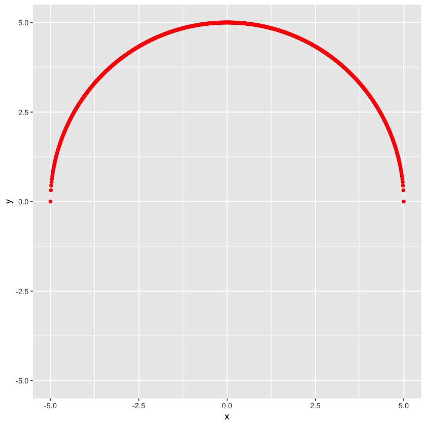
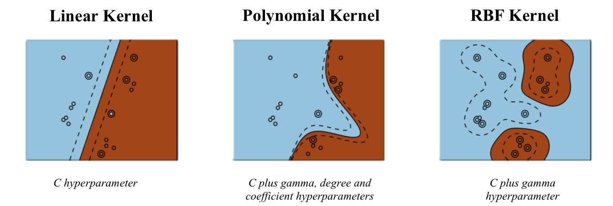
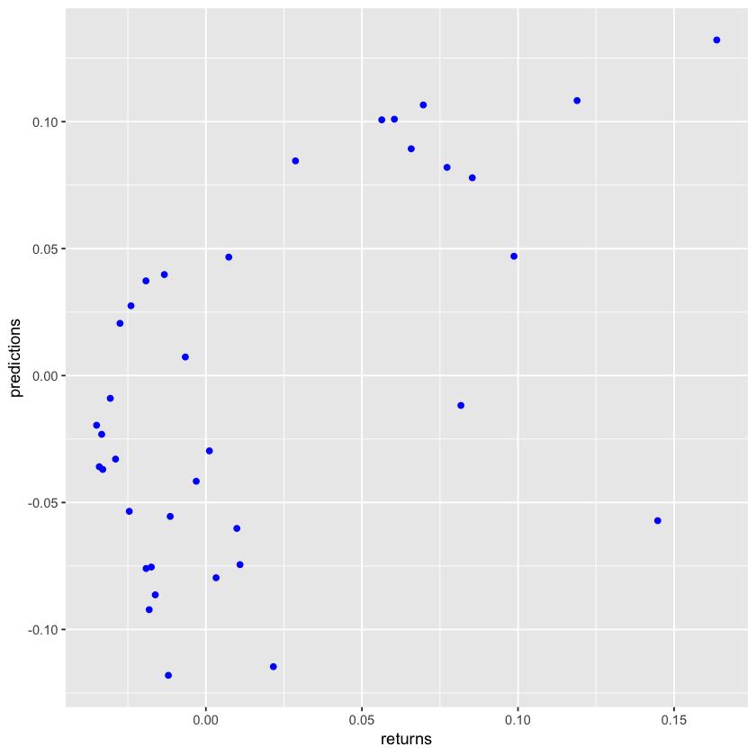
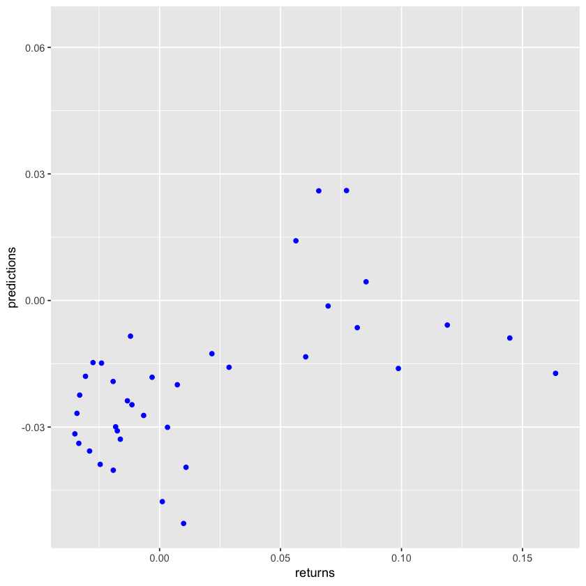
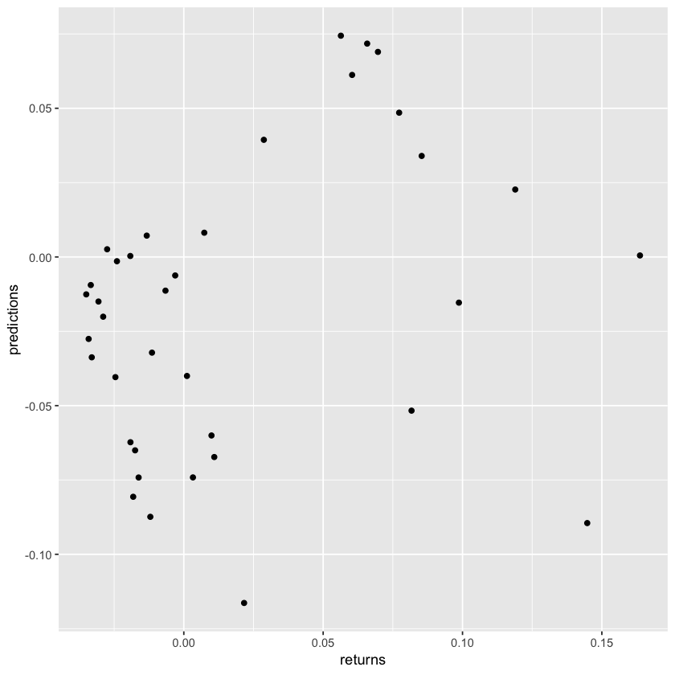
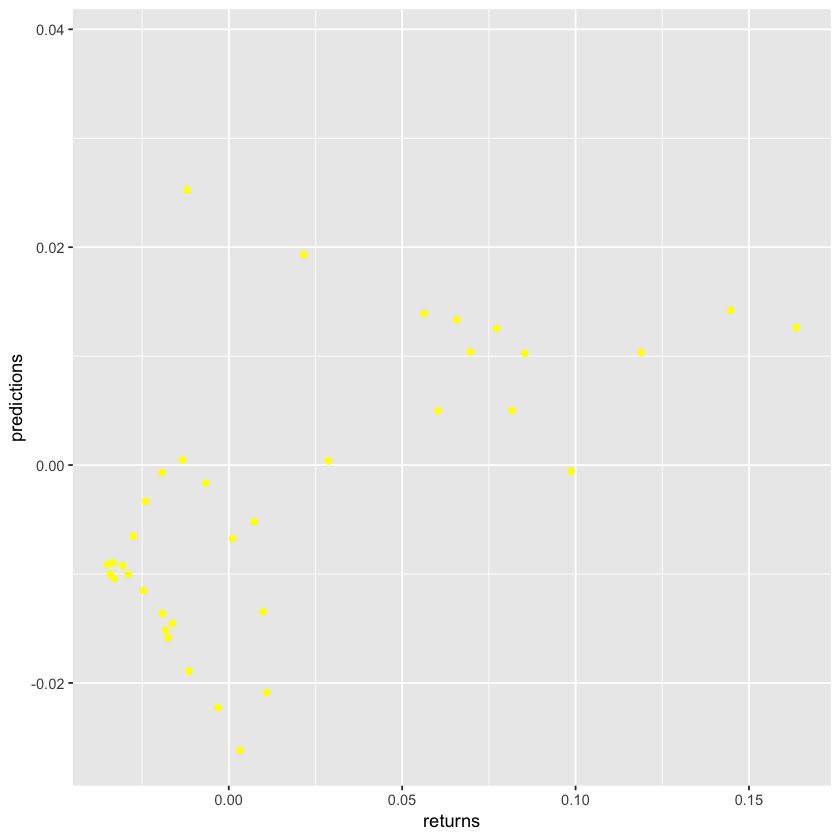
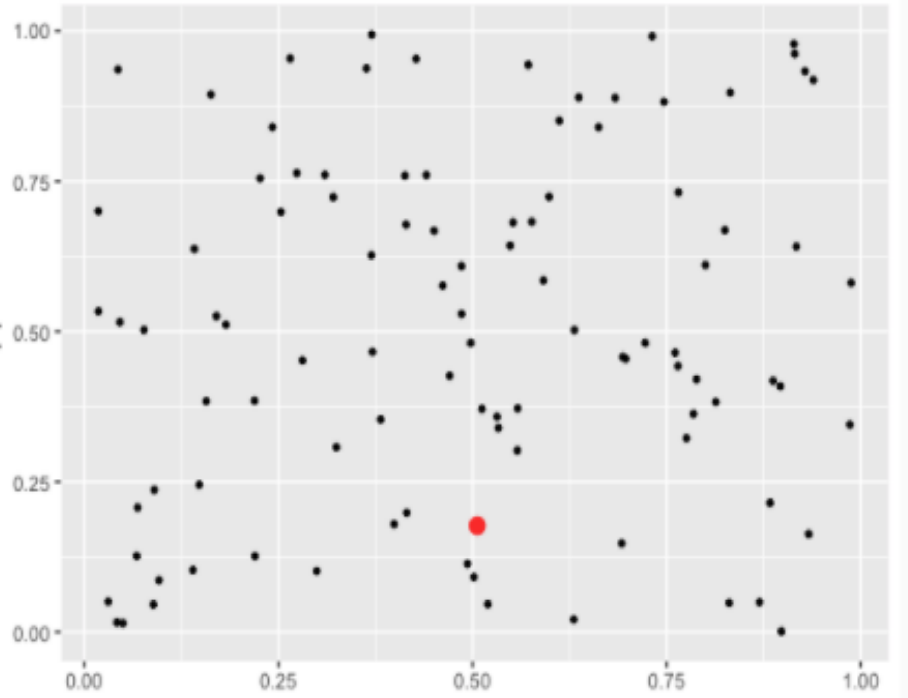
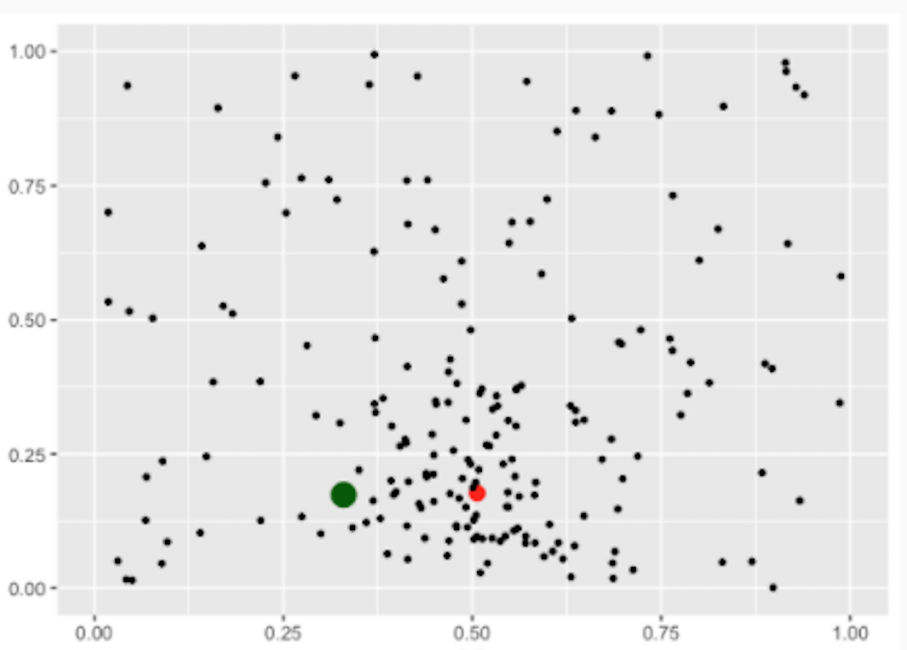
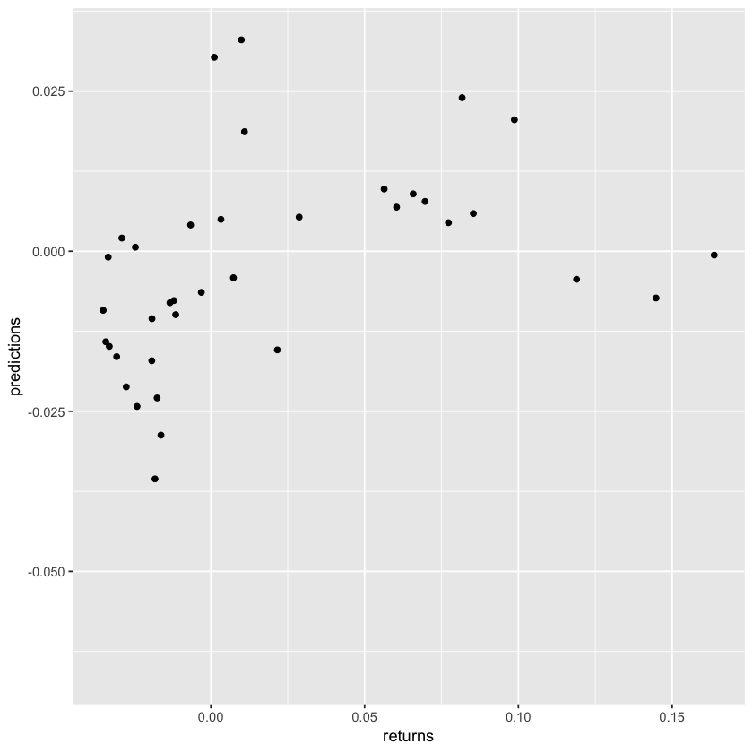
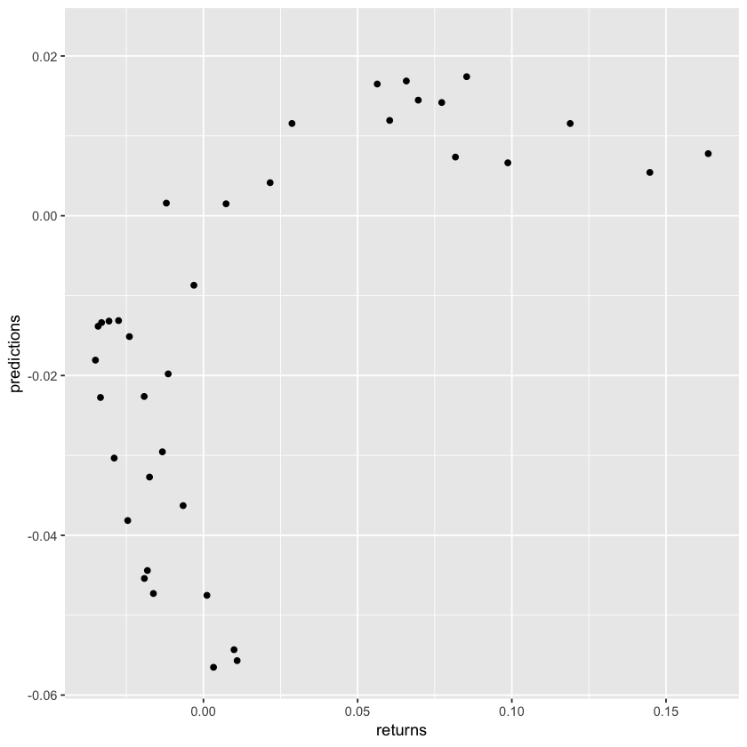

```R
##MCMC and normalized mutual information based feature selection for high dimensional problems##
#MAKE A SMALL PRESENTATION ON THE LAYOUT OF THE PROBLEM TO COMPLEMENT THE NOTEBOOK
```


```R
##Clear the memory##
rm(list=ls())
options(warn=-1)
```


```R
##Read the dataset in - k denotes integration scale, l denotes lag##
df <- read.csv('datas4.csv')
head(df)
dim(df)
```


<table>
<thead><tr><th scope=col>X</th><th scope=col>returnClose1NSEMALUPAPERk9l6</th><th scope=col>returnClose1NSEMALUPAPERk10l4</th><th scope=col>returnClose1NSEMALUPAPERk10l5</th><th scope=col>returnClose1NSEMALUPAPERk9l5</th><th scope=col>returnClose1NSEMALUPAPERk8l7</th><th scope=col>returnClose1NSEMALUPAPERk9l7</th><th scope=col>returnClose1NSEMALUPAPERk10l3</th><th scope=col>returnClose1NSEMALUPAPERk8l8</th><th scope=col>returnClose1NSEGRANULESk9l6</th><th scope=col>⋯</th><th scope=col>returnClose1NSEEVEREADYk8l9</th><th scope=col>signedvol1NSECENTENKAk4l10</th><th scope=col>returnClose1NSEEVEREADYk9l8</th><th scope=col>signedvol1NSEIFBINDk3l5</th><th scope=col>returnClose1NSESAREGAMAk10l4</th><th scope=col>returnClose1NSEHINDOILEXPk10l6</th><th scope=col>returnClose1NSEEVEREADYk10l6</th><th scope=col>returnClose1NSEJMCPROJECTk8l7</th><th scope=col>signedvol1NSEIFBINDk2l8</th><th scope=col>returnClose1NSE20MICRONS</th></tr></thead>
<tbody>
	<tr><td>1            </td><td>0.11872186   </td><td> 1.316681e-01</td><td>0.10506846   </td><td>0.14273227   </td><td>0.12499974   </td><td>0.09973565   </td><td> 0.1697314050</td><td>0.10760208   </td><td>0.08480748   </td><td>⋯            </td><td>0.017632920  </td><td>54244.26     </td><td>0.012662081  </td><td>9267.663     </td><td>-0.03320096  </td><td> 0.002509960 </td><td> 0.008368342 </td><td>-0.005736337 </td><td>9273.879     </td><td>         NA  </td></tr>
	<tr><td>2            </td><td>0.08519345   </td><td> 8.083274e-02</td><td>0.06182988   </td><td>0.10506846   </td><td>0.09973565   </td><td>0.07269663   </td><td> 0.1082203910</td><td>0.08698316   </td><td>0.07855748   </td><td>⋯            </td><td>0.018178150  </td><td>49542.95     </td><td>0.011213998  </td><td>9369.340     </td><td>-0.04766285  </td><td>-0.011381385 </td><td>-0.001659418 </td><td>-0.020379414 </td><td>9374.708     </td><td>         NA  </td></tr>
	<tr><td>3            </td><td>0.05114418   </td><td> 2.388166e-02</td><td>0.01864847   </td><td>0.06182988   </td><td>0.07269663   </td><td>0.05206565   </td><td> 0.0365694031</td><td>0.07080885   </td><td>0.06997168   </td><td>⋯            </td><td>0.018731260  </td><td>46215.57     </td><td>0.016402443  </td><td>9447.814     </td><td>-0.09428843  </td><td>-0.031423739 </td><td>-0.012062884 </td><td>-0.027949472 </td><td>9455.870     </td><td>         NA  </td></tr>
	<tr><td>4            </td><td>0.02513946   </td><td>-7.945152e-05</td><td>0.01145532   </td><td>0.01864847   </td><td>0.05206565   </td><td>0.03084249   </td><td> 0.0006555017</td><td>0.05369002   </td><td>0.05158979   </td><td>⋯            </td><td>0.018423919  </td><td>52217.46     </td><td>0.005135972  </td><td>9510.130     </td><td>-0.08627194  </td><td>-0.016634193 </td><td> 0.006069567 </td><td>-0.019369621 </td><td>9523.131     </td><td>         NA  </td></tr>
	<tr><td>5            </td><td>0.02038955   </td><td> 9.949586e-03</td><td>0.02097180   </td><td>0.01145532   </td><td>0.03084249   </td><td>0.02171576   </td><td>-0.0059320256</td><td>0.03069630   </td><td>0.05840223   </td><td>⋯            </td><td>0.006726772  </td><td>27440.03     </td><td>0.011308287  </td><td>9557.629     </td><td>-0.06105856  </td><td>-0.003730844 </td><td> 0.015973350 </td><td>-0.028605906 </td><td>9573.849     </td><td>         NA  </td></tr>
	<tr><td>6            </td><td>0.02242200   </td><td> 2.654730e-02</td><td>0.02717244   </td><td>0.02097180   </td><td>0.02171576   </td><td>0.02144309   </td><td> 0.0137095149</td><td>0.02094748   </td><td>0.05240548   </td><td>⋯            </td><td>0.011759896  </td><td>13418.62     </td><td>0.016333256  </td><td>9600.246     </td><td>-0.03049351  </td><td> 0.012377201 </td><td> 0.021977010 </td><td>-0.018214001 </td><td>9604.678     </td><td>-0.01202072  </td></tr>
</tbody>
</table>


<ol class=list-inline>
	<li>418</li>
	<li>201</li>
</ol>


```R
##Load packages##

#Reload the information theory package
clearpackage <- tryCatch({detach("package:infotheo", unload=TRUE)},error=function(e){})

#One hot encoding library
library(ade4)

#Library to parse dates quickly
library(lubridate)

#Mutual information usecase
library(entropy)

#Plotting library
library(ggplot2)

##Custom Functions##

##For one hot encoding##
OHE <- function(x,ohe_feats) {
  for (f in ohe_feats){
    x_ohe = acm.disjonctif(x[f])
    x[f] = NULL
    x = cbind(x, x_ohe)
  }
  return(x)
}

##Create lags in variables##
lagger <- function(x,lag=1){
  dims <- dim(x)
  colnamesx <- names(x)
  tbm <- as.data.frame(matrix(data=NA,nrow=lag,ncol=dims[2]))
  names(tbm) <- colnamesx
  if(dims[2]>1) { 
    x <- rbind(x[(lag+1):dims[1],],tbm)
  } else if(dims[2]==1){ 
    x <- as.data.frame(c(x[(lag+1):dims[1],],tbm[,colnamesx]))
  }
  names(x) <- paste(colnamesx,'l',lag,sep="")
  return(x)
}

##Create a lagged dataframe##
createLags <- function(x,cols,lags) {
  whichcols <- (names(x) %in% cols)
  if(sum(whichcols)>0) {
    namesx <- names(x)[whichcols]
    x <- x[,namesx]
    x <- as.data.frame(x)
    names(x) <- namesx
    if(exists("lagframe")) { remove(lagframe) }
    for(i in lags) {
      if(nrow(x)>i) templag <- lagger(x,i)
      if(exists("lagframe")) { lagframe <- cbind(lagframe,templag)
      } else { lagframe <- templag }
    }
  }
  if(exists('lagframe')) { return(lagframe) } else { return(NA) }
}

##Create returns for a financial time series##
createReturns <- function(x,lag=1) {
    x$returns <- c(rep(NA,lag),rev(diff(rev(x$Close),lag=lag))/x$Close[-c(1:lag)])
    x$pricevar <- x$Close
    x <- subset(x,select=-c(Close))
    return(x)
}

##Generate numbers according to a normal distribution using rejection sampling##
generate <- function(x,MAXVAL=0.9999,SIGMA=0.1,MINVAL=0.0001) {
  mean <- x
  sigma <- SIGMA
  while(1){
    x <- mean-2*sigma+4*sigma*runif(1)
    while(x<=0.0001 | x>=MAXVAL) {
      x <- mean-2*sigma+4*sigma*runif(1)
    }
    y <- runif(1)
    if(exp(-((x-mean)^2)/(2*sigma^2))>y) { return(x) }
  }
}

#Mutual information
micalc <- function(x,y,nbins=100){
  bins <- discretize2d(x,y,nbins,nbins)
  return(suppressWarnings(2*mi.empirical(bins)/(entropy(discretize(x,nbins)) + entropy(discretize(y,nbins)))))
}
```


```R
##Why Normalized Mutual Information? Better than Pearson and Spearman##

#Generate points on a semi-circle
x <- seq(-5,5,0.01)
y <- sqrt(5^2-x^2)

#Plot the points
ggplot(data.frame(x=x,y=y),aes(x,y)) + geom_point(color="red") + ylim(-5,5) + xlim(-5,5)

#Test the pearson and spearman-rank correlations - should be near 0.
suppressWarnings(cor.test(x,y,method="pearson"))
suppressWarnings(cor.test(x,y,method="spearman"))

#Compute mutual information
cat(paste("Normalized Mutual information is",micalc(x,y)))

#Sanity checks
cat("\nSanity Checks : Mutual information of a variable with itself should be 1\n")
print(paste("MI x,x = ",micalc(x,x)))
print(paste("MI y,y = ",micalc(y,y)))
```


    
    	Pearson's product-moment correlation
    
    data:  x and y
    t = -4.2594e-15, df = 999, p-value = 1
    alternative hypothesis: true correlation is not equal to 0
    95 percent confidence interval:
     -0.0619621  0.0619621
    sample estimates:
            cor 
    -1.3476e-16 


    
    	Spearman's rank correlation rho
    
    data:  x and y
    S = 167220000, p-value = 0.9926
    alternative hypothesis: true rho is not equal to 0
    sample estimates:
              rho 
    -0.0002932998 


    Normalized Mutual information is 0.760464945085607
    Sanity Checks : Mutual information of a variable with itself should be 1
    [1] "MI x,x =  1"
    [1] "MI y,y =  1"





```R
##Remove unnecessary columns from the data##
df <- subset(df,select=-c(X))
dim(df)
names(df)
```


<ol class=list-inline>
	<li>418</li>
	<li>200</li>
</ol>


<ol class=list-inline>
	<li>'returnClose1NSEMALUPAPERk9l6'</li>
	<li>'returnClose1NSEMALUPAPERk10l4'</li>
	<li>'returnClose1NSEMALUPAPERk10l5'</li>
	<li>'returnClose1NSEMALUPAPERk9l5'</li>
	<li>'returnClose1NSEMALUPAPERk8l7'</li>
	<li>'returnClose1NSEMALUPAPERk9l7'</li>
	<li>'returnClose1NSEMALUPAPERk10l3'</li>
	<li>'returnClose1NSEMALUPAPERk8l8'</li>
	<li>'returnClose1NSEGRANULESk9l6'</li>
	<li>'returnClose1NSEMALUPAPERk8l6'</li>
	<li>'returnClose1NSEBALAMINESk10l5'</li>
	<li>'returnClose1NSEBALAMINESk9l6'</li>
	<li>'returnClose1NSEMALUPAPERk10l6'</li>
	<li>'returnClose1NSEGRANULESk10l4'</li>
	<li>'returnClose1NSEGRANULESk9l5'</li>
	<li>'returnClose1NSEGRANULESk10l5'</li>
	<li>'returnClose1NSEBALAMINESk10l4'</li>
	<li>'returnClose1NSEMALUPAPERk9l4'</li>
	<li>'returnClose1NSEBALAMINESk9l7'</li>
	<li>'returnClose1NSEMALUPAPERk7l8'</li>
	<li>'returnClose1NSEBALAMINESk10l6'</li>
	<li>'returnClose1NSEGRANULESk8l7'</li>
	<li>'returnClose1NSEEVEREADYk8l7'</li>
	<li>'returnClose1NSEMALUPAPERk10l2'</li>
	<li>'returnClose1NSEGRANULESk9l7'</li>
	<li>'returnClose1NSEGRANULESk10l3'</li>
	<li>'returnClose1NSEMIRCELECTRk10l5'</li>
	<li>'returnClose1NSEBALAMINESk8l7'</li>
	<li>'returnClose1NSEBALAMINESk9l5'</li>
	<li>'returnClose1NSEEVEREADYk9l6'</li>
	<li>'returnClose1NSEMALUPAPERk7l7'</li>
	<li>'returnClose1NSEMALUPAPERk9l8'</li>
	<li>'returnClose1NSEEVEREADYk8l6'</li>
	<li>'returnClose1NSEEVEREADYk9l5'</li>
	<li>'returnClose1NSEBALAMINESk8l8'</li>
	<li>'returnClose1NSEMALUPAPERk7l9'</li>
	<li>'returnClose1NSEMALUPAPERk8l5'</li>
	<li>'returnClose1NSEGRANULESk8l6'</li>
	<li>'returnClose1NSEMALUPAPERk8l9'</li>
	<li>'returnClose1NSEEVEREADYk8l8'</li>
	<li>'returnClose1BSEBOM532944k8l7'</li>
	<li>'returnClose1NSEMIRCELECTRk10l4'</li>
	<li>'returnClose1BSEBOM532944k9l6'</li>
	<li>'returnClose1NSEGRANULESk8l8'</li>
	<li>'returnClose1NSEMIRCELECTRk10l6'</li>
	<li>'returnClose1NSEMIRCELECTRk9l6'</li>
	<li>'returnClose1NSEGRANULESk9l4'</li>
	<li>'returnClose1NSEGRANULESk10l6'</li>
	<li>'returnClose1NSEEVEREADYk7l8'</li>
	<li>'returnClose1BSEBOM532944k9l5'</li>
	<li>'returnClose1NSEEVEREADYk7l7'</li>
	<li>'returnClose1NSEMALUPAPERk10l7'</li>
	<li>'returnClose1NSEEVEREADYk9l7'</li>
	<li>'returnClose1NSEMIRCELECTRk9l7'</li>
	<li>'returnClose1NSEJMCPROJECTk10l5'</li>
	<li>'returnClose1BSEBOM532944k8l6'</li>
	<li>'returnClose1NSEJMCPROJECTk9l6'</li>
	<li>'returnClose1NSEEVEREADYk9l4'</li>
	<li>'returnClose2BSEBOM531717k9l6'</li>
	<li>'returnClose1NSEMALUPAPERk9l3'</li>
	<li>'returnClose1NSEEVEREADYk10l4'</li>
	<li>'cashflow1NSERAJSREESUGk5l7'</li>
	<li>'returnClose1NSEBLISSGVSk9l5'</li>
	<li>'returnClose2BSEBOM531717k10l5'</li>
	<li>'returnClose1NSEBALAMINESk10l3'</li>
	<li>'returnClose1NSEBALAMINESk9l8'</li>
	<li>'returnClose1NSEVLSFINANCEk9l6'</li>
	<li>'returnClose1BSEBOM532944k10l4'</li>
	<li>'returnClose1NSEHINDOILEXPk9l6'</li>
	<li>'returnClose2BSEBOM531717k9l7'</li>
	<li>'returnClose1NSESANOFIk10l5'</li>
	<li>'returnClose1NSESANOFIk9l6'</li>
	<li>'returnClose1NSEEVEREADYk10l5'</li>
	<li>'returnClose1NSEVLSFINANCEk10l5'</li>
	<li>'returnClose1NSESANOFIk10l4'</li>
	<li>'returnClose1NSEVRLLOGk10l5'</li>
	<li>'returnClose1BSEBOM532944k8l8'</li>
	<li>'signedvol1NSEIFBINDk1l8'</li>
	<li>'returnClose1NSEBLISSGVSk9l6'</li>
	<li>'returnClose1NSEJMCPROJECTk10l4'</li>
	<li>'returnClose1NSEEVEREADYk8l5'</li>
	<li>'signedvol1NSEIFBINDk1l7'</li>
	<li>'cashflow1NSERAJSREESUGk4l7'</li>
	<li>'returnClose1NSERMLk10l5'</li>
	<li>'returnClose1NSEBLISSGVSk8l7'</li>
	<li>'returnClose1NSEHINDOILEXPk10l5'</li>
	<li>'returnClose1NSEBALAMINESk8l6'</li>
	<li>'returnClose1NSEGRANULESk7l8'</li>
	<li>'returnClose1NSEJINDALPHOTk10l5'</li>
	<li>'returnClose1NSEJMCPROJECTk9l7'</li>
	<li>'signedvol1NSEIFBINDk2l7'</li>
	<li>'returnClose1NSEGRANULESk10l2'</li>
	<li>'returnClose1BSEBOM532944k10l5'</li>
	<li>'returnClose1NSEMIRCELECTRk9l5'</li>
	<li>'returnClose1NSEMALUPAPERk10l1'</li>
	<li>'returnClose1NSEEVEREADYk7l9'</li>
	<li>'returnClose1NSEBLISSGVSk8l6'</li>
	<li>'returnClose1BSEBOM532944k9l7'</li>
	<li>'returnClose1NSEVLSFINANCEk10l4'</li>
	<li>'returnClose1NSEBLISSGVSk10l4'</li>
	<li>'returnClose1NSEEVEREADYk10l3'</li>
	<li>'returnClose1NSEVLSFINANCEk9l7'</li>
	<li>'returnClose1NSEVLSFINANCEk8l7'</li>
	<li>'returnClose1BSEBOM532944k7l8'</li>
	<li>'returnClose1NSEMALUPAPERk7l10'</li>
	<li>'returnClose1NSEJMCPROJECTk10l6'</li>
	<li>'returnClose1BSEBOM532944k7l7'</li>
	<li>'returnClose1NSERBLk9l6'</li>
	<li>'returnClose1NSEMIRCELECTRk8l7'</li>
	<li>'returnClose2BSEBOM531717k8l7'</li>
	<li>'returnClose1NSEBALAMINESk10l7'</li>
	<li>'returnClose1NSEORIENTALTLk10l4'</li>
	<li>'returnClose1NSEITDCEMk8l7'</li>
	<li>'returnClose1NSEEVEREADYk9l3'</li>
	<li>'returnClose1NSEHINDOILEXPk9l7'</li>
	<li>'returnClose1NSEJINDALPHOTk10l6'</li>
	<li>'returnClose1NSEBPLk10l5'</li>
	<li>'returnClose1NSESANOFIk9l5'</li>
	<li>'returnClose2BSEBOM531717k8l8'</li>
	<li>'signedvol1NSEORIENTALTLk4l8'</li>
	<li>'returnClose2BSEBOM531717k10l6'</li>
	<li>'returnClose1NSEMIRCELECTRk8l8'</li>
	<li>'returnClose2BSEBOM531717k10l4'</li>
	<li>'signedvol1NSEIFBINDk2l6'</li>
	<li>'returnClose1BSEBOM506943k10l5'</li>
	<li>'returnClose1NSEHAVELLSk9l6'</li>
	<li>'returnClose1NSEHINDOILEXPk10l4'</li>
	<li>'returnClose1NSEVRLLOGk10l6'</li>
	<li>'signedvol1NSEORIENTALTLk4l7'</li>
	<li>'returnClose1NSESANOFIk9l7'</li>
	<li>'signedvol1NSEVISASTEELk2l6'</li>
	<li>'returnClose1NSERBLk10l4'</li>
	<li>'returnClose1NSEHAVELLSk10l5'</li>
	<li>'returnClose1NSEVRLLOGk10l4'</li>
	<li>'returnClose1NSEVLSFINANCEk8l8'</li>
	<li>'returnClose1NSEJMFINANCILk10l4'</li>
	<li>'cashflow1NSERAJSREESUGk4l6'</li>
	<li>'returnClose1NSEALKYLAMINEk10l5'</li>
	<li>'returnClose1NSERBLk9l5'</li>
	<li>'returnClose1NSEBALAMINESk7l8'</li>
	<li>'returnClose1NSEMALUPAPERk7l6'</li>
	<li>'returnClose1NSEALKYLAMINEk9l6'</li>
	<li>'returnClose1NSEJINDALPHOTk9l7'</li>
	<li>'cashflow1NSERAJSREESUGk4l8'</li>
	<li>'returnClose1NSEJMFINANCILk9l5'</li>
	<li>'returnClose1NSEBLISSGVSk9l4'</li>
	<li>'cashflow1NSERAJSREESUGk5l6'</li>
	<li>'returnClose1NSEHAVELLSk10l4'</li>
	<li>'returnClose1NSERANEENGINEk10l5'</li>
	<li>'returnClose1NSEITDCEMk8l6'</li>
	<li>'returnClose1NSEITDCEMk9l6'</li>
	<li>'signedvol1NSEIFBINDk3l6'</li>
	<li>'returnClose1NSEITDCEMk9l5'</li>
	<li>'returnClose1NSEJMCPROJECTk9l5'</li>
	<li>'signedvol1NSEORIENTALTLk5l6'</li>
	<li>'returnClose1NSEJINDALPHOTk9l6'</li>
	<li>'returnClose1NSEBLISSGVSk10l3'</li>
	<li>'returnClose1NSEATULk9l6'</li>
	<li>'returnClose1BSEBOM532944k9l4'</li>
	<li>'signedvol1NSEVISASTEELk1l7'</li>
	<li>'returnClose1NSESANOFIk10l6'</li>
	<li>'returnClose1NSEMIRCELECTRk10l7'</li>
	<li>'returnClose1NSEMALUPAPERk9l9'</li>
	<li>'returnClose1NSERMLk10l6'</li>
	<li>'returnClose1NSEHINDOILEXPk8l7'</li>
	<li>'returnClose1NSEVRLLOGk9l6'</li>
	<li>'returnClose1NSEJINDALPHOTk10l4'</li>
	<li>'signedvol1NSEORIENTALTLk5l7'</li>
	<li>'returnClose1NSEHINDOILEXPk9l5'</li>
	<li>'returnClose1NSERMLk10l4'</li>
	<li>'returnClose1NSEVLSFINANCEk9l5'</li>
	<li>'signedvol1NSEIFBINDk1l9'</li>
	<li>'volume1BSEBOM524727k1l6'</li>
	<li>'returnClose1NSEASPINWALLk10l4'</li>
	<li>'returnClose1NSEMALUPAPERk6l9'</li>
	<li>'returnClose1NSESANOFIk10l3'</li>
	<li>'returnClose1NSEHAVELLSk8l7'</li>
	<li>'cashflow1NSERAJSREESUGk3l7'</li>
	<li>'returnClose1NSEBPLk9l6'</li>
	<li>'returnClose1NSEBPLk10l4'</li>
	<li>'returnClose1NSESAREGAMAk10l5'</li>
	<li>'returnClose1BSEBOM532944k10l3'</li>
	<li>'returnClose1NSEMIRCELECTRk10l3'</li>
	<li>'returnClose1NSEEVEREADYk7l6'</li>
	<li>'returnClose1NSEMIRCELECTRk9l8'</li>
	<li>'returnClose1NSEVLSFINANCEk10l6'</li>
	<li>'returnClose1NSEORIENTALTLk9l5'</li>
	<li>'cashflow1NSEONELIFECAPk1l6'</li>
	<li>'returnClose1NSEJMFINANCILk9l6'</li>
	<li>'returnClose1NSEVRLLOGk9l7'</li>
	<li>'returnClose1NSEEVEREADYk8l9'</li>
	<li>'signedvol1NSECENTENKAk4l10'</li>
	<li>'returnClose1NSEEVEREADYk9l8'</li>
	<li>'signedvol1NSEIFBINDk3l5'</li>
	<li>'returnClose1NSESAREGAMAk10l4'</li>
	<li>'returnClose1NSEHINDOILEXPk10l6'</li>
	<li>'returnClose1NSEEVEREADYk10l6'</li>
	<li>'returnClose1NSEJMCPROJECTk8l7'</li>
	<li>'signedvol1NSEIFBINDk2l8'</li>
	<li>'returnClose1NSE20MICRONS'</li>
</ol>


```R
##Define train and test - usually (but not here) a rolling train and test where rolling window sizes << dataset sizes##

trainrows <- (round(nrow(df)*0.1)+1):nrow(df)
testrows <- 1:round(nrow(df)*0.1)
trainrows
testrows
```


<ol class=list-inline>
	<li>43</li>
	<li>44</li>
	<li>45</li>
	<li>46</li>
	<li>47</li>
	<li>48</li>
	<li>49</li>
	<li>50</li>
	<li>51</li>
	<li>52</li>
	<li>53</li>
	<li>54</li>
	<li>55</li>
	<li>56</li>
	<li>57</li>
	<li>58</li>
	<li>59</li>
	<li>60</li>
	<li>61</li>
	<li>62</li>
	<li>63</li>
	<li>64</li>
	<li>65</li>
	<li>66</li>
	<li>67</li>
	<li>68</li>
	<li>69</li>
	<li>70</li>
	<li>71</li>
	<li>72</li>
	<li>73</li>
	<li>74</li>
	<li>75</li>
	<li>76</li>
	<li>77</li>
	<li>78</li>
	<li>79</li>
	<li>80</li>
	<li>81</li>
	<li>82</li>
	<li>83</li>
	<li>84</li>
	<li>85</li>
	<li>86</li>
	<li>87</li>
	<li>88</li>
	<li>89</li>
	<li>90</li>
	<li>91</li>
	<li>92</li>
	<li>93</li>
	<li>94</li>
	<li>95</li>
	<li>96</li>
	<li>97</li>
	<li>98</li>
	<li>99</li>
	<li>100</li>
	<li>101</li>
	<li>102</li>
	<li>103</li>
	<li>104</li>
	<li>105</li>
	<li>106</li>
	<li>107</li>
	<li>108</li>
	<li>109</li>
	<li>110</li>
	<li>111</li>
	<li>112</li>
	<li>113</li>
	<li>114</li>
	<li>115</li>
	<li>116</li>
	<li>117</li>
	<li>118</li>
	<li>119</li>
	<li>120</li>
	<li>121</li>
	<li>122</li>
	<li>123</li>
	<li>124</li>
	<li>125</li>
	<li>126</li>
	<li>127</li>
	<li>128</li>
	<li>129</li>
	<li>130</li>
	<li>131</li>
	<li>132</li>
	<li>133</li>
	<li>134</li>
	<li>135</li>
	<li>136</li>
	<li>137</li>
	<li>138</li>
	<li>139</li>
	<li>140</li>
	<li>141</li>
	<li>142</li>
	<li>143</li>
	<li>144</li>
	<li>145</li>
	<li>146</li>
	<li>147</li>
	<li>148</li>
	<li>149</li>
	<li>150</li>
	<li>151</li>
	<li>152</li>
	<li>153</li>
	<li>154</li>
	<li>155</li>
	<li>156</li>
	<li>157</li>
	<li>158</li>
	<li>159</li>
	<li>160</li>
	<li>161</li>
	<li>162</li>
	<li>163</li>
	<li>164</li>
	<li>165</li>
	<li>166</li>
	<li>167</li>
	<li>168</li>
	<li>169</li>
	<li>170</li>
	<li>171</li>
	<li>172</li>
	<li>173</li>
	<li>174</li>
	<li>175</li>
	<li>176</li>
	<li>177</li>
	<li>178</li>
	<li>179</li>
	<li>180</li>
	<li>181</li>
	<li>182</li>
	<li>183</li>
	<li>184</li>
	<li>185</li>
	<li>186</li>
	<li>187</li>
	<li>188</li>
	<li>189</li>
	<li>190</li>
	<li>191</li>
	<li>192</li>
	<li>193</li>
	<li>194</li>
	<li>195</li>
	<li>196</li>
	<li>197</li>
	<li>198</li>
	<li>199</li>
	<li>200</li>
	<li>201</li>
	<li>202</li>
	<li>203</li>
	<li>204</li>
	<li>205</li>
	<li>206</li>
	<li>207</li>
	<li>208</li>
	<li>209</li>
	<li>210</li>
	<li>211</li>
	<li>212</li>
	<li>213</li>
	<li>214</li>
	<li>215</li>
	<li>216</li>
	<li>217</li>
	<li>218</li>
	<li>219</li>
	<li>220</li>
	<li>221</li>
	<li>222</li>
	<li>223</li>
	<li>224</li>
	<li>225</li>
	<li>226</li>
	<li>227</li>
	<li>228</li>
	<li>229</li>
	<li>230</li>
	<li>231</li>
	<li>232</li>
	<li>233</li>
	<li>234</li>
	<li>235</li>
	<li>236</li>
	<li>237</li>
	<li>238</li>
	<li>239</li>
	<li>240</li>
	<li>241</li>
	<li>242</li>
	<li>243</li>
	<li>244</li>
	<li>245</li>
	<li>246</li>
	<li>247</li>
	<li>248</li>
	<li>249</li>
	<li>250</li>
	<li>251</li>
	<li>252</li>
	<li>253</li>
	<li>254</li>
	<li>255</li>
	<li>256</li>
	<li>257</li>
	<li>258</li>
	<li>259</li>
	<li>260</li>
	<li>261</li>
	<li>262</li>
	<li>263</li>
	<li>264</li>
	<li>265</li>
	<li>266</li>
	<li>267</li>
	<li>268</li>
	<li>269</li>
	<li>270</li>
	<li>271</li>
	<li>272</li>
	<li>273</li>
	<li>274</li>
	<li>275</li>
	<li>276</li>
	<li>277</li>
	<li>278</li>
	<li>279</li>
	<li>280</li>
	<li>281</li>
	<li>282</li>
	<li>283</li>
	<li>284</li>
	<li>285</li>
	<li>286</li>
	<li>287</li>
	<li>288</li>
	<li>289</li>
	<li>290</li>
	<li>291</li>
	<li>292</li>
	<li>293</li>
	<li>294</li>
	<li>295</li>
	<li>296</li>
	<li>297</li>
	<li>298</li>
	<li>299</li>
	<li>300</li>
	<li>301</li>
	<li>302</li>
	<li>303</li>
	<li>304</li>
	<li>305</li>
	<li>306</li>
	<li>307</li>
	<li>308</li>
	<li>309</li>
	<li>310</li>
	<li>311</li>
	<li>312</li>
	<li>313</li>
	<li>314</li>
	<li>315</li>
	<li>316</li>
	<li>317</li>
	<li>318</li>
	<li>319</li>
	<li>320</li>
	<li>321</li>
	<li>322</li>
	<li>323</li>
	<li>324</li>
	<li>325</li>
	<li>326</li>
	<li>327</li>
	<li>328</li>
	<li>329</li>
	<li>330</li>
	<li>331</li>
	<li>332</li>
	<li>333</li>
	<li>334</li>
	<li>335</li>
	<li>336</li>
	<li>337</li>
	<li>338</li>
	<li>339</li>
	<li>340</li>
	<li>341</li>
	<li>342</li>
	<li>343</li>
	<li>344</li>
	<li>345</li>
	<li>346</li>
	<li>347</li>
	<li>348</li>
	<li>349</li>
	<li>350</li>
	<li>351</li>
	<li>352</li>
	<li>353</li>
	<li>354</li>
	<li>355</li>
	<li>356</li>
	<li>357</li>
	<li>358</li>
	<li>359</li>
	<li>360</li>
	<li>361</li>
	<li>362</li>
	<li>363</li>
	<li>364</li>
	<li>365</li>
	<li>366</li>
	<li>367</li>
	<li>368</li>
	<li>369</li>
	<li>370</li>
	<li>371</li>
	<li>372</li>
	<li>373</li>
	<li>374</li>
	<li>375</li>
	<li>376</li>
	<li>377</li>
	<li>378</li>
	<li>379</li>
	<li>380</li>
	<li>381</li>
	<li>382</li>
	<li>383</li>
	<li>384</li>
	<li>385</li>
	<li>386</li>
	<li>387</li>
	<li>388</li>
	<li>389</li>
	<li>390</li>
	<li>391</li>
	<li>392</li>
	<li>393</li>
	<li>394</li>
	<li>395</li>
	<li>396</li>
	<li>397</li>
	<li>398</li>
	<li>399</li>
	<li>400</li>
	<li>401</li>
	<li>402</li>
	<li>403</li>
	<li>404</li>
	<li>405</li>
	<li>406</li>
	<li>407</li>
	<li>408</li>
	<li>409</li>
	<li>410</li>
	<li>411</li>
	<li>412</li>
	<li>413</li>
	<li>414</li>
	<li>415</li>
	<li>416</li>
	<li>417</li>
	<li>418</li>
</ol>


<ol class=list-inline>
	<li>1</li>
	<li>2</li>
	<li>3</li>
	<li>4</li>
	<li>5</li>
	<li>6</li>
	<li>7</li>
	<li>8</li>
	<li>9</li>
	<li>10</li>
	<li>11</li>
	<li>12</li>
	<li>13</li>
	<li>14</li>
	<li>15</li>
	<li>16</li>
	<li>17</li>
	<li>18</li>
	<li>19</li>
	<li>20</li>
	<li>21</li>
	<li>22</li>
	<li>23</li>
	<li>24</li>
	<li>25</li>
	<li>26</li>
	<li>27</li>
	<li>28</li>
	<li>29</li>
	<li>30</li>
	<li>31</li>
	<li>32</li>
	<li>33</li>
	<li>34</li>
	<li>35</li>
	<li>36</li>
	<li>37</li>
	<li>38</li>
	<li>39</li>
	<li>40</li>
	<li>41</li>
	<li>42</li>
</ol>


```R
##SVM Kernel types##

require("IRdisplay")
display_png(file="svmkernels.png",width=500)
```





```R
##Fitness metric? - concordance not accuracy!##
```

$$Fitness_{metric} = max(mean_{accuracy}(returns<0),mean_{accuracy}(returns>0))$$


```R
##Trying a vanilla SVM - no optimizations##

library(e1071)
KERNEL <- 'linear'
additional <- paste(",type='eps-regression',kernel='",KERNEL,"'",sep="")
modelsvm <- tryCatch({eval(parse(text=paste("svm(returnClose1NSE20MICRONS~.,data=df[trainrows,]",additional,")",sep="")))},error=function(e){NA})
if(suppressWarnings(!is.na(modelsvm))){
    fitness <- 0
    dfdf <- df[testrows,]
    dfdfp <- subset(df[testrows,],returnClose1NSE20MICRONS>0)
    dfdfn <- subset(df[testrows,],returnClose1NSE20MICRONS<0)
    fitness <- min(mean(sign(predict(modelsvm,newdata=dfdfp))==1),mean(sign(predict(modelsvm,newdata=dfdfn))==-1)) 
    predictions <- predict(modelsvm,subset(df[testrows,],select=-c(returnClose1NSE20MICRONS)))
    print(paste("Fitness is ",fitness))
    p <- ggplot(data.frame(returns=df[testrows,"returnClose1NSE20MICRONS"],predictions=predictions),aes(returns,predictions)) + geom_point(color="blue")
    print(p)                    
}
```

    [1] "Fitness is  0.611111111111111"





```R
##Trying a vanilla RF - no optimizations##
library(randomForest)
dftrain <- df[trainrows,]
dftrain <- dftrain[complete.cases(dftrain),]
modelrf <- tryCatch({randomForest(returnClose1NSE20MICRONS~.,data=dftrain)},error=function(e){NA})
modelrf
if(suppressWarnings(!is.na(modelrf))){
    fitness <- 0
    dfdf <- df[testrows,]
    dfdfp <- subset(df[testrows,],returnClose1NSE20MICRONS>0)
    dfdfn <- subset(df[testrows,],returnClose1NSE20MICRONS<0)
    fitness <- min(mean(sign(predict(modelrf,newdata=dfdfp))==1),mean(sign(predict(modelrf,newdata=dfdfn))==-1))
    predictions <- predict(modelrf,subset(df[testrows,],select=-c(returnClose1NSE20MICRONS)))
    print(paste("Fitness is ",fitness))
    p <- ggplot(data.frame(returns=df[testrows,"returnClose1NSE20MICRONS"],predictions=predictions),aes(returns,predictions)) + geom_point(color="blue")
    print(p)                    
}
```


    
    Call:
     randomForest(formula = returnClose1NSE20MICRONS ~ ., data = dftrain) 
                   Type of random forest: regression
                         Number of trees: 500
    No. of variables tried at each split: 66
    
              Mean of squared residuals: 0.001982448
                        % Var explained: 55.99


    [1] "Fitness is  0.222222222222222"





```R
##Imposing correlation based cut-offs - which variables remain?##
cory <- sort(sapply(names(df[trainrows,]),function(x){abs(cor(df[trainrows,x],df[trainrows,"returnClose1NSE20MICRONS"],method="pearson",use="pairwise.complete.obs"))}),decreasing=TRUE)
head(cory)
head(names(cory))
```


<dl class=dl-horizontal>
	<dt>returnClose1NSE20MICRONS</dt>
		<dd>1</dd>
	<dt>returnClose1NSEBALAMINESk10l5</dt>
		<dd>0.446586370411756</dd>
	<dt>returnClose1NSEBALAMINESk9l6</dt>
		<dd>0.441629803685005</dd>
	<dt>returnClose1NSEBALAMINESk9l7</dt>
		<dd>0.437101027912902</dd>
	<dt>returnClose1NSEMALUPAPERk10l4</dt>
		<dd>0.434077951686347</dd>
	<dt>returnClose1NSEMALUPAPERk9l6</dt>
		<dd>0.43349271997297</dd>
</dl>


<ol class=list-inline>
	<li>'returnClose1NSE20MICRONS'</li>
	<li>'returnClose1NSEBALAMINESk10l5'</li>
	<li>'returnClose1NSEBALAMINESk9l6'</li>
	<li>'returnClose1NSEBALAMINESk9l7'</li>
	<li>'returnClose1NSEMALUPAPERk10l4'</li>
	<li>'returnClose1NSEMALUPAPERk9l6'</li>
</ol>


```R
##Correlation matrix to understand the correlation structure of variables and remove redundancies##
cormat <- abs(cor(df[trainrows,],method="pearson",use="pairwise.complete.obs"))
head(cormat)
```


<table>
<thead><tr><th></th><th scope=col>returnClose1NSEMALUPAPERk9l6</th><th scope=col>returnClose1NSEMALUPAPERk10l4</th><th scope=col>returnClose1NSEMALUPAPERk10l5</th><th scope=col>returnClose1NSEMALUPAPERk9l5</th><th scope=col>returnClose1NSEMALUPAPERk8l7</th><th scope=col>returnClose1NSEMALUPAPERk9l7</th><th scope=col>returnClose1NSEMALUPAPERk10l3</th><th scope=col>returnClose1NSEMALUPAPERk8l8</th><th scope=col>returnClose1NSEGRANULESk9l6</th><th scope=col>returnClose1NSEMALUPAPERk8l6</th><th scope=col>⋯</th><th scope=col>returnClose1NSEEVEREADYk8l9</th><th scope=col>signedvol1NSECENTENKAk4l10</th><th scope=col>returnClose1NSEEVEREADYk9l8</th><th scope=col>signedvol1NSEIFBINDk3l5</th><th scope=col>returnClose1NSESAREGAMAk10l4</th><th scope=col>returnClose1NSEHINDOILEXPk10l6</th><th scope=col>returnClose1NSEEVEREADYk10l6</th><th scope=col>returnClose1NSEJMCPROJECTk8l7</th><th scope=col>signedvol1NSEIFBINDk2l8</th><th scope=col>returnClose1NSE20MICRONS</th></tr></thead>
<tbody>
	<tr><th scope=row>returnClose1NSEMALUPAPERk9l6</th><td>1.0000000</td><td>0.9825560</td><td>0.9808556</td><td>0.9809172</td><td>0.9832356</td><td>0.9832995</td><td>0.9516574</td><td>0.9773522</td><td>0.4130143</td><td>0.9505134</td><td>⋯        </td><td>0.2724109</td><td>0.3296226</td><td>0.2889425</td><td>0.2857939</td><td>0.3528541</td><td>0.3624858</td><td>0.2883973</td><td>0.4604787</td><td>0.3092463</td><td>0.4334927</td></tr>
	<tr><th scope=row>returnClose1NSEMALUPAPERk10l4</th><td>0.9825560</td><td>1.0000000</td><td>0.9783848</td><td>0.9783873</td><td>0.9482809</td><td>0.9483058</td><td>0.9749459</td><td>0.9274016</td><td>0.4272384</td><td>0.9271605</td><td>⋯        </td><td>0.2459562</td><td>0.3100057</td><td>0.2689715</td><td>0.2702828</td><td>0.3905564</td><td>0.3666632</td><td>0.2872680</td><td>0.4530287</td><td>0.2873077</td><td>0.4340780</td></tr>
	<tr><th scope=row>returnClose1NSEMALUPAPERk10l5</th><td>0.9808556</td><td>0.9783848</td><td>1.0000000</td><td>0.9365088</td><td>0.9355469</td><td>0.9780791</td><td>0.9181451</td><td>0.9446119</td><td>0.4113004</td><td>0.8777406</td><td>⋯        </td><td>0.2485300</td><td>0.3052442</td><td>0.2753818</td><td>0.2936342</td><td>0.3473421</td><td>0.3865294</td><td>0.3019898</td><td>0.4185744</td><td>0.3071261</td><td>0.4320490</td></tr>
	<tr><th scope=row>returnClose1NSEMALUPAPERk9l5</th><td>0.9809172</td><td>0.9783873</td><td>0.9365088</td><td>1.0000000</td><td>0.9781236</td><td>0.9359587</td><td>0.9825449</td><td>0.9448774</td><td>0.4167535</td><td>0.9808930</td><td>⋯        </td><td>0.2669233</td><td>0.3295281</td><td>0.2781740</td><td>0.2582536</td><td>0.3819814</td><td>0.3333796</td><td>0.2671881</td><td>0.4847273</td><td>0.2856888</td><td>0.4247405</td></tr>
	<tr><th scope=row>returnClose1NSEMALUPAPERk8l7</th><td>0.9832356</td><td>0.9482809</td><td>0.9355469</td><td>0.9781236</td><td>1.0000000</td><td>0.9598099</td><td>0.9391470</td><td>0.9853273</td><td>0.3876857</td><td>0.9833396</td><td>⋯        </td><td>0.2873491</td><td>0.3517750</td><td>0.2882578</td><td>0.2774706</td><td>0.3371873</td><td>0.3323059</td><td>0.2729434</td><td>0.4837316</td><td>0.3070700</td><td>0.4200152</td></tr>
	<tr><th scope=row>returnClose1NSEMALUPAPERk9l7</th><td>0.9832995</td><td>0.9483058</td><td>0.9780791</td><td>0.9359587</td><td>0.9598099</td><td>1.0000000</td><td>0.8934065</td><td>0.9851885</td><td>0.3864249</td><td>0.9016318</td><td>⋯        </td><td>0.2756164</td><td>0.3187675</td><td>0.2939703</td><td>0.2984953</td><td>0.3034853</td><td>0.3670417</td><td>0.2900848</td><td>0.4184026</td><td>0.3272423</td><td>0.4141974</td></tr>
</tbody>
</table>


```R
##Basic correlation cut-off based feature selection##
featureselect <- names(cormat[,"returnClose1NSE20MICRONS"][cormat[,"returnClose1NSE20MICRONS"] > quantile(cormat[,"returnClose1NSE20MICRONS"],0.25)])

KERNEL <- 'linear'
additional <- paste(",type='eps-regression',kernel='",KERNEL,"'",sep="")
modelsvm <- tryCatch({eval(parse(text=paste("svm(returnClose1NSE20MICRONS~.,data=df[trainrows,c(featureselect)]",additional,")",sep="")))},error=function(e){NA})
if(suppressWarnings(!is.na(modelsvm))){
    fitness <- 0
    dfdf <- as.data.frame(df[testrows,featureselect])
    names(dfdf) <- featureselect
    dfdfp <- subset(df[testrows,],returnClose1NSE20MICRONS>0)[,featureselect]
    dfdfn <- subset(df[testrows,],returnClose1NSE20MICRONS<0)[,featureselect]
    fitness <- min(mean(sign(predict(modelsvm,newdata=dfdfp))==1),mean(sign(predict(modelsvm,newdata=dfdfn))==-1))         
    predictions <- predict(modelsvm,df[testrows,c(featureselect)])
    print(paste("Fitness is ",fitness))
    p <- ggplot(data.frame(returns=df[testrows[complete.cases(df[testrows,])],"returnClose1NSE20MICRONS"],predictions=predictions),aes(returns,predictions)) + geom_point()
    print(p)                    
}
```

    [1] "Fitness is  0.555555555555556"





```R
##Use a Monte-Carlo with a correlation matrix## 

niter <- 1000
modellist <- list()
varlist <- list()
bestvarexp <- -100 
bestvars <- NA

KERNELS <- c('linear','radial','polynomial')
k <- 1
 
for(n in 1:niter){
    THX <- 0.01 + 0.89*runif(1)
    THY <- 0.01 + 0.89*runif(1)
    EPS <- 0.05 + 0.45*runif(1)
    GAMMA <- 0.05 + 0.45*runif(1)
                             
    choosevars <- c(names(which.max(cory[names(cory)!="returnClose1NSE20MICRONS"])))
    if(cormat[choosevars,"returnClose1NSE20MICRONS"]<THY) next
    for(i in colnames(cormat)[colnames(cormat)!="returnClose1NSE20MICRONS"]){
        if(max(cormat[i,choosevars])<THX&cormat[i,"returnClose1NSE20MICRONS"]>THY){
            choosevars <- c(choosevars,i)
        }
    }
    if(!is.null(varlist[[paste(choosevars,collapse="-")]])) next
    
    if((n-1)%%333==0){
        KERNEL <- KERNELS[k]
        k <- k + 1
    }
                         
    additional <- paste(",type='eps-regression',kernel='",KERNEL,"',gamma=",GAMMA,",epsilon=",EPS,sep="")
    modelsvm <- tryCatch({eval(parse(text=paste("svm(returnClose1NSE20MICRONS~.,data=df[trainrows,c(choosevars,'returnClose1NSE20MICRONS')]",additional,")",sep="")))},error=function(e){NA})
    
    if((is.na(modelsvm))) next
    fitness <- 0
    dfdf <- as.data.frame(df[testrows,choosevars])
    names(dfdf) <- choosevars
    
    dfdfp <- as.data.frame(subset(df[testrows,],returnClose1NSE20MICRONS>0)[,choosevars])
    dfdfn <- as.data.frame(subset(df[testrows,],returnClose1NSE20MICRONS<0)[,choosevars])
    names(dfdfp) <- choosevars
    names(dfdfn) <- choosevars
    fitness <- min(mean(sign(predict(modelsvm,newdata=dfdfp))==1),mean(sign(predict(modelsvm,newdata=dfdfn))==-1))         

    varlist[[paste(choosevars,collapse="-")]] <- fitness
    print(paste(n,paste(choosevars,collapse=","),fitness))
    if(fitness>bestvarexp){
        bestvarexp <- varlist[[paste(choosevars,collapse="-")]]
        bestvars <- choosevars
        bestGAMMA <- GAMMA
        bestEPS <- EPS
        bestKERNEL <- KERNEL
        bestmodel <- modelsvm
        print(paste(n,paste(choosevars,collapse=","),fitness))
    } 
}
```

    [1] "2 returnClose1NSEBALAMINESk10l5,returnClose1NSEMALUPAPERk7l8,returnClose1NSEEVEREADYk8l8,cashflow1NSERAJSREESUGk5l7,returnClose1NSESANOFIk10l5,returnClose1NSEVRLLOGk10l5,signedvol1NSEIFBINDk1l8,returnClose1NSEBLISSGVSk8l7,returnClose1NSEORIENTALTLk10l4,returnClose1NSEMIRCELECTRk10l7,returnClose1NSEASPINWALLk10l4,signedvol1NSECENTENKAk4l10 0.555555555555556"
    [1] "2 returnClose1NSEBALAMINESk10l5,returnClose1NSEMALUPAPERk7l8,returnClose1NSEEVEREADYk8l8,cashflow1NSERAJSREESUGk5l7,returnClose1NSESANOFIk10l5,returnClose1NSEVRLLOGk10l5,signedvol1NSEIFBINDk1l8,returnClose1NSEBLISSGVSk8l7,returnClose1NSEORIENTALTLk10l4,returnClose1NSEMIRCELECTRk10l7,returnClose1NSEASPINWALLk10l4,signedvol1NSECENTENKAk4l10 0.555555555555556"
    [1] "6 returnClose1NSEBALAMINESk10l5 0.111111111111111"
    [1] "9 returnClose1NSEBALAMINESk10l5,cashflow1NSERAJSREESUGk5l7,signedvol1NSEIFBINDk1l8,returnClose1NSEEVEREADYk8l5,returnClose1NSEORIENTALTLk10l4,returnClose1NSESANOFIk9l5,returnClose1NSEVRLLOGk10l6,returnClose1NSEMALUPAPERk7l6,signedvol1NSECENTENKAk4l10 0.555555555555556"
    [1] "14 returnClose1NSEBALAMINESk10l5,returnClose1NSEMALUPAPERk9l6,returnClose1NSEGRANULESk9l6,returnClose1NSEEVEREADYk8l7,returnClose1NSEMIRCELECTRk10l5,returnClose1BSEBOM532944k8l7,returnClose1NSEJMCPROJECTk10l5,returnClose2BSEBOM531717k9l6,returnClose1NSEMALUPAPERk9l3,cashflow1NSERAJSREESUGk5l7,returnClose1NSEBLISSGVSk9l5,returnClose1NSEBALAMINESk10l3,returnClose1NSEVLSFINANCEk9l6,returnClose1NSEHINDOILEXPk9l6,returnClose1NSESANOFIk10l5,returnClose1NSEVRLLOGk10l5,signedvol1NSEIFBINDk1l8,cashflow1NSERAJSREESUGk4l7,returnClose1NSERMLk10l5,returnClose1NSEJINDALPHOTk10l5,returnClose1NSEGRANULESk10l2,returnClose1NSERBLk9l6,returnClose1NSEORIENTALTLk10l4,returnClose1NSEITDCEMk8l7,returnClose1NSEEVEREADYk9l3,returnClose1NSEBPLk10l5,signedvol1NSEORIENTALTLk4l8,returnClose1BSEBOM506943k10l5,returnClose1NSEHAVELLSk9l6,signedvol1NSEVISASTEELk2l6,returnClose1NSEJMFINANCILk10l4,returnClose1NSEALKYLAMINEk10l5,returnClose1NSEBALAMINESk7l8,returnClose1NSERANEENGINEk10l5,returnClose1NSEATULk9l6,volume1BSEBOM524727k1l6,returnClose1NSEASPINWALLk10l4,cashflow1NSERAJSREESUGk3l7,returnClose1NSESAREGAMAk10l5,returnClose1BSEBOM532944k10l3,cashflow1NSEONELIFECAPk1l6,signedvol1NSECENTENKAk4l10,signedvol1NSEIFBINDk3l5 0.555555555555556"
    [1] "16 returnClose1NSEBALAMINESk10l5,returnClose1NSEEVEREADYk7l7,returnClose1NSEMALUPAPERk9l3,cashflow1NSERAJSREESUGk5l7,returnClose1NSESANOFIk9l6,signedvol1NSEIFBINDk1l8,returnClose1NSEBLISSGVSk8l6,returnClose1NSEORIENTALTLk10l4,returnClose1NSEVRLLOGk10l6,returnClose1NSEMIRCELECTRk9l8,signedvol1NSECENTENKAk4l10 0.611111111111111"
    [1] "16 returnClose1NSEBALAMINESk10l5,returnClose1NSEEVEREADYk7l7,returnClose1NSEMALUPAPERk9l3,cashflow1NSERAJSREESUGk5l7,returnClose1NSESANOFIk9l6,signedvol1NSEIFBINDk1l8,returnClose1NSEBLISSGVSk8l6,returnClose1NSEORIENTALTLk10l4,returnClose1NSEVRLLOGk10l6,returnClose1NSEMIRCELECTRk9l8,signedvol1NSECENTENKAk4l10 0.611111111111111"
    [1] "17 returnClose1NSEBALAMINESk10l5,cashflow1NSERAJSREESUGk5l7,returnClose1NSEEVEREADYk8l5,signedvol1NSEIFBINDk2l7,returnClose1NSEVRLLOGk10l6,returnClose1NSESANOFIk9l7,returnClose1NSEMALUPAPERk7l6,returnClose1NSEJINDALPHOTk9l7,signedvol1NSECENTENKAk4l10 0.611111111111111"
    [1] "25 returnClose1NSEBALAMINESk10l5,returnClose1NSEMALUPAPERk9l6,returnClose1NSEGRANULESk9l6,returnClose1NSEEVEREADYk8l7,returnClose1NSEMIRCELECTRk10l5,returnClose1BSEBOM532944k8l7,returnClose1NSEJMCPROJECTk10l5,cashflow1NSERAJSREESUGk5l7,returnClose1NSEBLISSGVSk9l5,returnClose1NSEVLSFINANCEk9l6,returnClose1NSEHINDOILEXPk9l6,returnClose1NSEVRLLOGk10l5,signedvol1NSEIFBINDk1l8,returnClose1NSEJINDALPHOTk10l5,returnClose1NSERBLk9l6,returnClose1NSEORIENTALTLk10l4,returnClose1NSEJMFINANCILk10l4,returnClose1NSEALKYLAMINEk10l5,returnClose1NSEASPINWALLk10l4,returnClose1NSEBPLk9l6 0.5"
    [1] "26 returnClose1NSEBALAMINESk10l5,returnClose1NSEMALUPAPERk9l6,returnClose1NSEGRANULESk9l6,returnClose1NSEEVEREADYk8l7,returnClose1NSEMIRCELECTRk10l5,returnClose1BSEBOM532944k8l7,returnClose1NSEJMCPROJECTk10l5,returnClose2BSEBOM531717k9l6,cashflow1NSERAJSREESUGk5l7,returnClose1NSEBLISSGVSk9l5,returnClose1NSEVLSFINANCEk9l6,returnClose1NSEHINDOILEXPk9l6,returnClose1NSEVRLLOGk10l5,signedvol1NSEIFBINDk1l8,returnClose1NSEBALAMINESk8l6,returnClose1NSEJINDALPHOTk10l5,returnClose1NSERBLk9l6,returnClose1NSEORIENTALTLk10l4,returnClose1NSEITDCEMk8l7,returnClose1NSEBPLk10l5,returnClose1NSEALKYLAMINEk10l5,returnClose1NSEASPINWALLk10l4,returnClose1NSESAREGAMAk10l5 0.5"
    [1] "29 returnClose1NSEBALAMINESk10l5,cashflow1NSERAJSREESUGk5l7 0.111111111111111"
    [1] "31 returnClose1NSEBALAMINESk10l5,returnClose1NSEMALUPAPERk9l6,returnClose1NSEGRANULESk9l6,returnClose1NSEEVEREADYk8l7,returnClose1NSEMIRCELECTRk10l5,returnClose1BSEBOM532944k8l7,returnClose1NSEJMCPROJECTk10l5,cashflow1NSERAJSREESUGk5l7,returnClose1NSEBLISSGVSk9l5,returnClose1NSEVLSFINANCEk9l6,returnClose2BSEBOM531717k9l7,returnClose1NSESANOFIk10l5,returnClose1NSEVRLLOGk10l5,signedvol1NSEIFBINDk1l8,returnClose1NSERMLk10l5,returnClose1NSEJINDALPHOTk10l5,returnClose1NSERBLk9l6,returnClose1NSEORIENTALTLk10l4,signedvol1NSEORIENTALTLk4l8,returnClose1BSEBOM506943k10l5,returnClose1NSEHAVELLSk9l6,signedvol1NSEVISASTEELk2l6,returnClose1NSEJMFINANCILk10l4,returnClose1NSEALKYLAMINEk10l5,returnClose1NSEITDCEMk8l6,returnClose1NSEATULk9l6,volume1BSEBOM524727k1l6,returnClose1NSEASPINWALLk10l4,signedvol1NSECENTENKAk4l10 0.555555555555556"
    [1] "35 returnClose1NSEBALAMINESk10l5,returnClose1NSEMALUPAPERk9l6,returnClose1NSEGRANULESk9l6,returnClose1NSEJMCPROJECTk10l5 0.166666666666667"
    [1] "36 returnClose1NSEBALAMINESk10l5,returnClose1NSEMALUPAPERk9l6,returnClose1NSEGRANULESk9l6,returnClose1NSEEVEREADYk8l7,returnClose1NSEMIRCELECTRk10l5,returnClose1BSEBOM532944k8l7,returnClose1NSEJMCPROJECTk10l5,returnClose2BSEBOM531717k9l6,returnClose1NSEMALUPAPERk9l3,cashflow1NSERAJSREESUGk5l7,returnClose1NSEBLISSGVSk9l5,returnClose1NSEBALAMINESk10l3,returnClose1NSEVLSFINANCEk9l6,returnClose1NSEHINDOILEXPk9l6,returnClose1NSESANOFIk10l5,returnClose1NSEVRLLOGk10l5,signedvol1NSEIFBINDk1l8,cashflow1NSERAJSREESUGk4l7,returnClose1NSERMLk10l5,returnClose1NSEJINDALPHOTk10l5,returnClose1NSEGRANULESk10l2,returnClose1NSERBLk9l6,returnClose1NSEORIENTALTLk10l4,returnClose1NSEITDCEMk8l7,returnClose1NSEEVEREADYk9l3,returnClose1NSEBPLk10l5,signedvol1NSEORIENTALTLk4l8,returnClose1BSEBOM506943k10l5,returnClose1NSEHAVELLSk9l6,signedvol1NSEVISASTEELk2l6,returnClose1NSEJMFINANCILk10l4,returnClose1NSEALKYLAMINEk10l5,returnClose1NSEBALAMINESk7l8,returnClose1NSERANEENGINEk10l5,returnClose1NSEJMCPROJECTk9l5,returnClose1NSEATULk9l6,volume1BSEBOM524727k1l6,returnClose1NSEASPINWALLk10l4,cashflow1NSERAJSREESUGk3l7,returnClose1NSESAREGAMAk10l5,returnClose1BSEBOM532944k10l3,cashflow1NSEONELIFECAPk1l6,signedvol1NSEIFBINDk3l5 0.5"
    [1] "42 returnClose1NSEBALAMINESk10l5,cashflow1NSERAJSREESUGk5l7,signedvol1NSECENTENKAk4l10 0.166666666666667"
    [1] "46 returnClose1NSEBALAMINESk10l5,cashflow1NSERAJSREESUGk5l7,returnClose1BSEBOM532944k7l7,signedvol1NSECENTENKAk4l10 0.555555555555556"
    [1] "47 returnClose1NSEBALAMINESk10l5,returnClose1NSEMALUPAPERk9l6,returnClose1NSEGRANULESk8l7,returnClose1NSEEVEREADYk8l7,returnClose1NSEMIRCELECTRk10l6,cashflow1NSERAJSREESUGk5l7,returnClose1NSEBLISSGVSk9l5,returnClose1NSESANOFIk10l5,returnClose1NSEVRLLOGk10l5,signedvol1NSEIFBINDk1l8,returnClose1NSEJINDALPHOTk10l5,returnClose1NSEORIENTALTLk10l4,signedvol1NSEORIENTALTLk4l7,signedvol1NSECENTENKAk4l10 0.555555555555556"
    [1] "48 returnClose1NSEBALAMINESk10l5,returnClose1NSEMALUPAPERk9l6,returnClose1NSEGRANULESk9l6,returnClose1NSEEVEREADYk8l7,returnClose1NSEMIRCELECTRk10l5,returnClose1BSEBOM532944k8l7,returnClose1NSEJMCPROJECTk10l5,returnClose2BSEBOM531717k9l6,cashflow1NSERAJSREESUGk5l7,returnClose1NSEBLISSGVSk9l5,returnClose1NSEVLSFINANCEk9l6,returnClose1NSEHINDOILEXPk9l6,returnClose1NSESANOFIk10l5,returnClose1NSEVRLLOGk10l5,signedvol1NSEIFBINDk1l8,returnClose1NSERMLk10l5,returnClose1NSEBALAMINESk8l6,returnClose1NSEJINDALPHOTk10l5,returnClose1NSEGRANULESk10l2,returnClose1NSEMALUPAPERk10l1,returnClose1NSERBLk9l6,returnClose1NSEORIENTALTLk10l4,returnClose1NSEITDCEMk8l7,returnClose1NSEBPLk10l5,signedvol1NSEORIENTALTLk4l8,returnClose1BSEBOM506943k10l5,returnClose1NSEHAVELLSk9l6,signedvol1NSEVISASTEELk2l6,returnClose1NSEJMFINANCILk10l4,cashflow1NSERAJSREESUGk4l6,returnClose1NSEALKYLAMINEk10l5,returnClose1NSERANEENGINEk10l5,returnClose1NSEATULk9l6,volume1BSEBOM524727k1l6,returnClose1NSEASPINWALLk10l4,returnClose1NSESAREGAMAk10l5,cashflow1NSEONELIFECAPk1l6,signedvol1NSECENTENKAk4l10,signedvol1NSEIFBINDk3l5 0.555555555555556"
    [1] "49 returnClose1NSEBALAMINESk10l5,returnClose1NSEMALUPAPERk9l6,returnClose1NSEGRANULESk9l6,returnClose1NSEEVEREADYk8l7,returnClose1NSEMIRCELECTRk10l5,returnClose1BSEBOM532944k8l7,returnClose1NSEJMCPROJECTk9l6,cashflow1NSERAJSREESUGk5l7,returnClose1NSEBLISSGVSk9l5,returnClose1NSESANOFIk10l5,returnClose1NSEVRLLOGk10l5,signedvol1NSEIFBINDk1l8,returnClose1NSERMLk10l5,returnClose1NSEJINDALPHOTk10l5,returnClose1NSEVLSFINANCEk9l7,returnClose1NSERBLk9l6,returnClose1NSEORIENTALTLk10l4,returnClose1NSEITDCEMk8l7,signedvol1NSEORIENTALTLk4l8,returnClose1BSEBOM506943k10l5,returnClose1NSEHAVELLSk9l6,signedvol1NSEVISASTEELk2l6,returnClose1NSEJMFINANCILk10l4,returnClose1NSEASPINWALLk10l4,signedvol1NSECENTENKAk4l10 0.555555555555556"
    [1] "51 returnClose1NSEBALAMINESk10l5,returnClose1NSEMALUPAPERk9l6 0.111111111111111"
    [1] "63 returnClose1NSEBALAMINESk10l5,returnClose1NSEMALUPAPERk9l6,returnClose1NSEGRANULESk9l6,returnClose1NSEEVEREADYk8l7,returnClose1NSEMIRCELECTRk10l5,returnClose1BSEBOM532944k8l7,cashflow1NSERAJSREESUGk5l7,returnClose1NSEBLISSGVSk9l5,returnClose1NSESANOFIk10l5,returnClose1NSEVRLLOGk10l5,signedvol1NSEIFBINDk1l8,returnClose1NSERMLk10l5,returnClose1NSEJINDALPHOTk10l5,returnClose1NSEJMCPROJECTk9l7,returnClose1NSEVLSFINANCEk9l7,returnClose1NSERBLk9l6,returnClose1NSEORIENTALTLk10l4,signedvol1NSEORIENTALTLk4l8,returnClose1BSEBOM506943k10l5,returnClose1NSEHAVELLSk9l6,returnClose1NSEASPINWALLk10l4,signedvol1NSECENTENKAk4l10 0.555555555555556"
    [1] "64 returnClose1NSEBALAMINESk10l5,returnClose1NSEMALUPAPERk9l6,returnClose1NSEGRANULESk9l6,returnClose1NSEEVEREADYk8l7,returnClose1NSEMIRCELECTRk10l5,returnClose1NSEJMCPROJECTk10l5,returnClose1NSEBLISSGVSk9l5,returnClose1NSEVLSFINANCEk9l6,returnClose1NSEBALAMINESk8l6,returnClose1NSEJINDALPHOTk10l5,returnClose1NSERBLk9l6,returnClose1NSEBPLk10l5,returnClose1NSEASPINWALLk10l4 0"
    [1] "65 returnClose1NSEBALAMINESk10l5,returnClose1NSEMALUPAPERk9l6,returnClose1NSEGRANULESk9l6,returnClose1NSEEVEREADYk8l7,returnClose1NSEMIRCELECTRk10l5,returnClose1BSEBOM532944k8l7,returnClose1NSEJMCPROJECTk10l5,returnClose2BSEBOM531717k9l6,cashflow1NSERAJSREESUGk5l7,returnClose1NSEBLISSGVSk9l5,returnClose1NSEVLSFINANCEk9l6,returnClose1NSEHINDOILEXPk9l6,returnClose1NSESANOFIk9l6,returnClose1NSEVRLLOGk10l5,signedvol1NSEIFBINDk1l8,returnClose1NSERMLk10l5,returnClose1NSEBALAMINESk8l6,returnClose1NSEJINDALPHOTk10l5,returnClose1NSEMALUPAPERk10l1,returnClose1NSERBLk9l6,returnClose1NSEORIENTALTLk10l4,returnClose1NSEITDCEMk8l7,returnClose1NSEBPLk10l5,signedvol1NSEORIENTALTLk4l8,returnClose1BSEBOM506943k10l5,returnClose1NSEHAVELLSk9l6,returnClose1NSEJMFINANCILk10l4,returnClose1NSEALKYLAMINEk10l5,returnClose1NSERANEENGINEk10l5,returnClose1NSEASPINWALLk10l4,returnClose1NSESAREGAMAk10l5,cashflow1NSEONELIFECAPk1l6 0.5"
    [1] "72 returnClose1NSEBALAMINESk10l5,cashflow1NSEONELIFECAPk1l6 0.111111111111111"
    [1] "73 returnClose1NSEBALAMINESk10l5,cashflow1NSERAJSREESUGk5l7,returnClose1NSEEVEREADYk8l5,signedvol1NSEIFBINDk2l7,returnClose1NSEORIENTALTLk10l4,returnClose1NSESANOFIk9l5,returnClose1NSEVRLLOGk10l6,returnClose1NSEMALUPAPERk7l6 0.611111111111111"
    [1] "83 returnClose1NSEBALAMINESk10l5,volume1BSEBOM524727k1l6 0.111111111111111"
    [1] "84 returnClose1NSEBALAMINESk10l5,returnClose1NSEMALUPAPERk9l6,returnClose1NSEGRANULESk9l6,returnClose1NSEEVEREADYk8l7,returnClose1NSEMIRCELECTRk10l5,returnClose1NSEBALAMINESk8l7,returnClose1NSEMALUPAPERk8l5,returnClose1BSEBOM532944k8l7,returnClose1NSEGRANULESk9l4,returnClose1NSEJMCPROJECTk10l5,returnClose2BSEBOM531717k9l6,cashflow1NSERAJSREESUGk5l7,returnClose1NSEBLISSGVSk9l5,returnClose1NSEBALAMINESk10l3,returnClose1NSEBALAMINESk9l8,returnClose1NSEVLSFINANCEk9l6,returnClose1NSEHINDOILEXPk9l6,returnClose1NSESANOFIk10l5,returnClose1NSEVRLLOGk10l5,signedvol1NSEIFBINDk1l8,cashflow1NSERAJSREESUGk4l7,returnClose1NSERMLk10l5,returnClose1NSEJINDALPHOTk10l5,returnClose1BSEBOM532944k10l5,returnClose1NSEEVEREADYk10l3,returnClose1NSERBLk9l6,returnClose1NSEORIENTALTLk10l4,returnClose1NSEITDCEMk8l7,returnClose1NSEEVEREADYk9l3,returnClose1NSEBPLk10l5,signedvol1NSEORIENTALTLk4l8,signedvol1NSEIFBINDk2l6,returnClose1BSEBOM506943k10l5,returnClose1NSEHAVELLSk9l6,signedvol1NSEVISASTEELk2l6,returnClose1NSEJMFINANCILk10l4,returnClose1NSEALKYLAMINEk10l5,returnClose1NSERANEENGINEk10l5,returnClose1NSEJMCPROJECTk9l5,returnClose1NSEATULk9l6,volume1BSEBOM524727k1l6,returnClose1NSEASPINWALLk10l4,cashflow1NSERAJSREESUGk3l7,returnClose1NSESAREGAMAk10l5,returnClose1BSEBOM532944k10l3,cashflow1NSEONELIFECAPk1l6,signedvol1NSECENTENKAk4l10,returnClose1NSEEVEREADYk10l6 0.555555555555556"
    [1] "90 returnClose1NSEBALAMINESk10l5,cashflow1NSERAJSREESUGk5l7,signedvol1NSEIFBINDk2l7,returnClose1BSEBOM532944k7l7,returnClose1NSESANOFIk9l7,returnClose1NSEMALUPAPERk7l6,signedvol1NSECENTENKAk4l10 0.666666666666667"
    [1] "90 returnClose1NSEBALAMINESk10l5,cashflow1NSERAJSREESUGk5l7,signedvol1NSEIFBINDk2l7,returnClose1BSEBOM532944k7l7,returnClose1NSESANOFIk9l7,returnClose1NSEMALUPAPERk7l6,signedvol1NSECENTENKAk4l10 0.666666666666667"
    [1] "96 returnClose1NSEBALAMINESk10l5,returnClose1NSEMALUPAPERk7l8,returnClose1NSEEVEREADYk8l8,cashflow1NSERAJSREESUGk5l7,returnClose1NSESANOFIk10l5,returnClose1NSEVRLLOGk10l5,signedvol1NSEIFBINDk1l8,returnClose1NSEBLISSGVSk8l7,returnClose1NSEORIENTALTLk10l4,returnClose1NSEMIRCELECTRk10l7,returnClose1NSEASPINWALLk10l4 0.5"
    [1] "97 returnClose1NSEBALAMINESk10l5,signedvol1NSEORIENTALTLk4l7 0.111111111111111"
    [1] "108 returnClose1NSEBALAMINESk10l5,returnClose1NSEMALUPAPERk9l6,returnClose1NSEGRANULESk9l6,returnClose1NSEEVEREADYk8l7,returnClose1NSEMIRCELECTRk10l5,returnClose1BSEBOM532944k8l7,returnClose1NSEJMCPROJECTk10l5,cashflow1NSERAJSREESUGk5l7,returnClose1NSEBLISSGVSk9l5,returnClose1NSEVLSFINANCEk9l6,returnClose1NSESANOFIk10l5,returnClose1NSEVRLLOGk10l5,signedvol1NSEIFBINDk1l8,returnClose1NSERMLk10l5,returnClose1NSEJINDALPHOTk10l5,returnClose1NSERBLk9l6,returnClose2BSEBOM531717k8l7,returnClose1NSEORIENTALTLk10l4,returnClose1NSEHINDOILEXPk9l7,signedvol1NSEORIENTALTLk4l8,returnClose1BSEBOM506943k10l5,returnClose1NSEHAVELLSk9l6,signedvol1NSEVISASTEELk2l6,returnClose1NSEJMFINANCILk10l4,returnClose1NSEALKYLAMINEk10l5,volume1BSEBOM524727k1l6,returnClose1NSEASPINWALLk10l4,signedvol1NSECENTENKAk4l10 0.555555555555556"
    [1] "112 returnClose1NSEBALAMINESk10l5,returnClose1NSEMALUPAPERk9l6,returnClose1NSEGRANULESk9l6,returnClose1NSEEVEREADYk8l7,returnClose1NSEMIRCELECTRk10l5,returnClose1BSEBOM532944k8l7,returnClose1NSEJMCPROJECTk9l6,cashflow1NSERAJSREESUGk5l7,returnClose1NSEBLISSGVSk9l5,returnClose1NSEVLSFINANCEk9l6,returnClose1NSESANOFIk10l5,returnClose1NSEVRLLOGk10l5,signedvol1NSEIFBINDk1l8,returnClose1NSERMLk10l5,returnClose1NSEJINDALPHOTk10l5,returnClose1NSERBLk9l6,returnClose2BSEBOM531717k8l7,returnClose1NSEORIENTALTLk10l4,signedvol1NSEORIENTALTLk4l8,returnClose1BSEBOM506943k10l5,returnClose1NSEHAVELLSk9l6,signedvol1NSEVISASTEELk2l6,returnClose1NSEJMFINANCILk10l4,returnClose1NSEALKYLAMINEk10l5,volume1BSEBOM524727k1l6,returnClose1NSEASPINWALLk10l4 0.333333333333333"
    [1] "113 returnClose1NSEBALAMINESk10l5,returnClose1NSEMALUPAPERk8l8,returnClose1NSEEVEREADYk8l6,returnClose1NSEMIRCELECTRk9l7,cashflow1NSERAJSREESUGk5l7,returnClose1NSEBLISSGVSk9l5,returnClose1NSESANOFIk10l5,returnClose1NSEVRLLOGk10l5,signedvol1NSEIFBINDk1l8,returnClose1NSEGRANULESk7l8,returnClose1NSEORIENTALTLk10l4,returnClose1NSEJINDALPHOTk10l6,signedvol1NSECENTENKAk4l10 0.611111111111111"
    [1] "114 returnClose1NSEBALAMINESk10l5,returnClose1NSEMALUPAPERk9l6,returnClose1NSEGRANULESk9l6,returnClose1NSEEVEREADYk8l7,returnClose1NSEMIRCELECTRk10l5,returnClose1NSEJMCPROJECTk10l5,returnClose1NSEBLISSGVSk9l5,returnClose1NSEJINDALPHOTk10l5,returnClose1NSEBPLk10l5,returnClose1NSEASPINWALLk10l4 0.222222222222222"
    [1] "117 returnClose1NSEBALAMINESk10l5,returnClose1NSEMALUPAPERk9l6,returnClose1NSEGRANULESk9l6,returnClose1NSEEVEREADYk8l7,returnClose1NSEMIRCELECTRk10l5,returnClose1BSEBOM532944k8l7,returnClose1NSEJMCPROJECTk10l5,returnClose2BSEBOM531717k9l6,cashflow1NSERAJSREESUGk5l7,returnClose1NSEBLISSGVSk9l5,returnClose1NSEVLSFINANCEk9l6,returnClose1NSEHINDOILEXPk9l6,returnClose1NSESANOFIk10l5,returnClose1NSEVRLLOGk10l5,signedvol1NSEIFBINDk1l8,returnClose1NSERMLk10l5,returnClose1NSEBALAMINESk8l6,returnClose1NSEJINDALPHOTk10l5,returnClose1NSEMALUPAPERk10l1,returnClose1NSERBLk9l6,returnClose1NSEORIENTALTLk10l4,returnClose1NSEITDCEMk8l7,returnClose1NSEBPLk10l5,signedvol1NSEORIENTALTLk4l8,returnClose1BSEBOM506943k10l5,returnClose1NSEHAVELLSk9l6,signedvol1NSEVISASTEELk2l6,returnClose1NSEJMFINANCILk10l4,cashflow1NSERAJSREESUGk4l6,returnClose1NSEALKYLAMINEk10l5,returnClose1NSERANEENGINEk10l5,returnClose1NSEATULk9l6,volume1BSEBOM524727k1l6,returnClose1NSEASPINWALLk10l4,returnClose1NSESAREGAMAk10l5,cashflow1NSEONELIFECAPk1l6,signedvol1NSECENTENKAk4l10 0.555555555555556"
    [1] "120 returnClose1NSEBALAMINESk10l5,returnClose1NSEMALUPAPERk9l6,returnClose1NSEGRANULESk9l6,returnClose1NSEEVEREADYk8l7,returnClose1NSEMIRCELECTRk10l5,returnClose1BSEBOM532944k8l7,returnClose1NSEJMCPROJECTk10l5,cashflow1NSERAJSREESUGk5l7,returnClose1NSEBLISSGVSk9l5,returnClose1NSEVLSFINANCEk9l6,returnClose1NSESANOFIk10l5,returnClose1NSEVRLLOGk10l5,signedvol1NSEIFBINDk1l8,returnClose1NSERMLk10l5,returnClose1NSEJINDALPHOTk10l5,returnClose1NSERBLk9l6,returnClose1NSEORIENTALTLk10l4,returnClose1NSEITDCEMk8l7,returnClose1NSEHINDOILEXPk9l7,signedvol1NSEORIENTALTLk4l8,returnClose1BSEBOM506943k10l5,returnClose1NSEHAVELLSk9l6,returnClose1NSEJMFINANCILk10l4,returnClose1NSEALKYLAMINEk10l5,returnClose1NSEASPINWALLk10l4,returnClose1NSEBPLk9l6 0.555555555555556"
    [1] "121 returnClose1NSEBALAMINESk10l5,returnClose1NSEMALUPAPERk9l6,returnClose1NSEGRANULESk9l6,returnClose1NSEEVEREADYk8l7,returnClose1NSEMIRCELECTRk10l5,returnClose1BSEBOM532944k8l7,returnClose1NSEJMCPROJECTk10l5,returnClose2BSEBOM531717k9l6,cashflow1NSERAJSREESUGk5l7,returnClose1NSEBLISSGVSk9l5,returnClose1NSEVLSFINANCEk9l6,returnClose1NSESANOFIk10l5,returnClose1NSEVRLLOGk10l5,signedvol1NSEIFBINDk1l8,returnClose1NSERMLk10l5,returnClose1NSEHINDOILEXPk10l5,returnClose1NSEJINDALPHOTk10l5,returnClose1NSERBLk9l6,returnClose1NSEORIENTALTLk10l4,returnClose1NSEITDCEMk8l7,returnClose1NSEBPLk10l5,signedvol1NSEORIENTALTLk4l8,returnClose1BSEBOM506943k10l5,returnClose1NSEHAVELLSk9l6,signedvol1NSEVISASTEELk2l6,returnClose1NSEJMFINANCILk10l4,returnClose1NSEALKYLAMINEk10l5,returnClose1NSERANEENGINEk10l5,returnClose1NSEATULk9l6,volume1BSEBOM524727k1l6,returnClose1NSEASPINWALLk10l4,cashflow1NSERAJSREESUGk3l7,returnClose1NSESAREGAMAk10l5,cashflow1NSEONELIFECAPk1l6 0.444444444444444"
    [1] "122 returnClose1NSEBALAMINESk10l5,returnClose1NSEMALUPAPERk9l6,returnClose1NSEGRANULESk9l6,returnClose1NSEJMCPROJECTk10l5,returnClose1NSEASPINWALLk10l4 0.0555555555555556"
    [1] "126 returnClose1NSEBALAMINESk10l5,returnClose1NSEMALUPAPERk9l6,returnClose1NSEGRANULESk9l6,returnClose1NSEEVEREADYk8l7,returnClose1NSEMIRCELECTRk10l5,returnClose1BSEBOM532944k8l7,returnClose1NSEJMCPROJECTk10l5,returnClose2BSEBOM531717k9l6,cashflow1NSERAJSREESUGk5l7,returnClose1NSEBLISSGVSk9l5,returnClose1NSEVLSFINANCEk9l6,returnClose1NSESANOFIk10l5,returnClose1NSEVRLLOGk10l5,signedvol1NSEIFBINDk1l8,returnClose1NSERMLk10l5,returnClose1NSEHINDOILEXPk10l5,returnClose1NSEJINDALPHOTk10l5,returnClose1NSERBLk9l6,returnClose1NSEORIENTALTLk10l4,returnClose1NSEITDCEMk8l7,returnClose1NSEBPLk10l5,signedvol1NSEORIENTALTLk4l8,returnClose1BSEBOM506943k10l5,returnClose1NSEHAVELLSk9l6,signedvol1NSEVISASTEELk2l6,returnClose1NSEJMFINANCILk10l4,returnClose1NSEALKYLAMINEk10l5,returnClose1NSEATULk9l6,volume1BSEBOM524727k1l6,returnClose1NSEASPINWALLk10l4,cashflow1NSEONELIFECAPk1l6,signedvol1NSECENTENKAk4l10,returnClose1NSESAREGAMAk10l4 0.611111111111111"
    [1] "130 returnClose1NSEBALAMINESk10l5,returnClose1NSEMALUPAPERk9l5,returnClose1NSEEVEREADYk8l7,returnClose1NSEGRANULESk8l6,returnClose1NSEMIRCELECTRk9l7,cashflow1NSERAJSREESUGk5l7,returnClose1NSESANOFIk10l5,returnClose1NSEVRLLOGk10l5,signedvol1NSEIFBINDk1l8,returnClose1NSEBLISSGVSk9l6,returnClose1NSEJINDALPHOTk10l5,returnClose1NSEORIENTALTLk10l4,signedvol1NSECENTENKAk4l10 0.611111111111111"
    [1] "138 returnClose1NSEBALAMINESk10l5,returnClose1NSEMALUPAPERk9l6,returnClose1NSEGRANULESk8l7,returnClose1NSEEVEREADYk8l7,returnClose1NSEMIRCELECTRk10l6,cashflow1NSERAJSREESUGk5l7,returnClose1NSEBLISSGVSk9l5,returnClose1NSESANOFIk10l5,returnClose1NSEVRLLOGk10l5,signedvol1NSEIFBINDk1l8,returnClose1NSEJINDALPHOTk10l5,returnClose1NSEORIENTALTLk10l4,signedvol1NSEORIENTALTLk4l8,signedvol1NSECENTENKAk4l10 0.555555555555556"
    [1] "142 returnClose1NSEBALAMINESk10l5,returnClose1NSEMALUPAPERk9l6,returnClose1NSEGRANULESk9l6,returnClose1NSEEVEREADYk8l7,returnClose1NSEMIRCELECTRk10l5,returnClose1BSEBOM532944k8l7,returnClose1NSEJMCPROJECTk10l5,returnClose2BSEBOM531717k9l6,returnClose1NSEMALUPAPERk9l3,cashflow1NSERAJSREESUGk5l7,returnClose1NSEBLISSGVSk9l5,returnClose1NSEBALAMINESk10l3,returnClose1NSEVLSFINANCEk9l6,returnClose1NSEHINDOILEXPk9l6,returnClose1NSESANOFIk10l5,returnClose1NSEVRLLOGk10l5,signedvol1NSEIFBINDk1l8,cashflow1NSERAJSREESUGk4l7,returnClose1NSERMLk10l5,returnClose1NSEJINDALPHOTk10l5,returnClose1NSEGRANULESk10l2,returnClose1NSERBLk9l6,returnClose1NSEORIENTALTLk10l4,returnClose1NSEITDCEMk8l7,returnClose1NSEEVEREADYk9l3,returnClose1NSEBPLk10l5,signedvol1NSEORIENTALTLk4l8,returnClose1BSEBOM506943k10l5,returnClose1NSEHAVELLSk9l6,signedvol1NSEVISASTEELk2l6,returnClose1NSEJMFINANCILk10l4,returnClose1NSEALKYLAMINEk10l5,returnClose1NSEBALAMINESk7l8,returnClose1NSERANEENGINEk10l5,returnClose1NSEATULk9l6,volume1BSEBOM524727k1l6,returnClose1NSEASPINWALLk10l4,cashflow1NSERAJSREESUGk3l7,returnClose1NSESAREGAMAk10l5,returnClose1BSEBOM532944k10l3,cashflow1NSEONELIFECAPk1l6,signedvol1NSEIFBINDk3l5 0.444444444444444"
    [1] "145 returnClose1NSEBALAMINESk10l5,cashflow1NSERAJSREESUGk4l7 0.111111111111111"
    [1] "147 returnClose1NSEBALAMINESk10l5,returnClose1NSEMALUPAPERk9l6,returnClose1NSEGRANULESk9l6,returnClose1NSEEVEREADYk8l7,returnClose1NSEMIRCELECTRk10l5,returnClose1BSEBOM532944k8l7,returnClose1NSEJMCPROJECTk9l6,cashflow1NSERAJSREESUGk5l7,returnClose1NSEBLISSGVSk9l5,returnClose1NSEVLSFINANCEk9l6,returnClose1NSESANOFIk10l5,returnClose1NSEVRLLOGk10l5,signedvol1NSEIFBINDk1l8,returnClose1NSERMLk10l5,returnClose1NSEJINDALPHOTk10l5,returnClose1NSERBLk9l6,returnClose2BSEBOM531717k8l7,returnClose1NSEORIENTALTLk10l4,signedvol1NSEORIENTALTLk4l8,returnClose1BSEBOM506943k10l5,returnClose1NSEHAVELLSk9l6,signedvol1NSEVISASTEELk2l6,returnClose1NSEJMFINANCILk10l4,returnClose1NSEALKYLAMINEk10l5,volume1BSEBOM524727k1l6,returnClose1NSEASPINWALLk10l4,signedvol1NSECENTENKAk4l10 0.555555555555556"
    [1] "148 returnClose1NSEBALAMINESk10l5,returnClose1NSEMALUPAPERk9l6,returnClose1NSEEVEREADYk8l7,returnClose1NSEGRANULESk8l6,returnClose1NSEMIRCELECTRk9l6,cashflow1NSERAJSREESUGk5l7,returnClose1NSESANOFIk10l5,returnClose1NSEVRLLOGk10l5,signedvol1NSEIFBINDk1l8,returnClose1NSEBLISSGVSk9l6,returnClose1NSEJINDALPHOTk10l5,returnClose1NSEORIENTALTLk10l4,signedvol1NSEORIENTALTLk4l7,signedvol1NSECENTENKAk4l10 0.611111111111111"
    [1] "153 returnClose1NSEBALAMINESk10l5,returnClose1NSEMALUPAPERk9l6,returnClose1NSEGRANULESk9l6,returnClose1NSEEVEREADYk8l7,returnClose1NSEMIRCELECTRk10l5,returnClose1BSEBOM532944k8l7,cashflow1NSERAJSREESUGk5l7,returnClose1NSEBLISSGVSk9l5,returnClose1NSESANOFIk10l5,returnClose1NSEVRLLOGk10l5,signedvol1NSEIFBINDk1l8,returnClose1NSERMLk10l5,returnClose1NSEJINDALPHOTk10l5,returnClose1NSEJMCPROJECTk9l7,returnClose1NSEVLSFINANCEk9l7,returnClose1NSERBLk9l6,returnClose1NSEORIENTALTLk10l4,signedvol1NSEORIENTALTLk4l8,returnClose1NSEHAVELLSk10l5,returnClose1NSEASPINWALLk10l4,signedvol1NSECENTENKAk4l10 0.555555555555556"
    [1] "154 returnClose1NSEBALAMINESk10l5,signedvol1NSEORIENTALTLk4l8 0.111111111111111"
    [1] "156 returnClose1NSEBALAMINESk10l5,returnClose1NSEMALUPAPERk9l6,returnClose1NSEGRANULESk9l6,returnClose1NSEEVEREADYk8l7,returnClose1NSEMIRCELECTRk10l5,returnClose1BSEBOM532944k8l7,returnClose1NSEJMCPROJECTk10l5,returnClose2BSEBOM531717k9l6,cashflow1NSERAJSREESUGk5l7,returnClose1NSEBLISSGVSk9l5,returnClose1NSEVLSFINANCEk9l6,returnClose1NSEHINDOILEXPk9l6,returnClose1NSESANOFIk10l5,returnClose1NSEVRLLOGk10l5,signedvol1NSEIFBINDk1l8,returnClose1NSERMLk10l5,returnClose1NSEJINDALPHOTk10l5,returnClose1NSERBLk9l6,returnClose1NSEORIENTALTLk10l4,returnClose1NSEITDCEMk8l7,returnClose1NSEBPLk10l5,signedvol1NSEORIENTALTLk4l8,returnClose1BSEBOM506943k10l5,returnClose1NSEHAVELLSk9l6,signedvol1NSEVISASTEELk2l6,returnClose1NSEJMFINANCILk10l4,returnClose1NSEALKYLAMINEk10l5,returnClose1NSERANEENGINEk10l5,returnClose1NSEATULk9l6,volume1BSEBOM524727k1l6,returnClose1NSEASPINWALLk10l4,cashflow1NSERAJSREESUGk3l7,returnClose1NSESAREGAMAk10l5,cashflow1NSEONELIFECAPk1l6,signedvol1NSECENTENKAk4l10 0.555555555555556"
    [1] "158 returnClose1NSEBALAMINESk10l5,returnClose1NSEMALUPAPERk9l6,returnClose1NSEGRANULESk9l6,returnClose1NSEEVEREADYk8l7,returnClose1NSEMIRCELECTRk10l5,returnClose1BSEBOM532944k8l7,returnClose1NSEJMCPROJECTk10l5,returnClose2BSEBOM531717k9l6,returnClose1NSEMALUPAPERk9l3,cashflow1NSERAJSREESUGk5l7,returnClose1NSEBLISSGVSk9l5,returnClose1NSEVLSFINANCEk9l6,returnClose1NSEHINDOILEXPk9l6,returnClose1NSESANOFIk10l5,returnClose1NSEVRLLOGk10l5,signedvol1NSEIFBINDk1l8,cashflow1NSERAJSREESUGk4l7,returnClose1NSERMLk10l5,returnClose1NSEBALAMINESk8l6,returnClose1NSEJINDALPHOTk10l5,returnClose1NSEGRANULESk10l2,returnClose1NSERBLk9l6,returnClose1NSEORIENTALTLk10l4,returnClose1NSEITDCEMk8l7,returnClose1NSEEVEREADYk9l3,returnClose1NSEBPLk10l5,signedvol1NSEORIENTALTLk4l8,returnClose1BSEBOM506943k10l5,returnClose1NSEHAVELLSk9l6,signedvol1NSEVISASTEELk2l6,returnClose1NSEJMFINANCILk10l4,returnClose1NSEALKYLAMINEk10l5,returnClose1NSERANEENGINEk10l5,returnClose1NSEATULk9l6,volume1BSEBOM524727k1l6,returnClose1NSEASPINWALLk10l4,cashflow1NSERAJSREESUGk3l7,returnClose1NSESAREGAMAk10l5,returnClose1BSEBOM532944k10l3,cashflow1NSEONELIFECAPk1l6,signedvol1NSECENTENKAk4l10,signedvol1NSEIFBINDk3l5 0.555555555555556"
    [1] "161 returnClose1NSEBALAMINESk10l5,returnClose1NSEMALUPAPERk9l6,returnClose1NSEGRANULESk9l6,returnClose1NSEEVEREADYk8l7,returnClose1NSEJMCPROJECTk10l5,returnClose1NSEASPINWALLk10l4 0.111111111111111"
    [1] "166 returnClose1NSEBALAMINESk10l5,returnClose1NSEMALUPAPERk7l7,returnClose1NSEEVEREADYk7l8,cashflow1NSERAJSREESUGk5l7,returnClose1NSESANOFIk10l5,returnClose1NSEVRLLOGk10l5,signedvol1NSEIFBINDk1l8,returnClose1NSEBLISSGVSk8l7,returnClose1NSEORIENTALTLk10l4,returnClose1NSEMIRCELECTRk10l7,returnClose1NSEASPINWALLk10l4,signedvol1NSECENTENKAk4l10 0.555555555555556"
    [1] "172 returnClose1NSEBALAMINESk10l5,returnClose1NSEMALUPAPERk9l6,returnClose1NSEGRANULESk9l5,returnClose1NSEEVEREADYk8l7,returnClose1NSEMIRCELECTRk10l5,cashflow1NSERAJSREESUGk5l7,returnClose1NSESANOFIk10l5,returnClose1NSEVRLLOGk10l5,returnClose1BSEBOM532944k8l8,signedvol1NSEIFBINDk1l8,returnClose1NSEBLISSGVSk9l6,returnClose1NSEJINDALPHOTk10l5,returnClose1NSEORIENTALTLk10l4,signedvol1NSEORIENTALTLk4l8,returnClose1NSEHAVELLSk9l6,returnClose1NSEITDCEMk8l6,returnClose1NSERMLk10l6,returnClose1NSEASPINWALLk10l4,signedvol1NSECENTENKAk4l10 0.555555555555556"
    [1] "174 returnClose1NSEBALAMINESk10l5,returnClose1NSEMALUPAPERk9l6,returnClose1NSEGRANULESk9l6,returnClose1NSEEVEREADYk8l7,returnClose1NSEMIRCELECTRk10l5,returnClose1BSEBOM532944k8l7,cashflow1NSERAJSREESUGk5l7,returnClose1NSEBLISSGVSk9l5,returnClose1NSEVLSFINANCEk9l6,returnClose1NSESANOFIk10l5,returnClose1NSEVRLLOGk10l5,signedvol1NSEIFBINDk1l8,returnClose1NSERMLk10l5,returnClose1NSEJINDALPHOTk10l5,returnClose1NSEJMCPROJECTk9l7,returnClose1NSERBLk9l6,returnClose1NSEORIENTALTLk10l4,returnClose1NSEITDCEMk8l7,signedvol1NSEORIENTALTLk4l8,returnClose1BSEBOM506943k10l5,signedvol1NSEVISASTEELk2l6,returnClose1NSEHAVELLSk10l5,returnClose1NSEJMFINANCILk9l5,returnClose1NSEASPINWALLk10l4 0.111111111111111"
    [1] "180 returnClose1NSEBALAMINESk10l5,returnClose1NSEMALUPAPERk9l6,returnClose1NSEGRANULESk9l6,returnClose1NSEEVEREADYk8l7,returnClose1NSEMIRCELECTRk10l5,returnClose1BSEBOM532944k8l7,returnClose1NSEJMCPROJECTk10l5,returnClose2BSEBOM531717k9l6,returnClose1NSEMALUPAPERk9l3,cashflow1NSERAJSREESUGk5l7,returnClose1NSEBLISSGVSk9l5,returnClose1NSEBALAMINESk10l3,returnClose1NSEVLSFINANCEk9l6,returnClose1NSEHINDOILEXPk9l6,returnClose1NSESANOFIk10l5,returnClose1NSEVRLLOGk10l5,signedvol1NSEIFBINDk1l8,cashflow1NSERAJSREESUGk4l7,returnClose1NSERMLk10l5,returnClose1NSEJINDALPHOTk10l5,returnClose1NSEGRANULESk10l2,returnClose1NSERBLk9l6,returnClose1NSEORIENTALTLk10l4,returnClose1NSEITDCEMk8l7,returnClose1NSEEVEREADYk9l3,returnClose1NSEBPLk10l5,signedvol1NSEORIENTALTLk4l8,returnClose1BSEBOM506943k10l5,returnClose1NSEHAVELLSk9l6,signedvol1NSEVISASTEELk2l6,returnClose1NSEJMFINANCILk10l4,returnClose1NSEALKYLAMINEk10l5,returnClose1NSEBALAMINESk7l8,returnClose1NSERANEENGINEk10l5,returnClose1NSEJMCPROJECTk9l5,returnClose1NSEATULk9l6,volume1BSEBOM524727k1l6,returnClose1NSEASPINWALLk10l4,cashflow1NSERAJSREESUGk3l7,returnClose1NSESAREGAMAk10l5,returnClose1BSEBOM532944k10l3,cashflow1NSEONELIFECAPk1l6,signedvol1NSECENTENKAk4l10,signedvol1NSEIFBINDk3l5,returnClose1NSEEVEREADYk10l6 0.555555555555556"
    [1] "183 returnClose1NSEBALAMINESk10l5,returnClose1NSEMALUPAPERk9l6,returnClose1NSEGRANULESk9l6,returnClose1NSEEVEREADYk8l7,returnClose1NSEMIRCELECTRk10l5,returnClose1BSEBOM532944k8l7,returnClose1NSEJMCPROJECTk10l5,returnClose2BSEBOM531717k9l6,cashflow1NSERAJSREESUGk5l7,returnClose1NSEBLISSGVSk9l5,returnClose1NSEVLSFINANCEk9l6,returnClose1NSESANOFIk10l5,returnClose1NSEVRLLOGk10l5,signedvol1NSEIFBINDk1l8,returnClose1NSERMLk10l5,returnClose1NSEJINDALPHOTk10l5,returnClose1NSERBLk9l6,returnClose1NSEORIENTALTLk10l4,returnClose1NSEITDCEMk8l7,returnClose1NSEHINDOILEXPk9l7,signedvol1NSEORIENTALTLk4l8,returnClose1BSEBOM506943k10l5,returnClose1NSEHAVELLSk9l6,signedvol1NSEVISASTEELk2l6,returnClose1NSEJMFINANCILk10l4,returnClose1NSEALKYLAMINEk10l5,volume1BSEBOM524727k1l6,returnClose1NSEASPINWALLk10l4,returnClose1NSESAREGAMAk10l4 0.166666666666667"
    [1] "186 returnClose1NSEBALAMINESk10l5,returnClose1NSEMALUPAPERk9l6,returnClose1NSEEVEREADYk8l7,returnClose1NSEGRANULESk8l6,returnClose1NSEMIRCELECTRk9l7,cashflow1NSERAJSREESUGk5l7,returnClose1NSESANOFIk10l5,returnClose1NSEVRLLOGk10l5,signedvol1NSEIFBINDk1l8,returnClose1NSEBLISSGVSk9l6,returnClose1NSEJINDALPHOTk10l5,returnClose1NSEORIENTALTLk10l4,signedvol1NSEVISASTEELk2l6,signedvol1NSECENTENKAk4l10 0.611111111111111"
    [1] "190 returnClose1NSEBALAMINESk10l5,returnClose1NSEMALUPAPERk9l6,returnClose1NSEGRANULESk9l6,returnClose1NSEEVEREADYk8l7,returnClose1NSEMIRCELECTRk10l5,returnClose1NSEBALAMINESk8l7,returnClose1NSEMALUPAPERk8l5,returnClose1BSEBOM532944k8l7,returnClose1NSEGRANULESk9l4,returnClose1NSEJMCPROJECTk10l5,returnClose2BSEBOM531717k9l6,cashflow1NSERAJSREESUGk5l7,returnClose1NSEBLISSGVSk9l5,returnClose1NSEBALAMINESk10l3,returnClose1NSEBALAMINESk9l8,returnClose1NSEVLSFINANCEk9l6,returnClose1BSEBOM532944k10l4,returnClose1NSEHINDOILEXPk9l6,returnClose1NSESANOFIk10l5,returnClose1NSEVRLLOGk10l5,signedvol1NSEIFBINDk1l8,cashflow1NSERAJSREESUGk4l7,returnClose1NSERMLk10l5,returnClose1NSEJINDALPHOTk10l5,returnClose1NSEEVEREADYk10l3,returnClose1NSERBLk9l6,returnClose1NSEORIENTALTLk10l4,returnClose1NSEITDCEMk8l7,returnClose1NSEEVEREADYk9l3,returnClose1NSEBPLk10l5,signedvol1NSEORIENTALTLk4l8,signedvol1NSEIFBINDk2l6,returnClose1BSEBOM506943k10l5,returnClose1NSEHAVELLSk9l6,signedvol1NSEVISASTEELk2l6,returnClose1NSEJMFINANCILk10l4,returnClose1NSEALKYLAMINEk10l5,returnClose1NSERANEENGINEk10l5,signedvol1NSEIFBINDk3l6,returnClose1NSEJMCPROJECTk9l5,signedvol1NSEORIENTALTLk5l6,returnClose1NSEATULk9l6,returnClose1BSEBOM532944k9l4,volume1BSEBOM524727k1l6,returnClose1NSEASPINWALLk10l4,cashflow1NSERAJSREESUGk3l7,returnClose1NSESAREGAMAk10l5,cashflow1NSEONELIFECAPk1l6,signedvol1NSECENTENKAk4l10,returnClose1NSEEVEREADYk10l6 0.555555555555556"
    [1] "197 returnClose1NSEBALAMINESk10l5,returnClose1NSEMALUPAPERk9l6,returnClose1NSEGRANULESk9l6,returnClose1NSEEVEREADYk8l7,returnClose1NSEMIRCELECTRk10l5,returnClose1BSEBOM532944k8l7,returnClose1NSEJMCPROJECTk10l5,returnClose2BSEBOM531717k9l6,cashflow1NSERAJSREESUGk5l7,returnClose1NSEBLISSGVSk9l5,returnClose1NSEVLSFINANCEk9l6,returnClose1NSESANOFIk10l5,returnClose1NSEVRLLOGk10l5,signedvol1NSEIFBINDk1l8,returnClose1NSERMLk10l5,returnClose1NSEJINDALPHOTk10l5,returnClose1NSERBLk9l6,returnClose1NSEORIENTALTLk10l4,returnClose1NSEITDCEMk8l7,returnClose1NSEHINDOILEXPk9l7,returnClose1NSEBPLk10l5,signedvol1NSEORIENTALTLk4l8,returnClose1BSEBOM506943k10l5,returnClose1NSEHAVELLSk9l6,signedvol1NSEVISASTEELk2l6,returnClose1NSEJMFINANCILk10l4,returnClose1NSEALKYLAMINEk10l5,returnClose1NSEATULk9l6,volume1BSEBOM524727k1l6,returnClose1NSEASPINWALLk10l4,signedvol1NSECENTENKAk4l10,returnClose1NSESAREGAMAk10l4 0.611111111111111"
    [1] "211 returnClose1NSEBALAMINESk10l5,returnClose1NSEMALUPAPERk9l6,returnClose1NSEGRANULESk9l6,returnClose1NSEEVEREADYk8l7,returnClose1NSEMIRCELECTRk10l5,returnClose1BSEBOM532944k8l7,returnClose1NSEJMCPROJECTk10l5,returnClose2BSEBOM531717k9l6,cashflow1NSERAJSREESUGk5l7,returnClose1NSEBLISSGVSk9l5,returnClose1NSEVLSFINANCEk9l6,returnClose1NSEHINDOILEXPk9l6,returnClose1NSESANOFIk10l5,returnClose1NSEVRLLOGk10l5,signedvol1NSEIFBINDk1l8,returnClose1NSERMLk10l5,returnClose1NSEBALAMINESk8l6,returnClose1NSEJINDALPHOTk10l5,returnClose1NSERBLk9l6,returnClose1NSEORIENTALTLk10l4,returnClose1NSEITDCEMk8l7,returnClose1NSEBPLk10l5,signedvol1NSEORIENTALTLk4l8,returnClose1BSEBOM506943k10l5,returnClose1NSEHAVELLSk9l6,signedvol1NSEVISASTEELk2l6,returnClose1NSEJMFINANCILk10l4,returnClose1NSEALKYLAMINEk10l5,returnClose1NSERANEENGINEk10l5,returnClose1NSEATULk9l6,volume1BSEBOM524727k1l6,returnClose1NSEASPINWALLk10l4,cashflow1NSERAJSREESUGk3l7,returnClose1NSESAREGAMAk10l5,cashflow1NSEONELIFECAPk1l6,signedvol1NSECENTENKAk4l10 0.555555555555556"
    [1] "213 returnClose1NSEBALAMINESk10l5,returnClose1NSEMALUPAPERk9l6,returnClose1NSEGRANULESk9l6,returnClose1NSEEVEREADYk8l7,returnClose1NSEMIRCELECTRk10l5,returnClose1BSEBOM532944k8l7,returnClose1NSEJMCPROJECTk10l5,returnClose2BSEBOM531717k9l6,cashflow1NSERAJSREESUGk5l7,returnClose1NSEBLISSGVSk9l5,returnClose1NSEVLSFINANCEk9l6,returnClose1NSESANOFIk10l5,returnClose1NSEVRLLOGk10l5,signedvol1NSEIFBINDk1l8,returnClose1NSERMLk10l5,returnClose1NSEJINDALPHOTk10l5,returnClose1NSERBLk9l6,returnClose1NSEORIENTALTLk10l4,returnClose1NSEITDCEMk8l7,returnClose1NSEHINDOILEXPk9l7,signedvol1NSEORIENTALTLk4l8,returnClose1BSEBOM506943k10l5,returnClose1NSEHAVELLSk9l6,signedvol1NSEVISASTEELk2l6,returnClose1NSEJMFINANCILk10l4,returnClose1NSEALKYLAMINEk10l5,volume1BSEBOM524727k1l6,returnClose1NSEASPINWALLk10l4,signedvol1NSECENTENKAk4l10,returnClose1NSESAREGAMAk10l4 0.555555555555556"
    [1] "217 returnClose1NSEBALAMINESk10l5,returnClose1NSEMALUPAPERk9l5,returnClose1NSEEVEREADYk8l7,returnClose1NSEGRANULESk8l6,returnClose1NSEMIRCELECTRk9l7,cashflow1NSERAJSREESUGk5l7,returnClose1NSESANOFIk10l5,returnClose1NSEVRLLOGk10l5,signedvol1NSEIFBINDk1l8,returnClose1NSEBLISSGVSk8l7,returnClose1NSEJINDALPHOTk10l5,returnClose1NSEORIENTALTLk10l4,signedvol1NSECENTENKAk4l10 0.611111111111111"
    [1] "220 returnClose1NSEBALAMINESk10l5,returnClose1NSEMALUPAPERk9l6,returnClose1NSEGRANULESk9l6,returnClose1NSEJMCPROJECTk9l6 0.166666666666667"
    [1] "221 returnClose1NSEBALAMINESk10l5,returnClose1NSEMALUPAPERk9l6,returnClose1NSEGRANULESk9l6,returnClose1NSEEVEREADYk8l7,returnClose1NSEMIRCELECTRk10l5,returnClose1BSEBOM532944k8l7,returnClose1NSEJMCPROJECTk10l5,returnClose2BSEBOM531717k9l6,cashflow1NSERAJSREESUGk5l7,returnClose1NSEBLISSGVSk9l5,returnClose1NSEVLSFINANCEk9l6,returnClose1NSESANOFIk10l5,returnClose1NSEVRLLOGk10l5,signedvol1NSEIFBINDk1l8,returnClose1NSERMLk10l5,returnClose1NSEJINDALPHOTk10l5,returnClose1NSERBLk9l6,returnClose1NSEORIENTALTLk10l4,returnClose1NSEITDCEMk8l7,returnClose1NSEHINDOILEXPk9l7,signedvol1NSEORIENTALTLk4l8,returnClose1BSEBOM506943k10l5,returnClose1NSEHAVELLSk9l6,signedvol1NSEVISASTEELk2l6,returnClose1NSEJMFINANCILk10l4,returnClose1NSEALKYLAMINEk10l5,returnClose1NSEATULk9l6,volume1BSEBOM524727k1l6,returnClose1NSEASPINWALLk10l4,signedvol1NSECENTENKAk4l10,returnClose1NSESAREGAMAk10l4 0.555555555555556"
    [1] "222 returnClose1NSEBALAMINESk10l5,cashflow1NSERAJSREESUGk5l7,returnClose1BSEBOM532944k7l7,signedvol1NSEIFBINDk3l6,signedvol1NSECENTENKAk4l10 0.444444444444444"
    [1] "225 returnClose1NSEBALAMINESk10l5,returnClose1NSEMALUPAPERk9l6,returnClose1NSEGRANULESk9l5,returnClose1NSEEVEREADYk8l7,returnClose1NSEMIRCELECTRk10l5,cashflow1NSERAJSREESUGk5l7,returnClose1NSESANOFIk10l5,returnClose1NSEVRLLOGk10l5,returnClose1BSEBOM532944k8l8,signedvol1NSEIFBINDk1l8,returnClose1NSEBLISSGVSk9l6,returnClose1NSERMLk10l5,returnClose1NSEJINDALPHOTk10l5,returnClose1NSEJMCPROJECTk9l7,returnClose1NSEVLSFINANCEk8l7,returnClose1NSERBLk9l6,returnClose1NSEORIENTALTLk10l4,signedvol1NSEORIENTALTLk4l8,returnClose1NSEHAVELLSk9l6,returnClose1NSEITDCEMk8l6,returnClose1NSEASPINWALLk10l4,signedvol1NSECENTENKAk4l10 0.555555555555556"
    [1] "230 returnClose1NSEBALAMINESk10l5,returnClose1NSEMALUPAPERk9l6,returnClose1NSEGRANULESk9l6,returnClose1NSEEVEREADYk8l7,returnClose1NSEMIRCELECTRk10l5,returnClose1NSEJMCPROJECTk10l5,returnClose1NSEBLISSGVSk9l5,returnClose1NSEVLSFINANCEk9l6,returnClose1NSEHINDOILEXPk9l6,returnClose1NSEBALAMINESk8l6,returnClose1NSEJINDALPHOTk10l5,returnClose1NSERBLk9l6,returnClose1NSEBPLk10l5,returnClose1NSEASPINWALLk10l4 0"
    [1] "233 returnClose1NSEBALAMINESk10l5,returnClose1NSEMALUPAPERk8l7,returnClose1NSEEVEREADYk8l6,returnClose1NSEMIRCELECTRk9l7,cashflow1NSERAJSREESUGk5l7,returnClose1NSEBLISSGVSk9l5,returnClose1NSESANOFIk10l5,returnClose1NSEVRLLOGk10l5,signedvol1NSEIFBINDk1l8,returnClose1NSEGRANULESk7l8,returnClose1NSEJINDALPHOTk10l5,returnClose1NSEORIENTALTLk10l4,signedvol1NSECENTENKAk4l10 0.611111111111111"
    [1] "236 returnClose1NSEBALAMINESk10l5,returnClose1NSEMALUPAPERk9l6,returnClose1NSEGRANULESk8l7,returnClose1NSEEVEREADYk8l7,returnClose1NSEMIRCELECTRk10l6,returnClose1NSEBLISSGVSk9l5,returnClose1NSEVRLLOGk10l5,returnClose1NSEJINDALPHOTk10l5 0.111111111111111"
    [1] "240 returnClose1NSEBALAMINESk10l5,returnClose1NSEMALUPAPERk8l8,returnClose1NSEEVEREADYk8l6,cashflow1NSERAJSREESUGk5l7,returnClose1NSESANOFIk10l5,returnClose1NSEVRLLOGk10l5,signedvol1NSEIFBINDk1l8,returnClose1NSEBLISSGVSk8l7,returnClose1NSEGRANULESk7l8,returnClose1NSEORIENTALTLk10l4,returnClose1NSEJINDALPHOTk10l6,returnClose1NSEMIRCELECTRk8l8,signedvol1NSECENTENKAk4l10 0.611111111111111"
    [1] "246 returnClose1NSEBALAMINESk10l5,returnClose1NSEMALUPAPERk7l7,returnClose1NSEBLISSGVSk8l7,returnClose1NSEASPINWALLk10l4 0.0555555555555556"
    [1] "249 returnClose1NSEBALAMINESk10l5,returnClose1NSEMALUPAPERk8l7,returnClose1NSEEVEREADYk8l7,returnClose1NSEGRANULESk8l6,returnClose1NSEMIRCELECTRk9l7,cashflow1NSERAJSREESUGk5l7,returnClose1NSESANOFIk10l5,returnClose1NSEVRLLOGk10l5,signedvol1NSEIFBINDk1l8,returnClose1NSEBLISSGVSk8l7,returnClose1NSEJINDALPHOTk10l5,returnClose1NSEORIENTALTLk10l4,signedvol1NSECENTENKAk4l10 0.611111111111111"
    [1] "252 returnClose1NSEBALAMINESk10l5,returnClose1NSEMALUPAPERk9l6,returnClose1NSEGRANULESk9l6,returnClose1NSEEVEREADYk8l7,returnClose1NSEMIRCELECTRk10l5,returnClose1BSEBOM532944k8l7,returnClose1NSEJMCPROJECTk10l5,returnClose2BSEBOM531717k9l6,cashflow1NSERAJSREESUGk5l7,returnClose1NSEBLISSGVSk9l5,returnClose1NSEVLSFINANCEk9l6,returnClose1NSEHINDOILEXPk9l6,returnClose1NSESANOFIk10l5,returnClose1NSEVRLLOGk10l5,signedvol1NSEIFBINDk1l8,returnClose1NSERMLk10l5,returnClose1NSEBALAMINESk8l6,returnClose1NSEJINDALPHOTk10l5,returnClose1NSERBLk9l6,returnClose1NSEORIENTALTLk10l4,returnClose1NSEITDCEMk8l7,returnClose1NSEBPLk10l5,signedvol1NSEORIENTALTLk4l8,returnClose1BSEBOM506943k10l5,returnClose1NSEHAVELLSk9l6,signedvol1NSEVISASTEELk2l6,returnClose1NSEJMFINANCILk10l4,cashflow1NSERAJSREESUGk4l6,returnClose1NSEALKYLAMINEk10l5,returnClose1NSERANEENGINEk10l5,returnClose1NSEATULk9l6,volume1BSEBOM524727k1l6,returnClose1NSEASPINWALLk10l4,returnClose1NSESAREGAMAk10l5,cashflow1NSEONELIFECAPk1l6,signedvol1NSECENTENKAk4l10 0.555555555555556"
    [1] "260 returnClose1NSEBALAMINESk10l5,cashflow1NSERAJSREESUGk4l7,signedvol1NSECENTENKAk4l10 0.166666666666667"
    [1] "262 returnClose1NSEBALAMINESk10l5,returnClose1NSEMALUPAPERk9l6,returnClose1NSEGRANULESk9l6,returnClose1NSEEVEREADYk8l7,returnClose1NSEMIRCELECTRk10l5,returnClose1BSEBOM532944k8l7,returnClose1NSEJMCPROJECTk10l5,cashflow1NSERAJSREESUGk5l7,returnClose1NSEBLISSGVSk9l5,returnClose1NSEVLSFINANCEk9l6,returnClose1NSEHINDOILEXPk9l6,returnClose1NSESANOFIk10l5,returnClose1NSEVRLLOGk10l5,signedvol1NSEIFBINDk1l8,returnClose1NSERMLk10l5,returnClose1NSEJINDALPHOTk10l5,returnClose1NSERBLk9l6,returnClose1NSEORIENTALTLk10l4,signedvol1NSEORIENTALTLk4l8,returnClose2BSEBOM531717k10l6,returnClose1BSEBOM506943k10l5,returnClose1NSEHAVELLSk9l6,signedvol1NSEVISASTEELk2l6,returnClose1NSEJMFINANCILk10l4,returnClose1NSEALKYLAMINEk10l5,returnClose1NSEITDCEMk8l6,volume1BSEBOM524727k1l6,returnClose1NSEASPINWALLk10l4,returnClose1NSEBPLk9l6 0.388888888888889"
    [1] "265 returnClose1NSEBALAMINESk10l5,returnClose1NSEMALUPAPERk7l8,returnClose1NSEEVEREADYk8l8,cashflow1NSERAJSREESUGk5l7,returnClose1NSESANOFIk10l5,returnClose1NSEVRLLOGk10l5,signedvol1NSEIFBINDk1l8,returnClose1NSEBLISSGVSk8l7,returnClose1NSEGRANULESk7l8,returnClose1NSEORIENTALTLk10l4,returnClose1NSEMIRCELECTRk10l7,signedvol1NSECENTENKAk4l10 0.555555555555556"
    [1] "268 returnClose1NSEBALAMINESk10l5,returnClose1NSEMALUPAPERk9l6,returnClose1NSEGRANULESk9l5,returnClose1NSEEVEREADYk8l7,returnClose1NSEMIRCELECTRk10l4,cashflow1NSERAJSREESUGk5l7,returnClose1NSESANOFIk10l5,returnClose1NSEVRLLOGk10l5,returnClose1BSEBOM532944k8l8,signedvol1NSEIFBINDk1l8,returnClose1NSEBLISSGVSk9l6,returnClose1NSEJINDALPHOTk10l5,returnClose1NSEORIENTALTLk10l4,signedvol1NSEORIENTALTLk4l8,returnClose1NSEHAVELLSk9l6,returnClose1NSEITDCEMk8l6,returnClose1NSERMLk10l6,returnClose1NSEASPINWALLk10l4,signedvol1NSECENTENKAk4l10 0.555555555555556"
    [1] "273 returnClose1NSEBALAMINESk10l5,cashflow1NSERAJSREESUGk5l7,signedvol1NSEIFBINDk2l7,returnClose1BSEBOM532944k7l7,returnClose1NSESANOFIk9l7,signedvol1NSECENTENKAk4l10 0.444444444444444"
    [1] "274 returnClose1NSEBALAMINESk10l5,returnClose1NSEMALUPAPERk7l7,returnClose1NSEBLISSGVSk8l7 0.166666666666667"
    [1] "277 returnClose1NSEBALAMINESk10l5,returnClose1NSEMALUPAPERk9l6,returnClose1NSEGRANULESk9l6,returnClose1NSEEVEREADYk8l7,returnClose1NSEMIRCELECTRk10l5,returnClose1NSEJMCPROJECTk9l6,returnClose1NSEBLISSGVSk9l5,returnClose1NSEVLSFINANCEk9l6,returnClose1NSEJINDALPHOTk10l5,returnClose1NSERBLk9l6,returnClose1NSEASPINWALLk10l4 0"
    [1] "281 returnClose1NSEBALAMINESk10l5,returnClose1NSEMALUPAPERk9l6,returnClose1NSEGRANULESk9l6,returnClose1NSEEVEREADYk8l7,returnClose1NSEMIRCELECTRk10l5,returnClose1NSEJMCPROJECTk10l5,returnClose1NSEBLISSGVSk9l5,returnClose1NSEVLSFINANCEk9l6,returnClose1NSEHINDOILEXPk9l6,returnClose1NSEVRLLOGk10l5,returnClose1NSEJINDALPHOTk10l5,returnClose1NSERBLk9l6,returnClose1NSEBPLk10l5,returnClose1NSEASPINWALLk10l4 0.222222222222222"
    [1] "283 returnClose1NSEBALAMINESk10l5,returnClose1NSEMALUPAPERk9l6,returnClose1NSEGRANULESk8l7,returnClose1NSEEVEREADYk8l7,returnClose1NSEMIRCELECTRk10l6,cashflow1NSERAJSREESUGk5l7,returnClose1NSEBLISSGVSk9l5,returnClose1NSESANOFIk10l5,returnClose1NSEVRLLOGk10l5,signedvol1NSEIFBINDk1l8,returnClose1NSEJINDALPHOTk10l5,returnClose1NSEORIENTALTLk10l4,signedvol1NSEORIENTALTLk4l7 0.555555555555556"
    [1] "286 returnClose1NSEBALAMINESk10l5,returnClose1NSEMALUPAPERk9l5,returnClose1NSEEVEREADYk8l7,returnClose1NSEGRANULESk8l6,returnClose1NSEMIRCELECTRk9l7,cashflow1NSERAJSREESUGk5l7,returnClose1NSESANOFIk10l5,returnClose1NSEVRLLOGk10l5,signedvol1NSEIFBINDk1l8,returnClose1NSEBLISSGVSk9l6,returnClose1NSEJINDALPHOTk10l5,returnClose1NSEORIENTALTLk10l4,signedvol1NSEVISASTEELk2l6,signedvol1NSECENTENKAk4l10 0.611111111111111"
    [1] "289 returnClose1NSEBALAMINESk10l5,returnClose1NSEMALUPAPERk9l6,returnClose1NSEGRANULESk9l6,returnClose1NSEEVEREADYk8l7,returnClose1NSEMIRCELECTRk10l5,returnClose1BSEBOM532944k8l7,cashflow1NSERAJSREESUGk5l7,returnClose1NSEBLISSGVSk9l5,returnClose1NSESANOFIk10l5,returnClose1NSEVRLLOGk10l5,signedvol1NSEIFBINDk1l8,returnClose1NSERMLk10l5,returnClose1NSEJINDALPHOTk10l5,returnClose1NSEJMCPROJECTk9l7,returnClose1NSERBLk9l6,returnClose1NSEORIENTALTLk10l4,signedvol1NSEORIENTALTLk4l8,returnClose1NSEHAVELLSk9l6,returnClose1NSEVLSFINANCEk8l8,returnClose1NSEASPINWALLk10l4,signedvol1NSECENTENKAk4l10 0.555555555555556"
    [1] "314 returnClose1NSEBALAMINESk10l5,signedvol1NSEVISASTEELk1l7 0.166666666666667"
    [1] "318 returnClose1NSEBALAMINESk10l5,returnClose1NSEMALUPAPERk9l6,returnClose1NSEGRANULESk9l6,returnClose1NSEJMCPROJECTk9l7,returnClose1NSEASPINWALLk10l4 0.0555555555555556"
    [1] "321 returnClose1NSEBALAMINESk10l5,returnClose1NSEMALUPAPERk9l6,returnClose1NSEGRANULESk9l6,returnClose1NSEEVEREADYk8l7,returnClose1NSEMALUPAPERk10l2,returnClose1NSEMIRCELECTRk10l5,returnClose1NSEBALAMINESk8l7,returnClose1NSEJMCPROJECTk10l5,returnClose1NSEBLISSGVSk9l5,returnClose1NSEBALAMINESk10l3,returnClose1NSEBALAMINESk9l8,returnClose1NSEVLSFINANCEk9l6,returnClose1NSEHINDOILEXPk9l6,returnClose1NSEJINDALPHOTk10l5,returnClose1NSERBLk9l6,returnClose1NSEBPLk10l5,returnClose1NSEJMCPROJECTk9l5,returnClose1NSEASPINWALLk10l4 0.222222222222222"
    [1] "328 returnClose1NSEBALAMINESk10l5,returnClose1NSEMALUPAPERk9l6,returnClose1NSEGRANULESk9l5,returnClose1NSEEVEREADYk8l7,returnClose1NSEMIRCELECTRk10l5,returnClose1NSEVRLLOGk10l5,returnClose1NSEBLISSGVSk9l6,returnClose1NSEJINDALPHOTk10l5,returnClose1NSERBLk9l6,returnClose1NSEASPINWALLk10l4,returnClose1NSEJMCPROJECTk8l7 0"
    [1] "330 returnClose1NSEBALAMINESk10l5,returnClose1NSEMALUPAPERk9l6,returnClose1NSEGRANULESk9l6,returnClose1NSEEVEREADYk8l7,returnClose1NSEMIRCELECTRk10l5,returnClose1BSEBOM532944k8l7,returnClose1NSEJMCPROJECTk10l5,returnClose2BSEBOM531717k9l6,cashflow1NSERAJSREESUGk5l7,returnClose1NSEBLISSGVSk9l5,returnClose1NSEVLSFINANCEk9l6,returnClose1NSEHINDOILEXPk9l6,returnClose1NSESANOFIk10l5,returnClose1NSEVRLLOGk10l5,signedvol1NSEIFBINDk1l8,returnClose1NSERMLk10l5,returnClose1NSEBALAMINESk8l6,returnClose1NSEJINDALPHOTk10l5,returnClose1NSERBLk9l6,returnClose1NSEORIENTALTLk10l4,returnClose1NSEITDCEMk8l7,returnClose1NSEBPLk10l5,signedvol1NSEORIENTALTLk4l8,returnClose1BSEBOM506943k10l5,returnClose1NSEHAVELLSk9l6,signedvol1NSEVISASTEELk2l6,returnClose1NSEJMFINANCILk10l4,cashflow1NSERAJSREESUGk4l6,returnClose1NSEALKYLAMINEk10l5,returnClose1NSERANEENGINEk10l5,returnClose1NSEATULk9l6,volume1BSEBOM524727k1l6,returnClose1NSEASPINWALLk10l4,returnClose1NSESAREGAMAk10l5,cashflow1NSEONELIFECAPk1l6 0.277777777777778"
    [1] "339 returnClose1NSEBALAMINESk10l5,returnClose1NSEMALUPAPERk9l6,returnClose1NSEGRANULESk9l6,returnClose1NSEEVEREADYk8l7,returnClose1NSEMIRCELECTRk10l5,returnClose1BSEBOM532944k8l7,returnClose1NSEJMCPROJECTk10l5,cashflow1NSERAJSREESUGk5l7,returnClose1NSEBLISSGVSk9l5,returnClose1NSEVLSFINANCEk9l6,returnClose1NSEHINDOILEXPk9l6,returnClose1NSESANOFIk10l5,returnClose1NSEVRLLOGk10l5,signedvol1NSEIFBINDk1l8,returnClose1NSERMLk10l5,returnClose1NSEJINDALPHOTk10l5,returnClose1NSERBLk9l6,returnClose1NSEORIENTALTLk10l4,signedvol1NSEORIENTALTLk4l8,returnClose1BSEBOM506943k10l5,returnClose1NSEHAVELLSk9l6,signedvol1NSEVISASTEELk2l6,returnClose1NSEJMFINANCILk10l4,returnClose1NSEALKYLAMINEk10l5,returnClose1NSEITDCEMk8l6,returnClose1NSEATULk9l6,volume1BSEBOM524727k1l6,returnClose1NSEASPINWALLk10l4,returnClose1NSEBPLk9l6,signedvol1NSECENTENKAk4l10 0.611111111111111"
    [1] "342 returnClose1NSEBALAMINESk10l5,returnClose1NSEMALUPAPERk9l6,returnClose1NSEGRANULESk9l6,returnClose1NSEEVEREADYk8l7,returnClose1NSEMIRCELECTRk10l5,returnClose1BSEBOM532944k8l7,returnClose1NSEJMCPROJECTk10l5,returnClose2BSEBOM531717k9l6,cashflow1NSERAJSREESUGk5l7,returnClose1NSEBLISSGVSk9l5,returnClose1NSEVLSFINANCEk9l6,returnClose1NSEHINDOILEXPk9l6,returnClose1NSESANOFIk10l5,returnClose1NSEVRLLOGk10l5,signedvol1NSEIFBINDk1l8,returnClose1NSERMLk10l5,returnClose1NSEBALAMINESk8l6,returnClose1NSEJINDALPHOTk10l5,returnClose1NSEGRANULESk10l2,returnClose1NSEMALUPAPERk10l1,returnClose1NSERBLk9l6,returnClose1NSEORIENTALTLk10l4,returnClose1NSEITDCEMk8l7,returnClose1NSEBPLk10l5,signedvol1NSEORIENTALTLk4l8,returnClose1BSEBOM506943k10l5,returnClose1NSEHAVELLSk9l6,signedvol1NSEVISASTEELk2l6,returnClose1NSEJMFINANCILk10l4,cashflow1NSERAJSREESUGk4l6,returnClose1NSEALKYLAMINEk10l5,returnClose1NSERANEENGINEk10l5,returnClose1NSEATULk9l6,volume1BSEBOM524727k1l6,returnClose1NSEASPINWALLk10l4,returnClose1NSESAREGAMAk10l5,cashflow1NSEONELIFECAPk1l6,signedvol1NSEIFBINDk3l5 0.5"
    [1] "353 returnClose1NSEBALAMINESk10l5,returnClose1NSEMALUPAPERk9l6,returnClose1NSEGRANULESk9l5,returnClose1NSEEVEREADYk8l7,returnClose1NSEMIRCELECTRk10l4,cashflow1NSERAJSREESUGk5l7,returnClose1NSESANOFIk10l5,returnClose1NSEVRLLOGk10l5,signedvol1NSEIFBINDk1l8,returnClose1NSEBLISSGVSk9l6,returnClose1NSEJINDALPHOTk10l5,returnClose1NSEORIENTALTLk10l4,signedvol1NSEORIENTALTLk4l8,returnClose1NSEHAVELLSk9l6,returnClose1NSEITDCEMk8l6,returnClose1NSEASPINWALLk10l4 0.444444444444444"
    [1] "360 returnClose1NSEBALAMINESk10l5,returnClose1NSEMALUPAPERk9l6,returnClose1NSEGRANULESk8l7,returnClose1NSEEVEREADYk8l7,returnClose1NSEMIRCELECTRk10l4,cashflow1NSERAJSREESUGk5l7,returnClose1NSEBLISSGVSk9l5,returnClose1NSESANOFIk10l5,returnClose1NSEVRLLOGk10l5,signedvol1NSEIFBINDk1l8,returnClose1NSEJINDALPHOTk10l5,returnClose1BSEBOM532944k7l7,returnClose1NSEORIENTALTLk10l4,signedvol1NSEORIENTALTLk4l8,returnClose1NSEHAVELLSk9l6,returnClose1NSERBLk9l5,returnClose1NSERMLk10l6,returnClose1NSEASPINWALLk10l4 0.111111111111111"
    [1] "365 returnClose1NSEBALAMINESk10l5,returnClose1NSEMALUPAPERk9l6,returnClose1NSEGRANULESk9l6,returnClose1NSEEVEREADYk8l7,returnClose1NSEMALUPAPERk10l2,returnClose1NSEMIRCELECTRk10l5,returnClose1NSEBALAMINESk8l7,returnClose1BSEBOM532944k8l7,returnClose1NSEGRANULESk9l4,returnClose1NSEJMCPROJECTk10l5,returnClose2BSEBOM531717k9l6,cashflow1NSERAJSREESUGk5l7,returnClose1NSEBLISSGVSk9l5,returnClose1NSEBALAMINESk10l3,returnClose1NSEBALAMINESk9l8,returnClose1NSEVLSFINANCEk9l6,returnClose1BSEBOM532944k10l4,returnClose1NSEHINDOILEXPk9l6,returnClose1NSESANOFIk10l5,returnClose1NSEVRLLOGk10l5,signedvol1NSEIFBINDk1l8,cashflow1NSERAJSREESUGk4l7,returnClose1NSERMLk10l5,returnClose1NSEGRANULESk7l8,returnClose1NSEJINDALPHOTk10l5,returnClose1NSEEVEREADYk10l3,returnClose1NSERBLk9l6,returnClose1NSEORIENTALTLk10l4,returnClose1NSEITDCEMk8l7,returnClose1NSEEVEREADYk9l3,returnClose1NSEBPLk10l5,signedvol1NSEORIENTALTLk4l8,returnClose2BSEBOM531717k10l6,signedvol1NSEIFBINDk2l6,returnClose1BSEBOM506943k10l5,returnClose1NSEHAVELLSk9l6,signedvol1NSEVISASTEELk2l6,returnClose1NSEJMFINANCILk10l4,cashflow1NSERAJSREESUGk4l6,returnClose1NSEALKYLAMINEk10l5,returnClose1NSEMALUPAPERk7l6,returnClose1NSERANEENGINEk10l5,signedvol1NSEIFBINDk3l6,returnClose1NSEJMCPROJECTk9l5,signedvol1NSEORIENTALTLk5l6,returnClose1NSEATULk9l6,returnClose1BSEBOM532944k9l4,returnClose1NSEMALUPAPERk9l9,volume1BSEBOM524727k1l6,returnClose1NSEASPINWALLk10l4,returnClose1NSESANOFIk10l3,returnClose1NSESAREGAMAk10l5,returnClose1NSEMIRCELECTRk10l3,cashflow1NSEONELIFECAPk1l6,signedvol1NSECENTENKAk4l10,returnClose1NSEEVEREADYk9l8 0.555555555555556"
    [1] "369 returnClose1NSEBALAMINESk10l5,returnClose1NSEMALUPAPERk9l6,returnClose1NSEGRANULESk9l6,returnClose1NSEEVEREADYk8l7,returnClose1NSEMIRCELECTRk10l5,returnClose1BSEBOM532944k8l7,returnClose1NSEJMCPROJECTk10l5,cashflow1NSERAJSREESUGk5l7,returnClose1NSEBLISSGVSk9l5,returnClose1NSEVLSFINANCEk9l6,returnClose2BSEBOM531717k9l7,returnClose1NSESANOFIk10l5,returnClose1NSEVRLLOGk10l5,signedvol1NSEIFBINDk1l8,returnClose1NSERMLk10l5,returnClose1NSEJINDALPHOTk10l5,returnClose1NSERBLk9l6,returnClose1NSEORIENTALTLk10l4,signedvol1NSEORIENTALTLk4l8,returnClose1BSEBOM506943k10l5,returnClose1NSEHAVELLSk9l6,signedvol1NSEVISASTEELk2l6,returnClose1NSEJMFINANCILk10l4,returnClose1NSEALKYLAMINEk10l5,returnClose1NSEITDCEMk8l6,volume1BSEBOM524727k1l6,returnClose1NSEASPINWALLk10l4 0"
    [1] "371 returnClose1NSEBALAMINESk10l5,cashflow1NSERAJSREESUGk5l7,returnClose1BSEBOM532944k7l7,signedvol1NSEIFBINDk3l6 0.166666666666667"
    [1] "374 returnClose1NSEBALAMINESk10l5,returnClose1NSEEVEREADYk7l7,cashflow1NSERAJSREESUGk5l7,returnClose1NSESANOFIk9l6,signedvol1NSEIFBINDk1l8,returnClose1NSEMALUPAPERk10l1,returnClose1NSEBLISSGVSk8l6,returnClose1NSEORIENTALTLk10l4,returnClose1NSEVRLLOGk10l6,signedvol1NSECENTENKAk4l10 0.611111111111111"
    [1] "378 returnClose1NSEBALAMINESk10l5,returnClose1NSEMALUPAPERk9l5,returnClose1NSEEVEREADYk8l7,returnClose1NSEGRANULESk8l6,returnClose1NSEMIRCELECTRk9l7,cashflow1NSERAJSREESUGk5l7,returnClose1NSESANOFIk10l5,returnClose1NSEVRLLOGk10l5,signedvol1NSEIFBINDk1l8,returnClose1NSEBLISSGVSk9l6,returnClose1NSEJINDALPHOTk10l5,returnClose1NSEORIENTALTLk10l4 0.666666666666667"
    [1] "382 returnClose1NSEBALAMINESk10l5,returnClose1NSEMALUPAPERk9l6,returnClose1NSEGRANULESk8l7,returnClose1NSEEVEREADYk8l7,returnClose1NSEMIRCELECTRk10l6,cashflow1NSERAJSREESUGk5l7,returnClose1NSEBLISSGVSk9l5,returnClose1NSESANOFIk10l5,returnClose1NSEVRLLOGk10l5,signedvol1NSEIFBINDk1l8,returnClose1NSEJINDALPHOTk10l5,returnClose1NSEORIENTALTLk10l4,signedvol1NSEORIENTALTLk4l8 0.555555555555556"
    [1] "387 returnClose1NSEBALAMINESk10l5,cashflow1NSERAJSREESUGk5l7,returnClose1NSEEVEREADYk7l6,signedvol1NSECENTENKAk4l10 0.555555555555556"
    [1] "389 returnClose1NSEBALAMINESk10l5,returnClose1NSEMALUPAPERk9l6,returnClose1NSEGRANULESk8l7,returnClose1NSEEVEREADYk8l7,returnClose1NSEMIRCELECTRk10l6,cashflow1NSERAJSREESUGk5l7,returnClose1NSEBLISSGVSk9l5,returnClose1NSESANOFIk10l5,returnClose1NSEVRLLOGk10l5,signedvol1NSEIFBINDk1l8,returnClose1NSEJINDALPHOTk10l5,returnClose1NSEORIENTALTLk10l4,signedvol1NSEORIENTALTLk4l8,returnClose1NSEHAVELLSk9l6,returnClose1NSERMLk10l6,returnClose1NSEASPINWALLk10l4,signedvol1NSECENTENKAk4l10 0.555555555555556"
    [1] "402 returnClose1NSEBALAMINESk10l5,returnClose1NSEMALUPAPERk9l6,returnClose1NSEGRANULESk9l6 0.166666666666667"
    [1] "408 returnClose1NSEBALAMINESk10l5,returnClose1NSEMALUPAPERk9l6,returnClose1NSEGRANULESk8l7,returnClose1NSEEVEREADYk8l7,returnClose1NSEBLISSGVSk9l5,returnClose1NSEJINDALPHOTk10l5 0.222222222222222"
    [1] "421 returnClose1NSEBALAMINESk10l5,cashflow1NSERAJSREESUGk5l7,returnClose1NSEORIENTALTLk9l5 0.111111111111111"
    [1] "436 returnClose1NSEBALAMINESk10l5,returnClose1NSEMALUPAPERk9l6,returnClose1NSEGRANULESk9l6,returnClose1NSEEVEREADYk8l7,returnClose1NSEMIRCELECTRk10l5,returnClose1BSEBOM532944k8l7,returnClose1NSEJMCPROJECTk10l5,cashflow1NSERAJSREESUGk5l7,returnClose1NSEBLISSGVSk9l5,returnClose1NSEVLSFINANCEk9l6,returnClose1NSEHINDOILEXPk9l6,returnClose1NSESANOFIk10l5,returnClose1NSEVRLLOGk10l5,signedvol1NSEIFBINDk1l8,returnClose1NSERMLk10l5,returnClose1NSEJINDALPHOTk10l5,returnClose1NSERBLk9l6,returnClose1NSEORIENTALTLk10l4,signedvol1NSEORIENTALTLk4l8,returnClose2BSEBOM531717k10l6,returnClose1BSEBOM506943k10l5,returnClose1NSEHAVELLSk9l6,signedvol1NSEVISASTEELk2l6,returnClose1NSEJMFINANCILk10l4,returnClose1NSEALKYLAMINEk10l5,returnClose1NSEITDCEMk8l6,returnClose1NSEATULk9l6,volume1BSEBOM524727k1l6,returnClose1NSEASPINWALLk10l4,returnClose1NSEBPLk9l6,signedvol1NSECENTENKAk4l10 0.611111111111111"
    [1] "443 returnClose1NSEBALAMINESk10l5,returnClose1NSEMALUPAPERk9l6,returnClose1NSEGRANULESk9l6,returnClose1NSEEVEREADYk8l7,returnClose1NSEMIRCELECTRk10l5,returnClose1BSEBOM532944k8l7,returnClose1NSEJMCPROJECTk9l6,cashflow1NSERAJSREESUGk5l7,returnClose1NSEBLISSGVSk9l5,returnClose1NSEVLSFINANCEk9l6,returnClose1NSESANOFIk10l5,returnClose1NSEVRLLOGk10l5,signedvol1NSEIFBINDk1l8,returnClose1NSERMLk10l5,returnClose1NSEJINDALPHOTk10l5,returnClose1NSERBLk9l6,returnClose1NSEORIENTALTLk10l4,returnClose1NSEITDCEMk8l7,signedvol1NSEORIENTALTLk4l8,returnClose1BSEBOM506943k10l5,returnClose1NSEHAVELLSk9l6,returnClose1NSEJMFINANCILk10l4,returnClose1NSEASPINWALLk10l4 0.388888888888889"
    [1] "444 returnClose1NSEBALAMINESk10l5,returnClose1NSEMALUPAPERk9l6,returnClose1NSEGRANULESk9l6,returnClose1NSEEVEREADYk8l7,returnClose1NSEMIRCELECTRk10l5,returnClose1BSEBOM532944k8l7,returnClose1NSEJMCPROJECTk9l6,cashflow1NSERAJSREESUGk5l7,returnClose1NSEBLISSGVSk9l5,returnClose1NSESANOFIk10l5,returnClose1NSEVRLLOGk10l5,signedvol1NSEIFBINDk1l8,returnClose1NSERMLk10l5,returnClose1NSEJINDALPHOTk10l5,returnClose1NSEVLSFINANCEk9l7,returnClose1NSERBLk9l6,returnClose1NSEORIENTALTLk10l4,returnClose1NSEITDCEMk8l7,signedvol1NSEORIENTALTLk4l8,returnClose1BSEBOM506943k10l5,returnClose1NSEHAVELLSk9l6,signedvol1NSEVISASTEELk2l6,returnClose1NSEJMFINANCILk10l4,returnClose1NSEASPINWALLk10l4 0"
    [1] "454 returnClose1NSEBALAMINESk10l5,returnClose1NSEMALUPAPERk9l6,returnClose1NSEGRANULESk9l6,returnClose1NSEEVEREADYk8l7,returnClose1NSEMIRCELECTRk10l5,returnClose1BSEBOM532944k8l7,returnClose1NSEJMCPROJECTk9l6,cashflow1NSERAJSREESUGk5l7,returnClose1NSEBLISSGVSk9l5,returnClose1NSEVLSFINANCEk9l6,returnClose1NSESANOFIk10l5,returnClose1NSEVRLLOGk10l5,signedvol1NSEIFBINDk1l8,returnClose1NSERMLk10l5,returnClose1NSEJINDALPHOTk10l5,returnClose1NSERBLk9l6,returnClose2BSEBOM531717k8l7,returnClose1NSEORIENTALTLk10l4,signedvol1NSEORIENTALTLk4l8,returnClose1BSEBOM506943k10l5,returnClose1NSEHAVELLSk9l6,signedvol1NSEVISASTEELk2l6,returnClose1NSEJMFINANCILk9l5,returnClose1NSEASPINWALLk10l4,signedvol1NSECENTENKAk4l10 0.277777777777778"
    [1] "463 returnClose1NSEBALAMINESk10l5,returnClose1NSEMALUPAPERk9l6,returnClose1NSEGRANULESk9l6,returnClose1NSEEVEREADYk8l7,returnClose1NSEMIRCELECTRk10l5,returnClose1BSEBOM532944k8l7,returnClose1NSEJMCPROJECTk10l5,returnClose2BSEBOM531717k9l6,cashflow1NSERAJSREESUGk5l7,returnClose1NSEBLISSGVSk9l5,returnClose1NSEVLSFINANCEk9l6,returnClose1NSESANOFIk10l5,returnClose1NSEVRLLOGk10l5,signedvol1NSEIFBINDk1l8,returnClose1NSERMLk10l5,returnClose1NSEJINDALPHOTk10l5,returnClose1NSERBLk9l6,returnClose1NSEORIENTALTLk10l4,returnClose1NSEITDCEMk8l7,returnClose1NSEHINDOILEXPk9l7,signedvol1NSEORIENTALTLk4l8,returnClose1BSEBOM506943k10l5,returnClose1NSEHAVELLSk9l6,returnClose1NSEJMFINANCILk10l4,returnClose1NSEALKYLAMINEk10l5,returnClose1NSEASPINWALLk10l4,cashflow1NSEONELIFECAPk1l6,returnClose1NSESAREGAMAk10l4 0.444444444444444"
    [1] "476 returnClose1NSEBALAMINESk10l5,returnClose1NSEMALUPAPERk8l7,returnClose1NSEEVEREADYk8l6,returnClose1NSEGRANULESk8l8,returnClose1NSEMIRCELECTRk9l7,cashflow1NSERAJSREESUGk5l7,returnClose1NSEBLISSGVSk9l5,returnClose1NSESANOFIk10l5,returnClose1NSEVRLLOGk10l5,signedvol1NSEIFBINDk1l8,returnClose1NSEJINDALPHOTk10l5,returnClose1NSEORIENTALTLk10l4,signedvol1NSECENTENKAk4l10 0.611111111111111"
    [1] "478 returnClose1NSEBALAMINESk10l5,returnClose1NSEMALUPAPERk9l6,returnClose1NSEGRANULESk9l6,returnClose1NSEEVEREADYk8l7,returnClose1NSEMIRCELECTRk10l5,returnClose1BSEBOM532944k8l7,returnClose1NSEJMCPROJECTk10l5,returnClose2BSEBOM531717k9l6,cashflow1NSERAJSREESUGk5l7,returnClose1NSEBLISSGVSk9l5,returnClose1NSEVLSFINANCEk9l6,returnClose1NSEHINDOILEXPk9l6,returnClose1NSESANOFIk10l5,returnClose1NSEVRLLOGk10l5,signedvol1NSEIFBINDk1l8,returnClose1NSERMLk10l5,returnClose1NSEBALAMINESk8l6,returnClose1NSEJINDALPHOTk10l5,returnClose1NSEGRANULESk10l2,returnClose1NSEMALUPAPERk10l1,returnClose1NSERBLk9l6,returnClose1NSEORIENTALTLk10l4,returnClose1NSEITDCEMk8l7,returnClose1NSEEVEREADYk9l3,returnClose1NSEBPLk10l5,signedvol1NSEORIENTALTLk4l8,returnClose1BSEBOM506943k10l5,returnClose1NSEHAVELLSk9l6,signedvol1NSEVISASTEELk2l6,returnClose1NSEJMFINANCILk10l4,cashflow1NSERAJSREESUGk4l6,returnClose1NSEALKYLAMINEk10l5,returnClose1NSERANEENGINEk10l5,returnClose1NSEATULk9l6,volume1BSEBOM524727k1l6,returnClose1NSEASPINWALLk10l4,returnClose1NSESAREGAMAk10l5,cashflow1NSEONELIFECAPk1l6,signedvol1NSECENTENKAk4l10,signedvol1NSEIFBINDk3l5 0.555555555555556"
    [1] "497 returnClose1NSEBALAMINESk10l5,returnClose1NSEMALUPAPERk9l6,returnClose1NSEGRANULESk9l6,returnClose1NSEEVEREADYk8l7,returnClose1NSEMIRCELECTRk10l5,returnClose1BSEBOM532944k8l7,returnClose1NSEJMCPROJECTk9l6,cashflow1NSERAJSREESUGk5l7,returnClose1NSEBLISSGVSk9l5,returnClose1NSEVLSFINANCEk9l6,returnClose1NSEVRLLOGk10l5,signedvol1NSEIFBINDk1l8,returnClose1NSEJINDALPHOTk10l5,returnClose1NSERBLk9l6,returnClose1NSEORIENTALTLk10l4,returnClose1NSEITDCEMk8l7,returnClose1NSEASPINWALLk10l4 0.111111111111111"
    [1] "501 returnClose1NSEBALAMINESk10l5,returnClose1NSEMALUPAPERk9l6,returnClose1NSEGRANULESk9l5,returnClose1NSEEVEREADYk8l7,returnClose1NSEMIRCELECTRk10l5,cashflow1NSERAJSREESUGk5l7,returnClose1NSESANOFIk10l5,returnClose1NSEVRLLOGk10l5,returnClose1BSEBOM532944k8l8,signedvol1NSEIFBINDk1l8,returnClose1NSEBLISSGVSk9l6,returnClose1NSERMLk10l5,returnClose1NSEJINDALPHOTk10l5,returnClose1NSEVLSFINANCEk8l7,returnClose1NSERBLk9l6,returnClose1NSEORIENTALTLk10l4,signedvol1NSEORIENTALTLk4l8,returnClose1NSEHAVELLSk10l5,returnClose1NSEITDCEMk8l6,returnClose1NSEASPINWALLk10l4 0.222222222222222"
    [1] "505 returnClose1NSEBALAMINESk10l5,returnClose1NSEMALUPAPERk9l6,returnClose1NSEGRANULESk9l6,returnClose1NSEEVEREADYk8l7,returnClose1NSEMIRCELECTRk10l5,returnClose1BSEBOM532944k8l7,returnClose1NSEJMCPROJECTk9l6,cashflow1NSERAJSREESUGk5l7,returnClose1NSEBLISSGVSk9l5,returnClose1NSEVLSFINANCEk9l6,returnClose1NSESANOFIk10l5,returnClose1NSEVRLLOGk10l5,signedvol1NSEIFBINDk1l8,returnClose1NSERMLk10l5,returnClose1NSEJINDALPHOTk10l5,returnClose1NSERBLk9l6,returnClose2BSEBOM531717k8l7,returnClose1NSEORIENTALTLk10l4,returnClose1NSEHINDOILEXPk9l7,signedvol1NSEORIENTALTLk4l8,returnClose1BSEBOM506943k10l5,returnClose1NSEHAVELLSk9l6,signedvol1NSEVISASTEELk2l6,returnClose1NSEJMFINANCILk10l4,returnClose1NSEALKYLAMINEk10l5,volume1BSEBOM524727k1l6,returnClose1NSEASPINWALLk10l4,signedvol1NSECENTENKAk4l10 0.555555555555556"
    [1] "521 returnClose1NSEBALAMINESk10l5,returnClose1NSEMALUPAPERk9l6,returnClose1NSEGRANULESk9l5,returnClose1NSEJMCPROJECTk9l7,returnClose1NSEASPINWALLk10l4 0.111111111111111"
    [1] "527 returnClose1NSEBALAMINESk10l5,returnClose1NSEMALUPAPERk9l6,returnClose1NSEGRANULESk9l6,returnClose1NSEEVEREADYk8l7,returnClose1NSEMIRCELECTRk10l5,returnClose1BSEBOM532944k8l7,returnClose1NSEJMCPROJECTk10l5,returnClose2BSEBOM531717k9l6,cashflow1NSERAJSREESUGk5l7,returnClose1NSEBLISSGVSk9l5,returnClose1NSEVLSFINANCEk9l6,returnClose1NSESANOFIk10l5,returnClose1NSEVRLLOGk10l5,signedvol1NSEIFBINDk1l8,returnClose1NSERMLk10l5,returnClose1NSEHINDOILEXPk10l5,returnClose1NSEJINDALPHOTk10l5,returnClose1NSERBLk9l6,returnClose1NSEORIENTALTLk10l4,returnClose1NSEITDCEMk8l7,returnClose1NSEBPLk10l5,signedvol1NSEORIENTALTLk4l8,returnClose1BSEBOM506943k10l5,returnClose1NSEHAVELLSk9l6,signedvol1NSEVISASTEELk2l6,returnClose1NSEJMFINANCILk10l4,returnClose1NSEALKYLAMINEk10l5,returnClose1NSERANEENGINEk10l5,returnClose1NSEATULk9l6,volume1BSEBOM524727k1l6,returnClose1NSEASPINWALLk10l4,cashflow1NSEONELIFECAPk1l6,signedvol1NSECENTENKAk4l10,returnClose1NSESAREGAMAk10l4 0.611111111111111"
    [1] "536 returnClose1NSEBALAMINESk10l5,returnClose1NSEMALUPAPERk9l6,returnClose1NSEGRANULESk9l6,returnClose1NSEEVEREADYk8l7,returnClose1NSEMIRCELECTRk10l5,returnClose1BSEBOM532944k8l7,returnClose1NSEJMCPROJECTk10l5,returnClose2BSEBOM531717k9l6,cashflow1NSERAJSREESUGk5l7,returnClose1NSEBLISSGVSk9l5,returnClose1NSEVLSFINANCEk9l6,returnClose1NSEVRLLOGk10l5,signedvol1NSEIFBINDk1l8,returnClose1NSEJINDALPHOTk10l5,returnClose1NSERBLk9l6,returnClose1NSEORIENTALTLk10l4,returnClose1NSEITDCEMk8l7,returnClose1NSEHINDOILEXPk9l7,returnClose1NSEALKYLAMINEk10l5,returnClose1NSEASPINWALLk10l4,returnClose1NSESAREGAMAk10l4 0.222222222222222"
    [1] "543 returnClose1NSEBALAMINESk10l5,returnClose1NSEMALUPAPERk9l6,returnClose1NSEGRANULESk9l6,returnClose1NSEEVEREADYk8l7,returnClose1NSEMIRCELECTRk10l5,returnClose1BSEBOM532944k8l7,returnClose1NSEJMCPROJECTk10l5,returnClose2BSEBOM531717k9l6,cashflow1NSERAJSREESUGk5l7,returnClose1NSEBLISSGVSk9l5,returnClose1NSEVLSFINANCEk9l6,returnClose1NSEHINDOILEXPk9l6,returnClose1NSESANOFIk10l5,returnClose1NSEVRLLOGk10l5,signedvol1NSEIFBINDk1l8,returnClose1NSERMLk10l5,returnClose1NSEBALAMINESk8l6,returnClose1NSEJINDALPHOTk10l5,returnClose1NSERBLk9l6,returnClose1NSEORIENTALTLk10l4,returnClose1NSEITDCEMk8l7,returnClose1NSEBPLk10l5,signedvol1NSEORIENTALTLk4l8,returnClose1BSEBOM506943k10l5,returnClose1NSEHAVELLSk9l6,signedvol1NSEVISASTEELk2l6,returnClose1NSEJMFINANCILk10l4,returnClose1NSEALKYLAMINEk10l5,returnClose1NSERANEENGINEk10l5,returnClose1NSEATULk9l6,volume1BSEBOM524727k1l6,returnClose1NSEASPINWALLk10l4,cashflow1NSERAJSREESUGk3l7,returnClose1NSESAREGAMAk10l5,cashflow1NSEONELIFECAPk1l6 0.222222222222222"
    [1] "571 returnClose1NSEBALAMINESk10l5,returnClose1NSEMALUPAPERk7l7,returnClose1NSEEVEREADYk7l8,cashflow1NSERAJSREESUGk5l7,returnClose1NSESANOFIk10l5,signedvol1NSEIFBINDk1l8,returnClose1NSEBLISSGVSk8l7,returnClose1NSEORIENTALTLk10l4,returnClose1NSEVRLLOGk10l6,returnClose1NSEASPINWALLk10l4,returnClose1NSEMIRCELECTRk9l8,signedvol1NSECENTENKAk4l10 0.555555555555556"
    [1] "573 returnClose1NSEBALAMINESk10l5,returnClose1NSEMALUPAPERk9l6,returnClose1NSEGRANULESk9l6,returnClose1NSEEVEREADYk8l7,returnClose1NSEMALUPAPERk10l2,returnClose1NSEMIRCELECTRk10l5,returnClose1NSEBALAMINESk8l7,returnClose1BSEBOM532944k8l7,returnClose1NSEGRANULESk9l4,returnClose1NSEJMCPROJECTk10l5,returnClose2BSEBOM531717k9l6,cashflow1NSERAJSREESUGk5l7,returnClose1NSEBLISSGVSk9l5,returnClose1NSEBALAMINESk10l3,returnClose1NSEBALAMINESk9l8,returnClose1NSEVLSFINANCEk9l6,returnClose1BSEBOM532944k10l4,returnClose1NSEHINDOILEXPk9l6,returnClose1NSESANOFIk10l5,returnClose1NSEVRLLOGk10l5,signedvol1NSEIFBINDk1l8,cashflow1NSERAJSREESUGk4l7,returnClose1NSERMLk10l5,returnClose1NSEGRANULESk7l8,returnClose1NSEJINDALPHOTk10l5,returnClose1NSEEVEREADYk10l3,returnClose1NSERBLk9l6,returnClose1NSEORIENTALTLk10l4,returnClose1NSEITDCEMk8l7,returnClose1NSEEVEREADYk9l3,returnClose1NSEBPLk10l5,signedvol1NSEORIENTALTLk4l8,returnClose2BSEBOM531717k10l6,signedvol1NSEIFBINDk2l6,returnClose1BSEBOM506943k10l5,returnClose1NSEHAVELLSk9l6,signedvol1NSEVISASTEELk2l6,returnClose1NSEJMFINANCILk10l4,cashflow1NSERAJSREESUGk4l6,returnClose1NSEALKYLAMINEk10l5,returnClose1NSEMALUPAPERk7l6,returnClose1NSERANEENGINEk10l5,signedvol1NSEIFBINDk3l6,returnClose1NSEJMCPROJECTk9l5,signedvol1NSEORIENTALTLk5l6,returnClose1NSEATULk9l6,returnClose1BSEBOM532944k9l4,returnClose1NSEMALUPAPERk9l9,volume1BSEBOM524727k1l6,returnClose1NSEASPINWALLk10l4,returnClose1NSESANOFIk10l3,returnClose1NSESAREGAMAk10l5,cashflow1NSEONELIFECAPk1l6,signedvol1NSECENTENKAk4l10,returnClose1NSEEVEREADYk9l8 0.555555555555556"
    [1] "574 returnClose1NSEBALAMINESk10l5,returnClose1NSEMALUPAPERk9l6,returnClose1NSEGRANULESk9l6,returnClose1NSEEVEREADYk8l7,returnClose1NSEMIRCELECTRk10l5,returnClose1BSEBOM532944k8l7,returnClose1NSEJMCPROJECTk9l6,cashflow1NSERAJSREESUGk5l7,returnClose1NSEBLISSGVSk9l5,returnClose1NSEVLSFINANCEk9l6,returnClose1NSESANOFIk10l5,returnClose1NSEVRLLOGk10l5,signedvol1NSEIFBINDk1l8,returnClose1NSERMLk10l5,returnClose1NSEJINDALPHOTk10l5,returnClose1NSERBLk9l6,returnClose2BSEBOM531717k8l7,returnClose1NSEORIENTALTLk10l4,signedvol1NSEORIENTALTLk4l8,returnClose1BSEBOM506943k10l5,returnClose1NSEHAVELLSk9l6,signedvol1NSEVISASTEELk2l6,returnClose1NSEJMFINANCILk10l4,volume1BSEBOM524727k1l6,returnClose1NSEASPINWALLk10l4,signedvol1NSECENTENKAk4l10 0.555555555555556"
    [1] "575 returnClose1NSEBALAMINESk10l5,returnClose1NSEMALUPAPERk9l6,returnClose1NSEGRANULESk8l7,returnClose1NSEEVEREADYk8l7,returnClose1NSEMIRCELECTRk10l4,cashflow1NSERAJSREESUGk5l7,returnClose1NSEBLISSGVSk9l5,returnClose1NSESANOFIk10l5,returnClose1NSEVRLLOGk10l5,signedvol1NSEIFBINDk1l8,returnClose1NSEJINDALPHOTk10l5,returnClose1NSEORIENTALTLk10l4,signedvol1NSEORIENTALTLk4l8,returnClose1NSEHAVELLSk9l6,returnClose1NSEITDCEMk8l6,returnClose1NSERMLk10l6,returnClose1NSEASPINWALLk10l4,signedvol1NSECENTENKAk4l10 0.555555555555556"
    [1] "578 returnClose1NSEBALAMINESk10l5,returnClose1NSEMALUPAPERk9l6,returnClose1NSEGRANULESk9l6,returnClose1NSEEVEREADYk8l7,returnClose1NSEMIRCELECTRk10l5,returnClose1NSEBALAMINESk9l5,returnClose1NSEMALUPAPERk8l5,returnClose1BSEBOM532944k8l7,returnClose1NSEGRANULESk9l4,returnClose1NSEJMCPROJECTk10l5,returnClose2BSEBOM531717k9l6,cashflow1NSERAJSREESUGk5l7,returnClose1NSEBLISSGVSk9l5,returnClose1NSEVLSFINANCEk9l6,returnClose1NSEHINDOILEXPk9l6,returnClose1NSESANOFIk10l5,returnClose1NSEVRLLOGk10l5,signedvol1NSEIFBINDk1l8,cashflow1NSERAJSREESUGk4l7,returnClose1NSERMLk10l5,returnClose1NSEJINDALPHOTk10l5,returnClose1BSEBOM532944k10l5,returnClose1NSERBLk9l6,returnClose1NSEORIENTALTLk10l4,returnClose1NSEITDCEMk8l7,returnClose1NSEEVEREADYk9l3,returnClose1NSEBPLk10l5,signedvol1NSEORIENTALTLk4l8,signedvol1NSEIFBINDk2l6,returnClose1BSEBOM506943k10l5,returnClose1NSEHAVELLSk9l6,signedvol1NSEVISASTEELk2l6,returnClose1NSEJMFINANCILk10l4,returnClose1NSEALKYLAMINEk10l5,returnClose1NSERANEENGINEk10l5,returnClose1NSEJMCPROJECTk9l5,returnClose1NSEATULk9l6,volume1BSEBOM524727k1l6,returnClose1NSEASPINWALLk10l4,cashflow1NSERAJSREESUGk3l7,returnClose1NSESAREGAMAk10l5,returnClose1BSEBOM532944k10l3,cashflow1NSEONELIFECAPk1l6,returnClose1NSEEVEREADYk10l6 0.5"
    [1] "593 returnClose1NSEBALAMINESk10l5,returnClose1NSEMALUPAPERk9l6,returnClose1NSEGRANULESk9l6,returnClose1NSEMALUPAPERk10l2,returnClose1NSEBALAMINESk8l7,returnClose1NSEJMCPROJECTk10l5,returnClose1NSEBALAMINESk9l8,returnClose1NSEASPINWALLk10l4 0.0555555555555556"
    [1] "604 returnClose1NSEBALAMINESk10l5,returnClose1NSEMALUPAPERk9l6,returnClose1NSEGRANULESk9l6,returnClose1NSEEVEREADYk8l7,returnClose1NSEMALUPAPERk10l2,returnClose1NSEMIRCELECTRk10l5,returnClose1NSEBALAMINESk8l7,returnClose1NSEJMCPROJECTk10l5,returnClose1NSEBLISSGVSk9l5,returnClose1NSEBALAMINESk10l3,returnClose1NSEBALAMINESk9l8,returnClose1NSEVLSFINANCEk9l6,returnClose1NSEHINDOILEXPk9l6,returnClose1NSEVRLLOGk10l5,returnClose1NSEJINDALPHOTk10l5,returnClose1NSERBLk9l6,returnClose1NSEBPLk10l5,returnClose1NSEJMCPROJECTk9l5,returnClose1NSEASPINWALLk10l4 0.578947368421053"
    [1] "605 returnClose1NSEBALAMINESk10l5,returnClose1NSEMALUPAPERk9l4,returnClose1NSEEVEREADYk8l6,cashflow1NSERAJSREESUGk5l7,returnClose1NSESANOFIk10l5,returnClose1NSEVRLLOGk10l5,signedvol1NSEIFBINDk1l8,returnClose1NSEBLISSGVSk8l7,returnClose1NSEJINDALPHOTk10l5,returnClose1NSEMIRCELECTRk8l8,returnClose1NSEASPINWALLk10l4,returnClose1NSEORIENTALTLk9l5,signedvol1NSECENTENKAk4l10 0.555555555555556"
    [1] "606 returnClose1NSEBALAMINESk10l5,signedvol1NSEORIENTALTLk4l8,signedvol1NSECENTENKAk4l10 0.111111111111111"
    [1] "610 returnClose1NSEBALAMINESk10l5,returnClose1NSEMALUPAPERk9l6,returnClose1NSEGRANULESk8l7,returnClose1NSEEVEREADYk8l7,returnClose1NSEMIRCELECTRk10l6,returnClose1NSEBLISSGVSk9l5,returnClose1NSEVRLLOGk10l5,returnClose1NSEJINDALPHOTk10l5,returnClose1NSEASPINWALLk10l4 0.0555555555555556"
    [1] "611 returnClose1NSEBALAMINESk10l5,returnClose1NSEMALUPAPERk9l6,returnClose1NSEGRANULESk9l6,returnClose1NSEEVEREADYk8l7,returnClose1NSEMIRCELECTRk10l5,returnClose1BSEBOM532944k8l7,cashflow1NSERAJSREESUGk5l7,returnClose1NSEBLISSGVSk9l5,returnClose1NSEVLSFINANCEk9l6,returnClose1NSESANOFIk10l5,returnClose1NSEVRLLOGk10l5,signedvol1NSEIFBINDk1l8,returnClose1NSERMLk10l5,returnClose1NSEJINDALPHOTk10l5,returnClose1NSEJMCPROJECTk9l7,returnClose1NSERBLk9l6,returnClose1NSEORIENTALTLk10l4,returnClose1NSEITDCEMk8l7,signedvol1NSEORIENTALTLk4l8,returnClose1BSEBOM506943k10l5,signedvol1NSEVISASTEELk2l6,returnClose1NSEHAVELLSk10l5,returnClose1NSEJMFINANCILk9l5,returnClose1NSEASPINWALLk10l4,signedvol1NSECENTENKAk4l10 0.333333333333333"
    [1] "617 returnClose1NSEBALAMINESk10l5,returnClose1NSEMALUPAPERk9l6,returnClose1NSEGRANULESk9l6,returnClose1NSEEVEREADYk8l7,returnClose1NSEMIRCELECTRk10l5,returnClose1BSEBOM532944k8l7,returnClose1NSEJMCPROJECTk10l5,returnClose2BSEBOM531717k9l6,cashflow1NSERAJSREESUGk5l7,returnClose1NSEBLISSGVSk9l5,returnClose1NSEVLSFINANCEk9l6,returnClose1NSESANOFIk10l5,returnClose1NSEVRLLOGk10l5,signedvol1NSEIFBINDk1l8,returnClose1NSERMLk10l5,returnClose1NSEHINDOILEXPk10l5,returnClose1NSEJINDALPHOTk10l5,returnClose1NSERBLk9l6,returnClose1NSEORIENTALTLk10l4,returnClose1NSEITDCEMk8l7,returnClose1NSEBPLk10l5,signedvol1NSEORIENTALTLk4l8,returnClose1BSEBOM506943k10l5,returnClose1NSEHAVELLSk9l6,signedvol1NSEVISASTEELk2l6,returnClose1NSEJMFINANCILk10l4,returnClose1NSEALKYLAMINEk10l5,returnClose1NSEATULk9l6,volume1BSEBOM524727k1l6,returnClose1NSEASPINWALLk10l4,signedvol1NSECENTENKAk4l10,returnClose1NSESAREGAMAk10l4 0.611111111111111"
    [1] "624 returnClose1NSEBALAMINESk10l5,cashflow1NSERAJSREESUGk5l7,returnClose1BSEBOM532944k7l7 0.166666666666667"
    [1] "635 returnClose1NSEBALAMINESk10l5,returnClose1NSEMALUPAPERk9l6,returnClose1NSEGRANULESk9l6,returnClose1NSEEVEREADYk8l7,returnClose1NSEMIRCELECTRk10l5,returnClose1NSEJMCPROJECTk10l5,returnClose1NSEBLISSGVSk9l5,returnClose1NSEVLSFINANCEk9l6,returnClose1NSEHINDOILEXPk9l6,returnClose1NSEVRLLOGk10l5,returnClose1NSEBALAMINESk8l6,returnClose1NSEJINDALPHOTk10l5,returnClose1NSERBLk9l6,returnClose1NSEBPLk10l5,returnClose1NSEASPINWALLk10l4 0.277777777777778"
    [1] "640 returnClose1NSEBALAMINESk10l5,returnClose1NSEMALUPAPERk8l7,returnClose1NSEEVEREADYk8l6,returnClose1NSEBLISSGVSk9l5,returnClose1NSEVRLLOGk10l5,returnClose1NSEJINDALPHOTk10l5,returnClose1NSEASPINWALLk10l4 0.222222222222222"
    [1] "668 returnClose1NSEBALAMINESk10l5,cashflow1NSERAJSREESUGk5l7,signedvol1NSEIFBINDk2l7,returnClose1BSEBOM532944k7l7,returnClose1NSESANOFIk9l7 0.166666666666667"
    [1] "669 returnClose1NSEBALAMINESk10l5,returnClose1NSEMALUPAPERk9l7,returnClose1NSEEVEREADYk8l6,returnClose1NSEMIRCELECTRk9l7,cashflow1NSERAJSREESUGk5l7,returnClose1NSEBLISSGVSk9l5,returnClose1NSESANOFIk10l5,returnClose1NSEVRLLOGk10l5,signedvol1NSEIFBINDk1l8,returnClose1NSEGRANULESk7l8,returnClose1NSEORIENTALTLk10l4,returnClose1NSEJINDALPHOTk10l6 0.611111111111111"
    [1] "673 returnClose1NSEBALAMINESk10l5,returnClose1NSEMALUPAPERk9l6,returnClose1NSEGRANULESk9l6,returnClose1NSEEVEREADYk8l7,returnClose1NSEMIRCELECTRk10l5,returnClose1BSEBOM532944k8l7,returnClose1NSEJMCPROJECTk10l5,returnClose2BSEBOM531717k9l6,returnClose1NSEMALUPAPERk9l3,cashflow1NSERAJSREESUGk5l7,returnClose1NSEBLISSGVSk9l5,returnClose1NSEBALAMINESk10l3,returnClose1NSEVLSFINANCEk9l6,returnClose1NSEHINDOILEXPk9l6,returnClose1NSESANOFIk10l5,returnClose1NSEVRLLOGk10l5,signedvol1NSEIFBINDk1l8,cashflow1NSERAJSREESUGk4l7,returnClose1NSERMLk10l5,returnClose1NSEJINDALPHOTk10l5,returnClose1NSEGRANULESk10l2,returnClose1NSERBLk9l6,returnClose1NSEORIENTALTLk10l4,returnClose1NSEITDCEMk8l7,returnClose1NSEEVEREADYk9l3,returnClose1NSEBPLk10l5,signedvol1NSEORIENTALTLk4l8,signedvol1NSEIFBINDk2l6,returnClose1BSEBOM506943k10l5,returnClose1NSEHAVELLSk9l6,signedvol1NSEVISASTEELk2l6,returnClose1NSEJMFINANCILk10l4,returnClose1NSEALKYLAMINEk10l5,returnClose1NSEBALAMINESk7l8,returnClose1NSERANEENGINEk10l5,returnClose1NSEJMCPROJECTk9l5,returnClose1NSEATULk9l6,volume1BSEBOM524727k1l6,returnClose1NSEASPINWALLk10l4,cashflow1NSERAJSREESUGk3l7,returnClose1NSESAREGAMAk10l5,returnClose1BSEBOM532944k10l3,cashflow1NSEONELIFECAPk1l6,signedvol1NSECENTENKAk4l10,returnClose1NSEEVEREADYk10l6 0.555555555555556"
    [1] "679 returnClose1NSEBALAMINESk10l5,returnClose1NSEMALUPAPERk9l6,returnClose1NSEGRANULESk9l6,returnClose1NSEEVEREADYk8l7,returnClose1NSEMIRCELECTRk10l5,returnClose1BSEBOM532944k8l7,returnClose1NSEJMCPROJECTk10l5,returnClose2BSEBOM531717k9l6,returnClose1NSEMALUPAPERk9l3,cashflow1NSERAJSREESUGk5l7,returnClose1NSEBLISSGVSk9l5,returnClose1NSEVLSFINANCEk9l6,returnClose1NSEHINDOILEXPk9l6,returnClose1NSESANOFIk10l5,returnClose1NSEVRLLOGk10l5,signedvol1NSEIFBINDk1l8,returnClose1NSERMLk10l5,returnClose1NSEBALAMINESk8l6,returnClose1NSEJINDALPHOTk10l5,returnClose1NSEGRANULESk10l2,returnClose1NSERBLk9l6,returnClose1NSEORIENTALTLk10l4,returnClose1NSEITDCEMk8l7,returnClose1NSEEVEREADYk9l3,returnClose1NSEBPLk10l5,signedvol1NSEORIENTALTLk4l8,returnClose1BSEBOM506943k10l5,returnClose1NSEHAVELLSk9l6,signedvol1NSEVISASTEELk2l6,returnClose1NSEJMFINANCILk10l4,cashflow1NSERAJSREESUGk4l6,returnClose1NSEALKYLAMINEk10l5,returnClose1NSERANEENGINEk10l5,returnClose1NSEATULk9l6,volume1BSEBOM524727k1l6,returnClose1NSEASPINWALLk10l4,returnClose1NSESAREGAMAk10l5,cashflow1NSEONELIFECAPk1l6,signedvol1NSECENTENKAk4l10,signedvol1NSEIFBINDk3l5 0.611111111111111"
    [1] "680 returnClose1NSEBALAMINESk10l5,returnClose1NSEMALUPAPERk9l6,returnClose1NSEGRANULESk9l5,returnClose1NSEEVEREADYk8l7,returnClose1NSEMIRCELECTRk10l5,cashflow1NSERAJSREESUGk5l7,returnClose1NSESANOFIk10l5,returnClose1NSEVRLLOGk10l5,returnClose1BSEBOM532944k8l8,signedvol1NSEIFBINDk1l8,returnClose1NSEBLISSGVSk9l6,returnClose1NSEJINDALPHOTk10l5,returnClose1NSERBLk9l6,returnClose1NSEORIENTALTLk10l4,signedvol1NSEORIENTALTLk4l8,returnClose1NSEHAVELLSk9l6,returnClose1NSEITDCEMk8l6,returnClose1NSERMLk10l6,returnClose1NSEASPINWALLk10l4,signedvol1NSECENTENKAk4l10 0.555555555555556"
    [1] "684 returnClose1NSEBALAMINESk10l5,returnClose1NSEMALUPAPERk9l6,returnClose1NSEGRANULESk9l6,returnClose1NSEEVEREADYk8l7,returnClose1NSEMIRCELECTRk10l5,returnClose1BSEBOM532944k8l7,returnClose1NSEJMCPROJECTk10l5,cashflow1NSERAJSREESUGk5l7,returnClose1NSEBLISSGVSk9l5,returnClose1NSEVLSFINANCEk9l6,returnClose1NSESANOFIk10l5,returnClose1NSEVRLLOGk10l5,signedvol1NSEIFBINDk1l8,returnClose1NSERMLk10l5,returnClose1NSEJINDALPHOTk10l5,returnClose1NSERBLk9l6,returnClose2BSEBOM531717k8l7,returnClose1NSEORIENTALTLk10l4,returnClose1NSEHINDOILEXPk9l7,signedvol1NSEORIENTALTLk4l8,returnClose1BSEBOM506943k10l5,returnClose1NSEHAVELLSk9l6,signedvol1NSEVISASTEELk2l6,returnClose1NSEJMFINANCILk10l4,returnClose1NSEALKYLAMINEk10l5,volume1BSEBOM524727k1l6,returnClose1NSEASPINWALLk10l4 0.277777777777778"
    [1] "697 returnClose1NSEBALAMINESk10l5,returnClose1NSEMALUPAPERk9l6,returnClose1NSEGRANULESk9l6,returnClose1NSEEVEREADYk8l7,returnClose1NSEMIRCELECTRk10l5,returnClose1BSEBOM532944k8l7,cashflow1NSERAJSREESUGk5l7,returnClose1NSEBLISSGVSk9l5,returnClose1NSEVLSFINANCEk9l6,returnClose1NSESANOFIk10l5,returnClose1NSEVRLLOGk10l5,signedvol1NSEIFBINDk1l8,returnClose1NSERMLk10l5,returnClose1NSEJINDALPHOTk10l5,returnClose1NSEJMCPROJECTk9l7,returnClose1NSERBLk9l6,returnClose1NSEORIENTALTLk10l4,returnClose1NSEITDCEMk8l7,signedvol1NSEORIENTALTLk4l8,returnClose1BSEBOM506943k10l5,signedvol1NSEVISASTEELk2l6,returnClose1NSEHAVELLSk10l5,returnClose1NSEASPINWALLk10l4,signedvol1NSECENTENKAk4l10 0.444444444444444"
    [1] "700 returnClose1NSEBALAMINESk10l5,returnClose1NSEMALUPAPERk8l5,returnClose1NSEEVEREADYk7l7,cashflow1NSERAJSREESUGk5l7,returnClose1NSESANOFIk9l6,signedvol1NSEIFBINDk1l8,returnClose1NSEBLISSGVSk8l6,returnClose1NSEORIENTALTLk10l4,returnClose1NSEVRLLOGk10l6,returnClose1NSEMIRCELECTRk9l8,signedvol1NSECENTENKAk4l10 0.611111111111111"
    [1] "707 returnClose1NSEBALAMINESk10l5,returnClose1NSEMALUPAPERk9l6,returnClose1NSEGRANULESk9l6,returnClose1NSEEVEREADYk8l7,returnClose1NSEMIRCELECTRk10l5,returnClose1BSEBOM532944k8l7,returnClose1NSEJMCPROJECTk10l5,returnClose2BSEBOM531717k9l6,cashflow1NSERAJSREESUGk5l7,returnClose1NSEBLISSGVSk9l5,returnClose1NSEVLSFINANCEk9l6,returnClose1NSESANOFIk10l5,returnClose1NSEVRLLOGk10l5,signedvol1NSEIFBINDk1l8,returnClose1NSERMLk10l5,returnClose1NSEHINDOILEXPk10l5,returnClose1NSEJINDALPHOTk10l5,returnClose1NSERBLk9l6,returnClose1NSEORIENTALTLk10l4,returnClose1NSEITDCEMk8l7,returnClose1NSEBPLk10l5,signedvol1NSEORIENTALTLk4l8,returnClose1BSEBOM506943k10l5,returnClose1NSEHAVELLSk9l6,signedvol1NSEVISASTEELk2l6,returnClose1NSEJMFINANCILk10l4,returnClose1NSEALKYLAMINEk10l5,returnClose1NSERANEENGINEk10l5,returnClose1NSEATULk9l6,volume1BSEBOM524727k1l6,returnClose1NSEASPINWALLk10l4,cashflow1NSERAJSREESUGk3l7,returnClose1NSESAREGAMAk10l5,cashflow1NSEONELIFECAPk1l6,signedvol1NSECENTENKAk4l10 0.611111111111111"
    [1] "715 returnClose1NSEBALAMINESk10l5,returnClose1NSEMALUPAPERk9l6,returnClose1NSEGRANULESk8l7,returnClose1NSEEVEREADYk8l7,returnClose1NSEMIRCELECTRk10l6,cashflow1NSERAJSREESUGk5l7,returnClose1NSEBLISSGVSk9l5,returnClose1NSESANOFIk10l5,returnClose1NSEVRLLOGk10l5,signedvol1NSEIFBINDk1l8,returnClose1NSEJINDALPHOTk10l5,returnClose1NSEORIENTALTLk10l4,signedvol1NSEORIENTALTLk4l8,returnClose1NSERMLk10l6,signedvol1NSECENTENKAk4l10 0.611111111111111"
    [1] "730 returnClose1NSEBALAMINESk10l5,returnClose1NSEMALUPAPERk9l6,returnClose1NSEGRANULESk9l5,returnClose1NSEEVEREADYk8l7,returnClose1NSEMIRCELECTRk10l5,cashflow1NSERAJSREESUGk5l7,returnClose1NSEVRLLOGk10l5,signedvol1NSEIFBINDk1l8,returnClose1NSEBLISSGVSk9l6,returnClose1NSEJINDALPHOTk10l5,returnClose1NSEORIENTALTLk10l4,returnClose1NSEASPINWALLk10l4,returnClose1NSEJMCPROJECTk8l7 0.388888888888889"
    [1] "739 returnClose1NSEBALAMINESk10l5,returnClose1NSEMALUPAPERk8l5,returnClose1NSEJINDALPHOTk10l6 0.111111111111111"
    [1] "741 returnClose1NSEBALAMINESk10l5,returnClose1NSEMALUPAPERk9l6,returnClose1NSEGRANULESk9l6,returnClose1NSEEVEREADYk8l7,returnClose1NSEMIRCELECTRk10l5,returnClose1NSEJINDALPHOTk10l5,returnClose1NSEJMCPROJECTk9l7,returnClose1NSEASPINWALLk10l4 0.111111111111111"
    [1] "749 returnClose1NSEBALAMINESk10l5,returnClose1NSEMALUPAPERk9l6,returnClose1NSEGRANULESk9l6,returnClose1NSEEVEREADYk8l7,returnClose1NSEMIRCELECTRk10l5,returnClose1BSEBOM532944k8l7,returnClose1NSEJMCPROJECTk9l6,cashflow1NSERAJSREESUGk5l7,returnClose1NSEBLISSGVSk9l5,returnClose1NSEVLSFINANCEk9l6,returnClose1NSEVRLLOGk10l5,signedvol1NSEIFBINDk1l8,returnClose1NSEJINDALPHOTk10l5,returnClose1NSERBLk9l6,returnClose1NSEALKYLAMINEk10l5,returnClose1NSEASPINWALLk10l4 0.166666666666667"
    [1] "782 returnClose1NSEBALAMINESk10l5,returnClose1NSEMALUPAPERk9l6,returnClose1NSEGRANULESk9l6,returnClose1NSEEVEREADYk8l7,returnClose1NSEMIRCELECTRk10l5,returnClose1BSEBOM532944k8l7,returnClose1NSEJMCPROJECTk10l5,returnClose2BSEBOM531717k9l6,returnClose1NSEMALUPAPERk9l3,cashflow1NSERAJSREESUGk5l7,returnClose1NSEBLISSGVSk9l5,returnClose1NSEVLSFINANCEk9l6,returnClose1NSEHINDOILEXPk9l6,returnClose1NSESANOFIk10l5,returnClose1NSEVRLLOGk10l5,signedvol1NSEIFBINDk1l8,cashflow1NSERAJSREESUGk4l7,returnClose1NSERMLk10l5,returnClose1NSEBALAMINESk8l6,returnClose1NSEJINDALPHOTk10l5,returnClose1NSEGRANULESk10l2,returnClose1NSERBLk9l6,returnClose1NSEORIENTALTLk10l4,returnClose1NSEITDCEMk8l7,returnClose1NSEEVEREADYk9l3,returnClose1NSEBPLk10l5,signedvol1NSEORIENTALTLk4l8,returnClose1BSEBOM506943k10l5,returnClose1NSEHAVELLSk9l6,signedvol1NSEVISASTEELk2l6,returnClose1NSEJMFINANCILk10l4,returnClose1NSEALKYLAMINEk10l5,returnClose1NSERANEENGINEk10l5,returnClose1NSEATULk9l6,volume1BSEBOM524727k1l6,returnClose1NSEASPINWALLk10l4,cashflow1NSERAJSREESUGk3l7,returnClose1NSESAREGAMAk10l5,cashflow1NSEONELIFECAPk1l6,signedvol1NSECENTENKAk4l10,signedvol1NSEIFBINDk3l5 0.555555555555556"
    [1] "796 returnClose1NSEBALAMINESk10l5,returnClose1NSEMALUPAPERk9l6,returnClose1NSEGRANULESk9l6,returnClose1NSEEVEREADYk8l7,returnClose1NSEMIRCELECTRk10l5,returnClose1BSEBOM532944k8l7,returnClose1NSEJMCPROJECTk9l6,cashflow1NSERAJSREESUGk5l7,returnClose1NSEBLISSGVSk9l5,returnClose1NSEVLSFINANCEk9l6,returnClose1NSESANOFIk10l5,returnClose1NSEVRLLOGk10l5,signedvol1NSEIFBINDk1l8,returnClose1NSERMLk10l5,returnClose1NSEJINDALPHOTk10l5,returnClose1NSERBLk9l6,returnClose2BSEBOM531717k8l7,returnClose1NSEORIENTALTLk10l4,signedvol1NSEORIENTALTLk4l8,returnClose1BSEBOM506943k10l5,returnClose1NSEHAVELLSk9l6,signedvol1NSEVISASTEELk2l6,returnClose1NSEJMFINANCILk10l4,volume1BSEBOM524727k1l6,returnClose1NSEASPINWALLk10l4 0.0555555555555556"
    [1] "803 returnClose1NSEBALAMINESk10l5,returnClose1NSEMALUPAPERk7l7,returnClose1NSEEVEREADYk7l8,cashflow1NSERAJSREESUGk5l7,returnClose1NSESANOFIk10l5,signedvol1NSEIFBINDk1l8,returnClose1NSEBLISSGVSk8l7,returnClose1NSEORIENTALTLk10l4,returnClose1NSEVRLLOGk10l6,returnClose1NSEASPINWALLk10l4 0.5"
    [1] "811 returnClose1NSEBALAMINESk10l5,returnClose1NSEMALUPAPERk9l6,returnClose1NSEGRANULESk9l6,returnClose1NSEEVEREADYk8l7,returnClose1NSEMIRCELECTRk10l5,returnClose1BSEBOM532944k8l7,returnClose1NSEJMCPROJECTk10l5,returnClose2BSEBOM531717k9l6,cashflow1NSERAJSREESUGk5l7,returnClose1NSEBLISSGVSk9l5,returnClose1NSEVLSFINANCEk9l6,returnClose1NSESANOFIk10l5,returnClose1NSEVRLLOGk10l5,signedvol1NSEIFBINDk1l8,returnClose1NSERMLk10l5,returnClose1NSEHINDOILEXPk10l5,returnClose1NSEJINDALPHOTk10l5,returnClose1NSERBLk9l6,returnClose1NSEORIENTALTLk10l4,returnClose1NSEITDCEMk8l7,returnClose1NSEBPLk10l5,signedvol1NSEORIENTALTLk4l8,returnClose1BSEBOM506943k10l5,returnClose1NSEHAVELLSk9l6,signedvol1NSEVISASTEELk2l6,returnClose1NSEJMFINANCILk10l4,returnClose1NSEALKYLAMINEk10l5,returnClose1NSEATULk9l6,volume1BSEBOM524727k1l6,returnClose1NSEASPINWALLk10l4,cashflow1NSEONELIFECAPk1l6,returnClose1NSESAREGAMAk10l4 0.5"
    [1] "817 returnClose1NSEBALAMINESk10l5,returnClose1NSEMALUPAPERk9l6,returnClose1NSEGRANULESk8l7,returnClose1NSEEVEREADYk8l7,returnClose1NSEMIRCELECTRk10l6,cashflow1NSERAJSREESUGk5l7,returnClose1NSEBLISSGVSk9l5,returnClose1NSEVRLLOGk10l5,signedvol1NSEIFBINDk1l8,returnClose1NSEJINDALPHOTk10l5 0.666666666666667"
    [1] "833 returnClose1NSEBALAMINESk10l5,returnClose1NSEMALUPAPERk9l6,returnClose1NSEGRANULESk9l6,returnClose1NSEEVEREADYk8l7,returnClose1NSEMIRCELECTRk10l5,returnClose1BSEBOM532944k8l7,returnClose1NSEJMCPROJECTk10l5,returnClose2BSEBOM531717k9l6,returnClose1NSEMALUPAPERk9l3,cashflow1NSERAJSREESUGk5l7,returnClose1NSEBLISSGVSk9l5,returnClose1NSEBALAMINESk10l3,returnClose1NSEVLSFINANCEk9l6,returnClose1NSEHINDOILEXPk9l6,returnClose1NSESANOFIk10l5,returnClose1NSEVRLLOGk10l5,signedvol1NSEIFBINDk1l8,cashflow1NSERAJSREESUGk4l7,returnClose1NSERMLk10l5,returnClose1NSEJINDALPHOTk10l5,returnClose1NSEGRANULESk10l2,returnClose1NSERBLk9l6,returnClose1NSEORIENTALTLk10l4,returnClose1NSEITDCEMk8l7,returnClose1NSEEVEREADYk9l3,returnClose1NSEBPLk10l5,signedvol1NSEORIENTALTLk4l8,returnClose1BSEBOM506943k10l5,returnClose1NSEHAVELLSk9l6,signedvol1NSEVISASTEELk2l6,returnClose1NSEJMFINANCILk10l4,returnClose1NSEALKYLAMINEk10l5,returnClose1NSEBALAMINESk7l8,returnClose1NSERANEENGINEk10l5,returnClose1NSEJMCPROJECTk9l5,returnClose1NSEATULk9l6,volume1BSEBOM524727k1l6,returnClose1NSEASPINWALLk10l4,cashflow1NSERAJSREESUGk3l7,returnClose1NSESAREGAMAk10l5,returnClose1BSEBOM532944k10l3,cashflow1NSEONELIFECAPk1l6,signedvol1NSEIFBINDk3l5,returnClose1NSEEVEREADYk10l6 0.5"
    [1] "834 returnClose1NSEBALAMINESk10l5,returnClose1NSEMALUPAPERk9l6,returnClose1NSEGRANULESk9l6,returnClose1NSEEVEREADYk8l7,returnClose1NSEMIRCELECTRk10l5,returnClose1BSEBOM532944k8l7,cashflow1NSERAJSREESUGk5l7,returnClose1NSEBLISSGVSk9l5,returnClose1NSEVLSFINANCEk9l6,returnClose1NSESANOFIk10l5,returnClose1NSEVRLLOGk10l5,signedvol1NSEIFBINDk1l8,returnClose1NSERMLk10l5,returnClose1NSEJINDALPHOTk10l5,returnClose1NSEJMCPROJECTk9l7,returnClose1NSERBLk9l6,returnClose1NSEORIENTALTLk10l4,returnClose1NSEITDCEMk8l7,signedvol1NSEORIENTALTLk4l8,returnClose1BSEBOM506943k10l5,returnClose1NSEHAVELLSk9l6,signedvol1NSEVISASTEELk2l6,returnClose1NSEJMFINANCILk9l5,returnClose1NSEASPINWALLk10l4,signedvol1NSECENTENKAk4l10 0.444444444444444"
    [1] "840 returnClose1NSEBALAMINESk10l5,returnClose1NSEMALUPAPERk7l7,returnClose1NSEEVEREADYk7l8,cashflow1NSERAJSREESUGk5l7,returnClose1NSESANOFIk10l5,returnClose1NSEVRLLOGk10l5,signedvol1NSEIFBINDk1l8,returnClose1NSEBLISSGVSk8l7,returnClose1NSEORIENTALTLk10l4,returnClose1NSEASPINWALLk10l4,returnClose1NSEMIRCELECTRk9l8,signedvol1NSECENTENKAk4l10 0.555555555555556"
    [1] "849 returnClose1NSEBALAMINESk10l5,returnClose1NSEMALUPAPERk9l6,returnClose1NSEGRANULESk9l6,returnClose1NSEEVEREADYk8l7,returnClose1NSEMIRCELECTRk10l5,returnClose1BSEBOM532944k8l7,returnClose1NSEJMCPROJECTk10l5,cashflow1NSERAJSREESUGk5l7,returnClose1NSEBLISSGVSk9l5,returnClose1NSEVLSFINANCEk9l6,returnClose1NSEVRLLOGk10l5,returnClose1NSEJINDALPHOTk10l5,returnClose1NSERBLk9l6,returnClose1NSEHINDOILEXPk9l7,returnClose1NSEASPINWALLk10l4,returnClose1NSEBPLk9l6 0.333333333333333"
    [1] "863 returnClose1NSEBALAMINESk10l5,returnClose1NSEMALUPAPERk9l6,returnClose1NSEGRANULESk9l6,returnClose1NSEEVEREADYk8l7,returnClose1NSEMIRCELECTRk10l5,returnClose1NSEJMCPROJECTk10l5,returnClose1NSEJINDALPHOTk10l5,returnClose1NSEASPINWALLk10l4 0"
    [1] "874 returnClose1NSEBALAMINESk10l5,returnClose1NSEMALUPAPERk8l8,returnClose1NSEASPINWALLk10l4 0.0555555555555556"
    [1] "913 returnClose1NSEBALAMINESk10l5,returnClose1NSEMALUPAPERk9l5 0.166666666666667"
    [1] "933 returnClose1NSEBALAMINESk10l5,returnClose1NSEMALUPAPERk9l6,returnClose1NSEEVEREADYk8l7,returnClose1NSEGRANULESk8l6,returnClose1NSEMIRCELECTRk9l7,cashflow1NSERAJSREESUGk5l7,returnClose1NSESANOFIk10l5,returnClose1NSEVRLLOGk10l5,signedvol1NSEIFBINDk1l8,returnClose1NSEBLISSGVSk9l6,returnClose1NSEJINDALPHOTk10l5,returnClose1NSEORIENTALTLk10l4,signedvol1NSEORIENTALTLk4l7,signedvol1NSECENTENKAk4l10 0.555555555555556"
    [1] "946 returnClose1NSEBALAMINESk10l5,returnClose1NSEMALUPAPERk9l6,returnClose1NSEGRANULESk9l6,returnClose1NSEEVEREADYk8l7,returnClose1NSEMIRCELECTRk10l5,returnClose1BSEBOM532944k8l7,returnClose1NSEJMCPROJECTk10l5,returnClose2BSEBOM531717k9l6,returnClose1NSEMALUPAPERk9l3,cashflow1NSERAJSREESUGk5l7,returnClose1NSEBLISSGVSk9l5,returnClose1NSEBALAMINESk10l3,returnClose1NSEVLSFINANCEk9l6,returnClose1NSEHINDOILEXPk9l6,returnClose1NSEVRLLOGk10l5,returnClose1NSEJINDALPHOTk10l5,returnClose1NSERBLk9l6,returnClose1NSEBPLk10l5,returnClose1NSEBALAMINESk7l8,returnClose1NSEJMCPROJECTk9l5,returnClose1NSEASPINWALLk10l4 0.333333333333333"
    [1] "951 returnClose1NSEBALAMINESk10l5,returnClose1NSEMALUPAPERk8l8 0.111111111111111"
    [1] "954 returnClose1NSEBALAMINESk10l5,returnClose1NSEMALUPAPERk9l6,returnClose1NSEGRANULESk9l5,returnClose1NSEEVEREADYk8l7,returnClose1NSEMIRCELECTRk10l4,cashflow1NSERAJSREESUGk5l7,returnClose1NSESANOFIk10l4,returnClose1NSEVRLLOGk10l5,signedvol1NSEIFBINDk1l8,returnClose1NSEBLISSGVSk9l6,returnClose1NSEJINDALPHOTk10l5,returnClose1NSEORIENTALTLk10l4,signedvol1NSEORIENTALTLk4l8,returnClose1NSEHAVELLSk9l6,returnClose1NSEITDCEMk8l6,returnClose1NSEASPINWALLk10l4 0.444444444444444"
    [1] "962 returnClose1NSEBALAMINESk10l5,returnClose1NSEMALUPAPERk7l8,returnClose1NSEEVEREADYk8l6,cashflow1NSERAJSREESUGk5l7,returnClose1NSESANOFIk10l5,returnClose1NSEVRLLOGk10l5,signedvol1NSEIFBINDk1l8,returnClose1NSEBLISSGVSk8l7,returnClose1NSEORIENTALTLk10l4,returnClose1NSEASPINWALLk10l4 0.555555555555556"
    [1] "987 returnClose1NSEBALAMINESk10l5,returnClose1NSEMALUPAPERk7l8,returnClose1NSEEVEREADYk8l8,cashflow1NSERAJSREESUGk5l7,returnClose1NSEVRLLOGk10l5,signedvol1NSEIFBINDk1l8,returnClose1NSEBLISSGVSk8l7,returnClose1NSEORIENTALTLk10l4,returnClose1NSEASPINWALLk10l4 0.388888888888889"


```R
dfdf <- as.data.frame(df[testrows,bestvars])
names(dfdf) <- bestvars
predictions <- predict(bestmodel,dfdf)
print(paste("Best fitness is ",bestvarexp))
p <- ggplot(data.frame(returns=df[testrows,"returnClose1NSE20MICRONS"],predictions=predictions),aes(returns,predictions)) + geom_point(color="Yellow")
print(p)


```

    [1] "Best fitness is  0.666666666666667"





```R
require("IRdisplay")
display_png(file="MC.png",width=250)
display_png(file="MCMC.png",width=250) 
```








```R
#########Use Pearson and a Markov Chain Monte Carlo####
xquantiles <- quantile(as.matrix(cormat))
yquantiles <- quantile(as.matrix(cory))                    
            
x1 <- min(xquantiles)
x2 <- xquantiles[4]-x1
y1 <- yquantiles[2]
y2 <- max(yquantiles)-y1
                    
niter <- 3000
rp <- niter/3 
modellist <- list()
varlist <- list()
bestvarexp <- -100
bestvars <- NA
bestGAMMA <- NA
bestEPS <- NA
bestKERNEL <- NA
bestCOST <- NA
bestTHX <- NA
bestTHY <- NA
bestmodel <- NA
fitnessold <- NA
fitness <- NA

KERNELS <- c('polynomial','radial','linear')
k <- 1

for(n in 1:niter){
  if((n-1)%%rp==0){
    THX <- x1 + x2*runif(1)
    THY <- y1 + y2*runif(1)
    EPS <- 0.05 + 0.45*runif(1)
    GAMMA <- 0.05 + 0.45*runif(1)
    COST <- 0.01 + 0.99*runif(1)
  }else{
    condition <- 0
    if(is.na(fitnessold)){
      condition <- 1
    }else if(fitnessold==0){
      condition <- 1
    }else if(runif(1)<fitness/fitnessold){
      condition <- 1
    }

    if(condition==1){
      THXOLD <- THX
      THYOLD <- THY
      EPSOLD <- EPS
      GAMMAOLD <- GAMMA
      COSTOLD <- COST
      fitnessold <- fitness
      THX <- generate(THX,0.9,max((0.2-0.1*((n-floor(n/rp)*rp)/rp)^(0.30)),0.01),0.0001);  
      THY <- generate(THY,0.9,max((0.2-0.1*((n-floor(n/rp)*rp)/rp)^(0.30)),0.01),0.0001);  
      EPS <- generate(EPS,0.5,max((0.2-0.1*((n-floor(n/rp)*rp)/rp)^(0.30)),0.05),0.0001);  
      GAMMA <- generate(GAMMA,0.5,max((0.2-0.1*((n-floor(n/rp)*rp)/rp)^(0.30)),0.05),0.0001);  
      COST <- generate(COST,1,max((0.2-0.1*((n-floor(n/rp)*rp)/rp)^(0.30)),0.01),0.0001);  
    }else{
      THX <- generate(THXOLD,0.9,max((0.2-0.1*((n-floor(n/rp)*rp)/rp)^(0.30)),0.01),0.0001);  
      THY <- generate(THYOLD,0.9,max((0.2-0.1*((n-floor(n/rp)*rp)/rp)^(0.30)),0.01),0.0001);  
      EPS <- generate(EPSOLD,0.5,max((0.2-0.1*((n-floor(n/rp)*rp)/rp)^(0.30)),0.05),0.0001);  
      GAMMA <- generate(GAMMAOLD,0.5,max((0.2-0.1*((n-floor(n/rp)*rp)/rp)^(0.30)),0.05),0.0001);  
      COST <- generate(COSTOLD,1,max((0.2-0.1*((n-floor(n/rp)*rp)/rp)^(0.30)),0.01),0.0001);
    }
  }
  
  if((n-1)%%rp==0){
    KERNEL <- KERNELS[k]
    k <- k + 1
  } 
      
  if(n%%100==0) print(n)
  
  choosevars <- c(names(which.max(cory[names(cory)!="returnClose1NSE20MICRONS"])))
  if(cormat[choosevars,"returnClose1NSE20MICRONS"]<THY) next
  for(i in colnames(cormat)[colnames(cormat)!="returnClose1NSE20MICRONS"]){
    if(max(cormat[i,choosevars])<=THX&cormat[i,"returnClose1NSE20MICRONS"]>=THY){
      choosevars <- c(choosevars,i)
    }
  }
  if(!is.null(varlist[[paste(choosevars,collapse="-")]])) next
        
  additional <- paste(",type='eps-regression',kernel='",KERNEL,"',gamma=",GAMMA,",epsilon=",EPS,",cost=",COST,sep="")
  modelsvm <- tryCatch({eval(parse(text=paste("svm(returnClose1NSE20MICRONS~.,data=df[trainrows,c(choosevars,'returnClose1NSE20MICRONS')]",additional,")",sep="")))},error=function(e){NA})
  if(is.na(modelsvm)) next
  fitness <- 0
  dfdf <- as.data.frame(df[testrows,choosevars])
  names(dfdf) <- choosevars
      
  dfdfp <- as.data.frame(subset(df[testrows,],returnClose1NSE20MICRONS>0)[,choosevars])
  dfdfn <- as.data.frame(subset(df[testrows,],returnClose1NSE20MICRONS<0)[,choosevars])
  names(dfdfp) <- choosevars
  names(dfdfn) <- choosevars

  fitness <- min(mean(sign(predict(modelsvm,newdata=dfdfp))==1),mean(sign(predict(modelsvm,newdata=dfdfn))==-1))         
  
  varlist[[paste(choosevars,collapse="-")]] <- fitness
  if(fitness>bestvarexp){
    bestvarexp <- varlist[[paste(choosevars,collapse="-")]]
    bestvars <- choosevars
    bestGAMMA <- GAMMA
    bestEPS <- EPS
    bestKERNEL <- KERNEL
    bestCOST <- COST
    bestTHX <- THX
    bestTHY <- THY
    bestmodel <- modelsvm
    print(paste(n,paste(choosevars,collapse=","),fitness))
  } 
}      
```

    [1] "1 returnClose1NSEBALAMINESk10l5 0"
    [1] "2 returnClose1NSEBALAMINESk10l5,cashflow1NSERAJSREESUGk5l7,returnClose1BSEBOM532944k7l7,signedvol1NSECENTENKAk4l10 0.0555555555555556"
    [1] "4 returnClose1NSEBALAMINESk10l5,returnClose1NSEEVEREADYk7l7,cashflow1NSERAJSREESUGk5l7,returnClose1NSESANOFIk9l6,signedvol1NSEIFBINDk1l8,returnClose1NSEMALUPAPERk10l1,returnClose1NSEBLISSGVSk8l6,returnClose1NSEORIENTALTLk10l4,returnClose1NSEVRLLOGk10l6,signedvol1NSECENTENKAk4l10 0.388888888888889"
    [1] 100
    [1] "112 returnClose1NSEBALAMINESk10l5,returnClose1NSEMALUPAPERk9l6,returnClose1NSEGRANULESk9l6,returnClose1NSEEVEREADYk8l7,returnClose1NSEMALUPAPERk10l2,returnClose1NSEMIRCELECTRk10l5,returnClose1NSEBALAMINESk8l7,returnClose1BSEBOM532944k8l7,returnClose1NSEGRANULESk9l4,returnClose1NSEJMCPROJECTk10l5,returnClose2BSEBOM531717k9l6,cashflow1NSERAJSREESUGk5l7,returnClose1NSEBLISSGVSk9l5,returnClose1NSEBALAMINESk10l3,returnClose1NSEBALAMINESk9l8,returnClose1NSEVLSFINANCEk9l6,returnClose1NSEHINDOILEXPk9l6,returnClose1NSEVRLLOGk10l5,signedvol1NSEIFBINDk1l8,cashflow1NSERAJSREESUGk4l7,returnClose1NSEJINDALPHOTk10l5,returnClose1NSERBLk9l6,returnClose1NSEORIENTALTLk10l4,returnClose1NSEITDCEMk8l7,returnClose1NSEBPLk10l5,returnClose1NSEALKYLAMINEk10l5,returnClose1NSEJMCPROJECTk9l5,returnClose1NSEASPINWALLk10l4,returnClose1NSESAREGAMAk10l5 0.722222222222222"
    [1] 200
    [1] 300
    [1] 400
    [1] 500
    [1] 600
    [1] 700
    [1] 800
    [1] 900
    [1] 1000
    [1] 1100
    [1] 1200
    [1] 1300
    [1] 1400
    [1] 1500
    [1] 1600
    [1] 1700
    [1] 1800
    [1] 1900
    [1] 2000
    [1] 2100
    [1] 2200
    [1] 2300
    [1] 2400
    [1] 2500
    [1] 2600
    [1] 2700
    [1] 2800
    [1] 2900
    [1] 3000


```R
##What is the best fitness from this process?##

dfdf <- as.data.frame(df[testrows,bestvars])
names(dfdf) <- bestvars
predictions <- predict(bestmodel,dfdf)
print(paste("Best fitness is ",bestvarexp))
p <- ggplot(data.frame(returns=df[testrows,"returnClose1NSE20MICRONS"],predictions=predictions),aes(returns,predictions)) + geom_point()
print(p)    
print(paste("best THX and THY are",THX,THY))
print(paste("best vars are",paste(bestvars,collapse=",")))
print(paste("Best Kernel,Gamma,Epsilon, and COST are",bestKERNEL,bestGAMMA,bestEPS,bestCOST))
```

    [1] "Best fitness is  0.722222222222222"
    [1] "best THX and THY are 0.485506187527604 0.49556535868585"
    [1] "best vars are returnClose1NSEBALAMINESk10l5,returnClose1NSEMALUPAPERk9l6,returnClose1NSEGRANULESk9l6,returnClose1NSEEVEREADYk8l7,returnClose1NSEMALUPAPERk10l2,returnClose1NSEMIRCELECTRk10l5,returnClose1NSEBALAMINESk8l7,returnClose1BSEBOM532944k8l7,returnClose1NSEGRANULESk9l4,returnClose1NSEJMCPROJECTk10l5,returnClose2BSEBOM531717k9l6,cashflow1NSERAJSREESUGk5l7,returnClose1NSEBLISSGVSk9l5,returnClose1NSEBALAMINESk10l3,returnClose1NSEBALAMINESk9l8,returnClose1NSEVLSFINANCEk9l6,returnClose1NSEHINDOILEXPk9l6,returnClose1NSEVRLLOGk10l5,signedvol1NSEIFBINDk1l8,cashflow1NSERAJSREESUGk4l7,returnClose1NSEJINDALPHOTk10l5,returnClose1NSERBLk9l6,returnClose1NSEORIENTALTLk10l4,returnClose1NSEITDCEMk8l7,returnClose1NSEBPLk10l5,returnClose1NSEALKYLAMINEk10l5,returnClose1NSEJMCPROJECTk9l5,returnClose1NSEASPINWALLk10l4,returnClose1NSESAREGAMAk10l5"
    [1] "Best Kernel,Gamma,Epsilon, and COST are polynomial 0.271383572725238 0.136328358349191 0.703919848679932"





```R
##Use mutual information and a Markov Chain Monte Carlo##

library(infotheo)
mimat <- mutinformation(discretize(df[trainrows,]))
entropies <- sapply(names(df[trainrows,]),function(x) entropy(discretize(df[trainrows,x])))
mimat <- as.data.frame(mimat)
normalizations <- apply(as.data.frame(t(replicate(53,entropies))),2,function(x){ (x + c(entropies))/2 })
mimat <- mimat/normalizations
miy <- mimat["returnClose1NSE20MICRONS",]
     
xquantiles <- quantile(as.matrix(mimat))
yquantiles <- quantile(as.matrix(mimat["returnClose1NSE20MICRONS",]))                    
            
x1 <- min(xquantiles)
x2 <- xquantiles[4]-x1
y1 <- yquantiles[2]
y2 <- max(yquantiles)-y1
                    
niter <- 3000
rp <- niter/3 
modellist <- list()
varlist <- list()
bestvarexp <- -100
bestvars <- NA
bestGAMMA <- NA
bestEPS <- NA
bestKERNEL <- NA
bestCOST <- NA
bestTHX <- NA
bestTHY <- NA
bestmodel <- NA
fitnessold <- NA
fitness <- NA

KERNELS <- c('polynomial','radial','linear')
k <- 1

for(n in 1:niter){
  if((n-1)%%rp==0){
    THX <- x1 + x2*runif(1)
    THY <- y1 + y2*runif(1)
    EPS <- 0.05 + 0.45*runif(1)
    GAMMA <- 0.05 + 0.45*runif(1)
    COST <- 0.01 + 0.99*runif(1)
  }else{
    condition <- 0
    if(is.na(fitnessold)){
      condition <- 1
    }else if(fitnessold==0){
      condition <- 1
    }else if(runif(1)<fitness/fitnessold){
      condition <- 1
    }

    if(condition==1){
      THXOLD <- THX
      THYOLD <- THY
      EPSOLD <- EPS
      GAMMAOLD <- GAMMA
      COSTOLD <- COST
      fitnessold <- fitness
      THX <- generate(THX,0.9,max((0.2-0.1*((n-floor(n/rp)*rp)/rp)^(0.30)),0.01),0.0001);  
      THY <- generate(THY,0.9,max((0.2-0.1*((n-floor(n/rp)*rp)/rp)^(0.30)),0.01),0.0001);  
      EPS <- generate(EPS,0.5,max((0.2-0.1*((n-floor(n/rp)*rp)/rp)^(0.30)),0.05),0.0001);  
      GAMMA <- generate(GAMMA,0.5,max((0.2-0.1*((n-floor(n/rp)*rp)/rp)^(0.30)),0.05),0.0001);  
      COST <- generate(COST,1,max((0.2-0.1*((n-floor(n/rp)*rp)/rp)^(0.30)),0.01),0.0001);  
    }else{
      THX <- generate(THXOLD,0.9,max((0.2-0.1*((n-floor(n/rp)*rp)/rp)^(0.30)),0.01),0.0001);  
      THY <- generate(THYOLD,0.9,max((0.2-0.1*((n-floor(n/rp)*rp)/rp)^(0.30)),0.01),0.0001);  
      EPS <- generate(EPSOLD,0.5,max((0.2-0.1*((n-floor(n/rp)*rp)/rp)^(0.30)),0.05),0.0001);  
      GAMMA <- generate(GAMMAOLD,0.5,max((0.2-0.1*((n-floor(n/rp)*rp)/rp)^(0.30)),0.05),0.0001);  
      COST <- generate(COSTOLD,1,max((0.2-0.1*((n-floor(n/rp)*rp)/rp)^(0.30)),0.01),0.0001);
    }
  }
  
  if((n-1)%%rp==0){
    KERNEL <- KERNELS[k]
    k <- k + 1
  } 
      
  if(n%%100==0) print(n)
  
  choosevars <- c(names(which.max(miy[names(miy)!="returnClose1NSE20MICRONS"])))
  if(mimat[choosevars,"returnClose1NSE20MICRONS"]<THY) next
  for(i in colnames(mimat)[colnames(mimat)!="returnClose1NSE20MICRONS"]){
    if(max(mimat[i,choosevars])<=THX&mimat[i,"returnClose1NSE20MICRONS"]>=THY){
      choosevars <- c(choosevars,i)
    }
  }
  if(!is.null(varlist[[paste(choosevars,collapse="-")]])) next
        
  additional <- paste(",type='eps-regression',kernel='",KERNEL,"',gamma=",GAMMA,",epsilon=",EPS,",cost=",COST,sep="")
  modelsvm <- tryCatch({eval(parse(text=paste("svm(returnClose1NSE20MICRONS~.,data=df[trainrows,c(choosevars,'returnClose1NSE20MICRONS')]",additional,")",sep="")))},error=function(e){NA})
  if(is.na(modelsvm)) next
  fitness <- 0
  dfdf <- as.data.frame(df[testrows,choosevars])
  names(dfdf) <- choosevars
      
  dfdfp <- as.data.frame(subset(df[testrows,],returnClose1NSE20MICRONS>0)[,choosevars])
  dfdfn <- as.data.frame(subset(df[testrows,],returnClose1NSE20MICRONS<0)[,choosevars])
  names(dfdfp) <- choosevars
  names(dfdfn) <- choosevars

  fitness <- min(mean(sign(predict(modelsvm,newdata=dfdfp))==1),mean(sign(predict(modelsvm,newdata=dfdfn))==-1))         
  
  varlist[[paste(choosevars,collapse="-")]] <- fitness
  if(fitness>bestvarexp){
    bestvarexp <- varlist[[paste(choosevars,collapse="-")]]
    bestvars <- choosevars
    bestGAMMA <- GAMMA
    bestEPS <- EPS
    bestKERNEL <- KERNEL
    bestCOST <- COST
    bestTHX <- THX
    bestTHY <- THY
    bestmodel <- modelsvm
    print(paste(n,paste(choosevars,collapse=","),fitness))
  } 
}      
```

    [1] 100
    [1] "105 returnClose1NSEEVEREADYk9l7,returnClose1NSEMALUPAPERk9l6,returnClose1NSEGRANULESk9l6,returnClose1NSEBALAMINESk10l5,returnClose1NSEMIRCELECTRk10l5,returnClose1BSEBOM532944k8l7,returnClose1NSEEVEREADYk7l7,returnClose1NSEJMCPROJECTk10l5,returnClose2BSEBOM531717k9l6,returnClose1NSEMALUPAPERk9l3,cashflow1NSERAJSREESUGk5l7,returnClose1NSEBLISSGVSk9l5,returnClose1NSEVLSFINANCEk9l6,returnClose1NSEHINDOILEXPk9l6,returnClose1NSESANOFIk10l5,returnClose1NSEVRLLOGk10l5,signedvol1NSEIFBINDk1l8,returnClose1NSERMLk10l5,returnClose1NSEBALAMINESk8l6,returnClose1NSEJINDALPHOTk10l5,returnClose1NSEGRANULESk10l2,returnClose1NSERBLk9l6,returnClose1NSEORIENTALTLk10l4,returnClose1NSEITDCEMk8l7,returnClose1NSEBPLk10l5,signedvol1NSEORIENTALTLk4l8,returnClose1BSEBOM506943k10l5,returnClose1NSEHAVELLSk9l6,signedvol1NSEVISASTEELk2l6,returnClose1NSEJMFINANCILk10l4,returnClose1NSEALKYLAMINEk10l5,returnClose1NSERANEENGINEk10l5,returnClose1NSEATULk9l6,volume1BSEBOM524727k1l6,returnClose1NSEASPINWALLk10l4,cashflow1NSERAJSREESUGk3l7,returnClose1NSESAREGAMAk10l5,cashflow1NSEONELIFECAPk1l6,signedvol1NSECENTENKAk4l10 0.277777777777778"
    [1] 200
    [1] "263 returnClose1NSEEVEREADYk9l7,returnClose1NSEMALUPAPERk9l6,returnClose1NSEGRANULESk9l6,returnClose1NSEMALUPAPERk8l6,returnClose1NSEBALAMINESk10l5,returnClose1NSEMALUPAPERk10l6,returnClose1NSEEVEREADYk8l7,returnClose1NSEMALUPAPERk10l2,returnClose1NSEGRANULESk10l3,returnClose1NSEMIRCELECTRk10l5,returnClose1NSEBALAMINESk8l7,returnClose1NSEMALUPAPERk7l9,returnClose1NSEGRANULESk8l6,returnClose1BSEBOM532944k8l7,returnClose1NSEGRANULESk10l6,returnClose1NSEEVEREADYk7l7,returnClose1NSEJMCPROJECTk10l5,returnClose1NSEEVEREADYk9l4,returnClose2BSEBOM531717k9l6,returnClose1NSEEVEREADYk10l4,cashflow1NSERAJSREESUGk5l7,returnClose1NSEBLISSGVSk9l5,returnClose1NSEBALAMINESk10l3,returnClose1NSEBALAMINESk9l8,returnClose1NSEVLSFINANCEk9l6,returnClose1BSEBOM532944k10l4,returnClose1NSEHINDOILEXPk9l6,returnClose1NSESANOFIk10l5,returnClose1NSEVRLLOGk10l5,signedvol1NSEIFBINDk1l8,cashflow1NSERAJSREESUGk4l7,returnClose1NSERMLk10l5,returnClose1NSEJINDALPHOTk10l5,returnClose1NSEJMCPROJECTk9l7,returnClose1NSEMIRCELECTRk9l5,returnClose1NSEMALUPAPERk10l1,returnClose1NSEEVEREADYk7l9,returnClose1BSEBOM532944k9l7,returnClose1BSEBOM532944k7l7,returnClose1NSERBLk9l6,returnClose1NSEORIENTALTLk10l4,returnClose1NSEITDCEMk8l7,returnClose1NSEBPLk10l5,returnClose1NSESANOFIk9l5,returnClose2BSEBOM531717k8l8,signedvol1NSEORIENTALTLk4l8,returnClose2BSEBOM531717k10l6,returnClose1NSEMIRCELECTRk8l8,returnClose1BSEBOM506943k10l5,returnClose1NSEHAVELLSk9l6,signedvol1NSEVISASTEELk2l6,returnClose1NSEVLSFINANCEk8l8,returnClose1NSEJMFINANCILk10l4,returnClose1NSEALKYLAMINEk10l5,returnClose1NSERANEENGINEk10l5,returnClose1NSEJMCPROJECTk9l5,signedvol1NSEORIENTALTLk5l6,returnClose1NSEATULk9l6,returnClose1BSEBOM532944k9l4,returnClose1NSEMIRCELECTRk10l7,returnClose1NSEMALUPAPERk9l9,volume1BSEBOM524727k1l6,returnClose1NSEASPINWALLk10l4,cashflow1NSERAJSREESUGk3l7,returnClose1NSESAREGAMAk10l5,returnClose1NSEVLSFINANCEk10l6,cashflow1NSEONELIFECAPk1l6,signedvol1NSECENTENKAk4l10,signedvol1NSEIFBINDk3l5,returnClose1NSEHINDOILEXPk10l6,returnClose1NSEJMCPROJECTk8l7 0.333333333333333"
    [1] "279 returnClose1NSEEVEREADYk9l7,returnClose1NSEMALUPAPERk9l6,returnClose1NSEMALUPAPERk10l3,returnClose1NSEGRANULESk9l6,returnClose1NSEBALAMINESk10l5,returnClose1NSEBALAMINESk9l6,returnClose1NSEMALUPAPERk10l6,returnClose1NSEGRANULESk10l5,returnClose1NSEBALAMINESk10l4,returnClose1NSEEVEREADYk8l7,returnClose1NSEGRANULESk10l3,returnClose1NSEEVEREADYk9l5,returnClose1NSEBALAMINESk8l8,returnClose1BSEBOM532944k9l6,returnClose1NSEGRANULESk9l4,returnClose1BSEBOM532944k9l5,returnClose1NSEEVEREADYk7l7,returnClose1NSEJMCPROJECTk10l5,returnClose1NSEJMCPROJECTk9l6,returnClose2BSEBOM531717k9l6,returnClose1NSEBALAMINESk9l8,returnClose1BSEBOM532944k10l4,returnClose1NSEHINDOILEXPk9l6,returnClose1NSESANOFIk10l5,returnClose1NSEBALAMINESk8l6,returnClose1NSEJMCPROJECTk9l7,returnClose1NSEGRANULESk10l2,returnClose1NSEEVEREADYk7l9,returnClose1NSEEVEREADYk10l3,returnClose1NSEJMCPROJECTk10l6,returnClose1BSEBOM532944k7l7,returnClose1NSEITDCEMk8l7,returnClose1NSEEVEREADYk9l3,returnClose2BSEBOM531717k8l8,returnClose2BSEBOM531717k10l6,returnClose1NSEHAVELLSk9l6,returnClose1NSESANOFIk9l7,returnClose1NSERBLk9l5,returnClose1NSEBALAMINESk7l8,returnClose1NSEITDCEMk9l5,returnClose1BSEBOM532944k9l4,returnClose1NSEVRLLOGk9l6,returnClose1NSEHAVELLSk8l7,returnClose1NSEBPLk9l6,cashflow1NSEONELIFECAPk1l6,returnClose1NSEEVEREADYk8l9,returnClose1NSEJMCPROJECTk8l7 0.555555555555556"
    [1] 300
    [1] 400
    [1] 500
    [1] 600
    [1] 700
    [1] 800
    [1] 900
    [1] 1000
    [1] "1023 returnClose1NSEEVEREADYk9l7,returnClose1NSEMALUPAPERk9l6,returnClose1NSEGRANULESk9l5,returnClose1BSEBOM532944k8l7,cashflow1NSERAJSREESUGk5l7,returnClose1NSESANOFIk10l5,returnClose1NSEVRLLOGk10l5,signedvol1NSEIFBINDk1l8,returnClose1NSEBLISSGVSk10l4,returnClose1NSEJMCPROJECTk10l6,returnClose1NSEJINDALPHOTk10l6,signedvol1NSEORIENTALTLk4l8,returnClose1BSEBOM506943k10l5,signedvol1NSEVISASTEELk1l7,returnClose1NSEASPINWALLk10l4,signedvol1NSECENTENKAk4l10 0.684210526315789"
    [1] 1100
    [1] 1200
    [1] 1300
    [1] 1400
    [1] 1500
    [1] 1600
    [1] 1700
    [1] 1800
    [1] "1897 returnClose1NSEEVEREADYk9l7,returnClose1NSEMALUPAPERk9l6,returnClose1NSEGRANULESk8l6,returnClose1NSEBLISSGVSk9l5,returnClose1NSESANOFIk10l5,signedvol1NSEIFBINDk1l8,returnClose1BSEBOM532944k7l8,signedvol1NSEORIENTALTLk4l8,returnClose1NSEVRLLOGk10l4,cashflow1NSERAJSREESUGk4l8 0.736842105263158"
    [1] 1900
    [1] 2000
    [1] 2100
    [1] 2200
    [1] "2282 returnClose1NSEEVEREADYk9l7,returnClose1NSEMALUPAPERk9l6,returnClose1NSEGRANULESk8l7,returnClose1BSEBOM532944k9l5,returnClose1NSESANOFIk10l5,returnClose1NSEVRLLOGk10l5,returnClose2BSEBOM531717k10l6,returnClose1BSEBOM506943k10l5,signedvol1NSEORIENTALTLk5l7,returnClose1NSERMLk10l4,cashflow1NSEONELIFECAPk1l6 0.777777777777778"
    [1] 2300
    [1] 2400
    [1] 2500
    [1] 2600
    [1] 2700
    [1] 2800
    [1] 2900
    [1] 3000


```R
##Is this any better? - No, but this indicates that it is most likely that the##
##pearson is already doing a good job of identifying redundant features and if at##
##all non-linear effects exist, they are possibly ignorable.##

dfdf <- as.data.frame(df[testrows,bestvars])
names(dfdf) <- bestvars
predictions <- predict(bestmodel,dfdf)
print(paste("Best fitness is ",bestvarexp))
p <- ggplot(data.frame(returns=df[testrows,"returnClose1NSE20MICRONS"],predictions=predictions),aes(returns,predictions)) + geom_point()
print(p)    
print(paste("best THX and THY are",THX,THY))
print(paste("best vars are",paste(bestvars,collapse=",")))
print(paste("Best Kernel,Gamma,Epsilon, and COST are",bestKERNEL,bestGAMMA,bestEPS,bestCOST))
```

    [1] "Best fitness is  0.777777777777778"
    [1] "best THX and THY are 0.592242905926886 0.157988879233881"
    [1] "best vars are returnClose1NSEEVEREADYk9l7,returnClose1NSEMALUPAPERk9l6,returnClose1NSEGRANULESk8l7,returnClose1BSEBOM532944k9l5,returnClose1NSESANOFIk10l5,returnClose1NSEVRLLOGk10l5,returnClose2BSEBOM531717k10l6,returnClose1BSEBOM506943k10l5,signedvol1NSEORIENTALTLk5l7,returnClose1NSERMLk10l4,cashflow1NSEONELIFECAPk1l6"
    [1] "Best Kernel,Gamma,Epsilon, and COST are linear 0.446911558817081 0.193702260158448 0.749122670864085"




